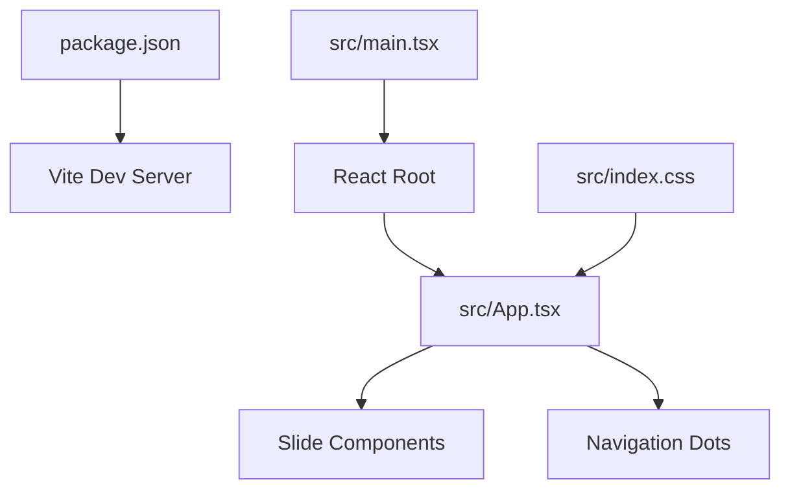
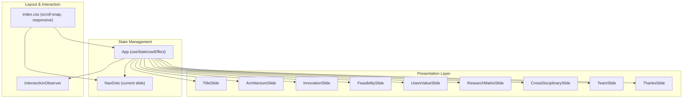
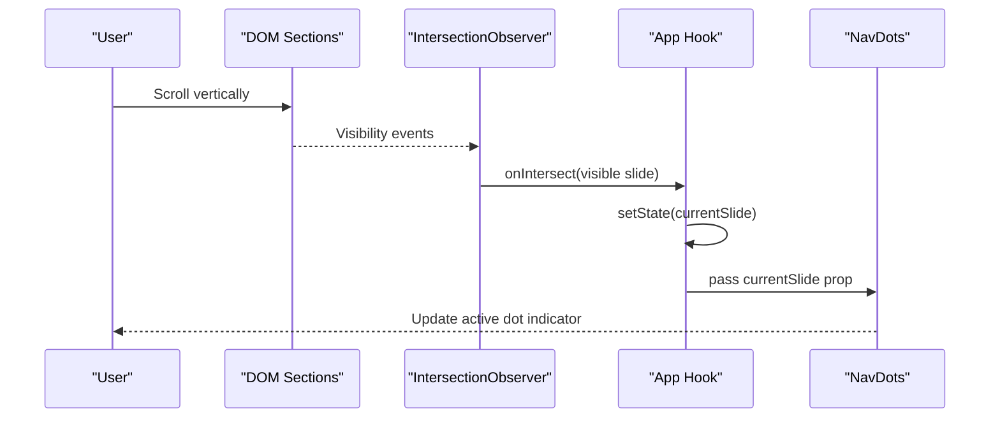
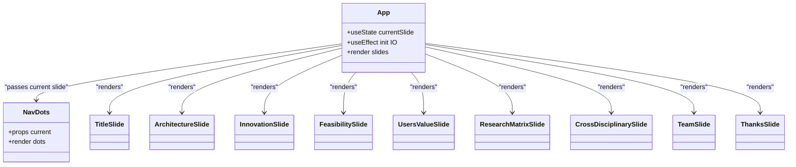
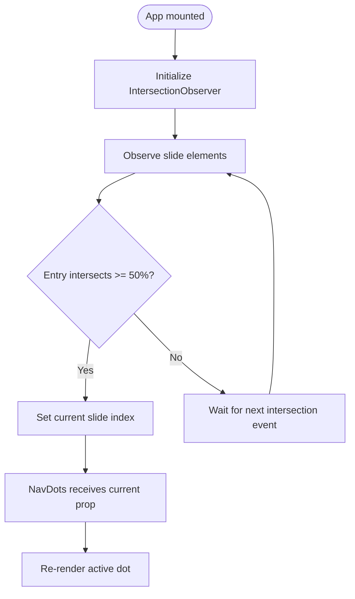
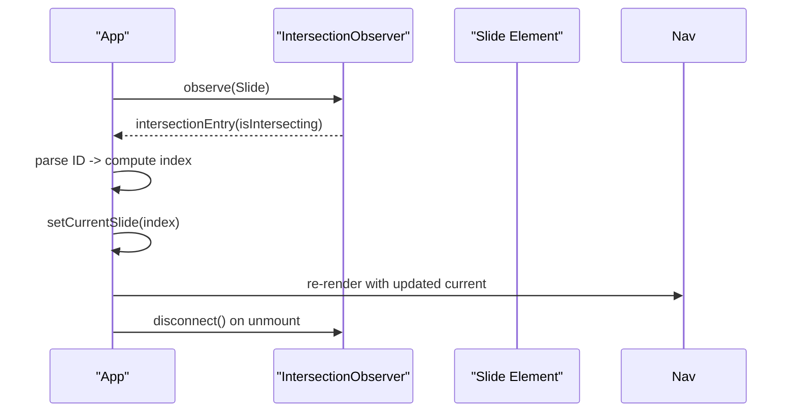
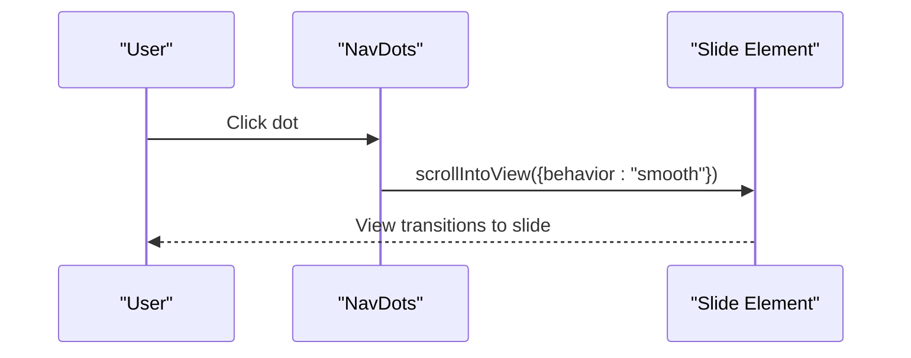
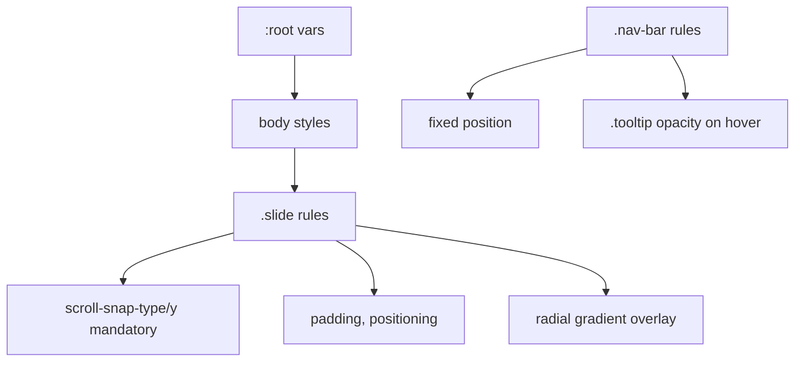
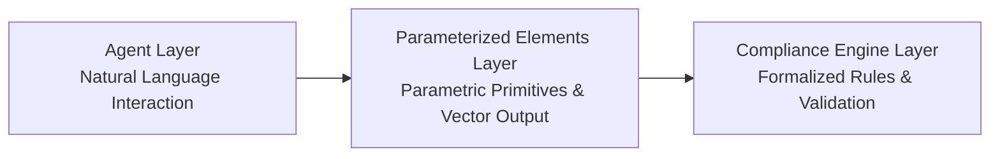
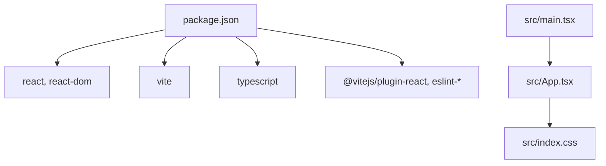

# Application Architecture

<cite>
**Referenced Files in This Document**
- [src/App.tsx](file://src/App.tsx)
- [src/main.tsx](file://src/main.tsx)
- [src/index.css](file://src/index.css)
- [package.json](file://package.json)
- [README.md](file://README.md)
</cite>

## Table of Contents
1. [Introduction](#introduction)
2. [Project Structure](#project-structure)
3. [Core Components](#core-components)
4. [Architecture Overview](#architecture-overview)
5. [Detailed Component Analysis](#detailed-component-analysis)
6. [Dependency Analysis](#dependency-analysis)
7. [Performance Considerations](#performance-considerations)
8. [Troubleshooting Guide](#troubleshooting-guide)
9. [Conclusion](#conclusion)

## Introduction
This document describes the architectural design of the Patent Drawing Application, a React-based slide presentation focused on showcasing a three-layer hybrid architecture for intelligent patent drawing generation. The application follows a slide-based presentation pattern, a component-based architecture, and uses React hooks for state management. It leverages the Intersection Observer API for automatic slide detection, implements a navigation system, and applies a responsive layout strategy. The UI presents the conceptual architecture composed of Agent, Parameterized Elements, and Compliance Engine layers, emphasizing component relationships, data flow, and architectural decisions.

## Project Structure
The project is a minimal React + TypeScript + Vite application bootstrapped with official templates. The runtime entry point renders the root application component into the DOM. Styling is centralized in a single CSS file with theme variables and responsive breakpoints.

**Diagram sources**
- [package.json:1-31](file://package.json#L1-L31)
- [src/main.tsx:1-11](file://src/main.tsx#L1-L11)
- [src/App.tsx:401-444](file://src/App.tsx#L401-L444)
- [src/index.css:1-851](file://src/index.css#L1-L851)

**Section sources**
- [package.json:1-31](file://package.json#L1-L31)
- [src/main.tsx:1-11](file://src/main.tsx#L1-L11)
- [README.md:1-74](file://README.md#L1-L74)

## Core Components
The application is composed of:
- A root App component that orchestrates slide rendering, state management, and Intersection Observer-based slide detection.
- Nine reusable slide components representing distinct presentation pages.
- A navigation dot bar component for quick slide selection.

Key implementation patterns:
- Slide-based presentation: Each slide is a self-contained section element with a unique ID.
- Component-based architecture: Each slide is implemented as a dedicated functional component.
- React hooks: useState manages the current slide index; useEffect initializes and tears down the Intersection Observer.
- Intersection Observer: Observes slide elements to update the current slide index when they reach a visibility threshold.
- Navigation system: A dot-based bar reflects the current slide and allows direct navigation via click handlers.

**Section sources**
- [src/App.tsx:401-444](file://src/App.tsx#L401-L444)
- [src/App.tsx:405-428](file://src/App.tsx#L405-L428)
- [src/App.tsx:384-398](file://src/App.tsx#L384-L398)

## Architecture Overview
The application enforces a slide-based presentation architecture with a responsive, scroll-snap layout. The Intersection Observer monitors slide visibility to synchronize the navigation dots and current slide state. The UI visually represents the three-layer hybrid architecture concept (Agent, Parameterized Elements, Compliance Engine) through dedicated slide content and layered visuals.

**Diagram sources**
- [src/App.tsx:401-444](file://src/App.tsx#L401-L444)
- [src/App.tsx:405-428](file://src/App.tsx#L405-L428)
- [src/index.css:23-47](file://src/index.css#L23-L47)

## Detailed Component Analysis

### Slide-Based Presentation Pattern
The application organizes content into nine distinct slides, each rendered as a section element with a unique identifier. Slides are rendered sequentially in the root App component, enabling a vertical, scroll-snap driven presentation.

**Diagram sources**
- [src/App.tsx:405-428](file://src/App.tsx#L405-L428)
- [src/App.tsx:401-444](file://src/App.tsx#L401-L444)
- [src/App.tsx:384-398](file://src/App.tsx#L384-L398)

**Section sources**
- [src/App.tsx:433-441](file://src/App.tsx#L433-L441)
- [src/index.css:23-47](file://src/index.css#L23-L47)

### Component-Based Architecture
Each slide is implemented as a standalone functional component, encapsulating its own JSX structure and styling. The root App component composes these slide components, promoting modularity and testability.

**Diagram sources**
- [src/App.tsx:401-444](file://src/App.tsx#L401-L444)
- [src/App.tsx:384-398](file://src/App.tsx#L384-L398)

**Section sources**
- [src/App.tsx:4-28](file://src/App.tsx#L4-L28)
- [src/App.tsx:31-79](file://src/App.tsx#L31-L79)
- [src/App.tsx:82-132](file://src/App.tsx#L82-L132)
- [src/App.tsx:135-192](file://src/App.tsx#L135-L192)
- [src/App.tsx:195-246](file://src/App.tsx#L195-L246)
- [src/App.tsx:249-287](file://src/App.tsx#L249-L287)
- [src/App.tsx:290-323](file://src/App.tsx#L290-L323)
- [src/App.tsx:326-368](file://src/App.tsx#L326-L368)
- [src/App.tsx:371-379](file://src/App.tsx#L371-L379)

### State Management with React Hooks
The root App component maintains the current slide index using useState. The useEffect hook sets up an Intersection Observer to track visibility thresholds of slide elements, updating the state when a slide becomes sufficiently visible. This establishes a reactive relationship between scroll position and UI state.

**Diagram sources**
- [src/App.tsx:405-428](file://src/App.tsx#L405-L428)
- [src/App.tsx:401-402](file://src/App.tsx#L401-L402)
- [src/App.tsx:384-398](file://src/App.tsx#L384-L398)

**Section sources**
- [src/App.tsx:401-402](file://src/App.tsx#L401-L402)
- [src/App.tsx:405-428](file://src/App.tsx#L405-L428)

### Intersection Observer Implementation for Automatic Slide Detection
The Intersection Observer is configured with a 50% threshold to reliably detect when a slide enters the viewport. The observer is attached to each slide element during mount and disconnected on cleanup. The callback extracts the slide number from the element’s ID and updates the current slide index.

**Diagram sources**
- [src/App.tsx:405-428](file://src/App.tsx#L405-L428)

**Section sources**
- [src/App.tsx:405-428](file://src/App.tsx#L405-L428)

### Navigation System Design
The navigation dots component renders a vertical list of clickable indicators. Each dot corresponds to a slide label and triggers a smooth scroll to the associated section when clicked. The active dot is highlighted based on the current slide index managed by the App component.

**Diagram sources**
- [src/App.tsx:384-398](file://src/App.tsx#L384-L398)

**Section sources**
- [src/App.tsx:384-398](file://src/App.tsx#L384-L398)

### Responsive Layout Architecture
The application employs a CSS-driven responsive layout:
- Scroll behavior is set to smooth scrolling with mandatory vertical scroll-snap alignment per slide.
- Slide containers enforce minimum height, padding, and centered content.
- Navigation dots are fixed to the right side and vertically centered.
- Media queries adjust spacing and layout for smaller screens.

**Diagram sources**
- [src/index.css:1-15](file://src/index.css#L1-L15)
- [src/index.css:23-47](file://src/index.css#L23-L47)
- [src/index.css:72-125](file://src/index.css#L72-L125)

**Section sources**
- [src/index.css:23-47](file://src/index.css#L23-L47)
- [src/index.css:72-125](file://src/index.css#L72-L125)

### Three-Layer Hybrid Architecture Concept (Agent, Parameterized Elements, Compliance Engine)
The application’s UI presents the conceptual architecture through dedicated slides:
- Agent layer: Natural language interaction and intent extraction.
- Parameterized Elements layer: Parametric mechanical primitives, dimension-driven geometry, and vector output.
- Compliance Engine layer: Formalized rules for patent drawing standards, resolution/line width checks, risk warnings, and guideline semantic conversion.

These layers are visually represented with icons, titles, subtitles, and feature lists, connected by directional indicators to illustrate the pipeline.

**Diagram sources**
- [src/App.tsx:31-79](file://src/App.tsx#L31-L79)

**Section sources**
- [src/App.tsx:31-79](file://src/App.tsx#L31-L79)

## Dependency Analysis
External dependencies are minimal and focused on React and Vite tooling. The application relies on React for component rendering and hooks, and Vite for development and build processes.

**Diagram sources**
- [package.json:12-29](file://package.json#L12-L29)
- [src/main.tsx:1-11](file://src/main.tsx#L1-L11)
- [src/App.tsx:401-444](file://src/App.tsx#L401-L444)

**Section sources**
- [package.json:12-29](file://package.json#L12-L29)
- [src/main.tsx:1-11](file://src/main.tsx#L1-L11)

## Performance Considerations
- Intersection Observer threshold: Using a 50% threshold balances responsiveness with stability, reducing frequent re-renders while ensuring accurate slide detection.
- Minimal DOM updates: The navigation dots rely on a single numeric prop change, keeping re-render costs low.
- CSS scroll-snap: Native browser scroll-snap reduces JavaScript overhead for page transitions.
- Component granularity: Each slide is a self-contained component, aiding maintainability and potential future code-splitting opportunities.
- Styling efficiency: Centralized CSS avoids redundant style computations and leverages efficient selectors.

[No sources needed since this section provides general guidance]

## Troubleshooting Guide
Common issues and resolutions:
- Navigation dots not highlighting: Verify the current slide index is being updated by the Intersection Observer and passed to NavDots.
- Click navigation not working: Ensure slide elements have unique IDs matching the expected pattern and that smooth scroll targets exist.
- Scroll snapping not functioning: Confirm scroll-snap properties are applied to the root container and slides.
- Styles not loading: Check that the global CSS file is imported in the root module and that CSS variables are defined.

**Section sources**
- [src/App.tsx:405-428](file://src/App.tsx#L405-L428)
- [src/App.tsx:384-398](file://src/App.tsx#L384-L398)
- [src/index.css:23-47](file://src/index.css#L23-L47)

## Conclusion
The Patent Drawing Application demonstrates a clean, component-based React architecture tailored for a slide-based presentation. It integrates Intersection Observer for robust slide detection, a concise navigation system, and a responsive layout strategy. The UI effectively communicates the three-layer hybrid architecture concept, aligning the technical design with the intended narrative. The modular structure supports maintainability and scalability, with room for enhancements such as route-based navigation, lazy-loaded slides, and advanced accessibility features.