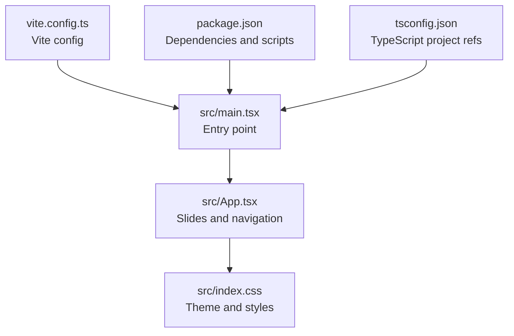
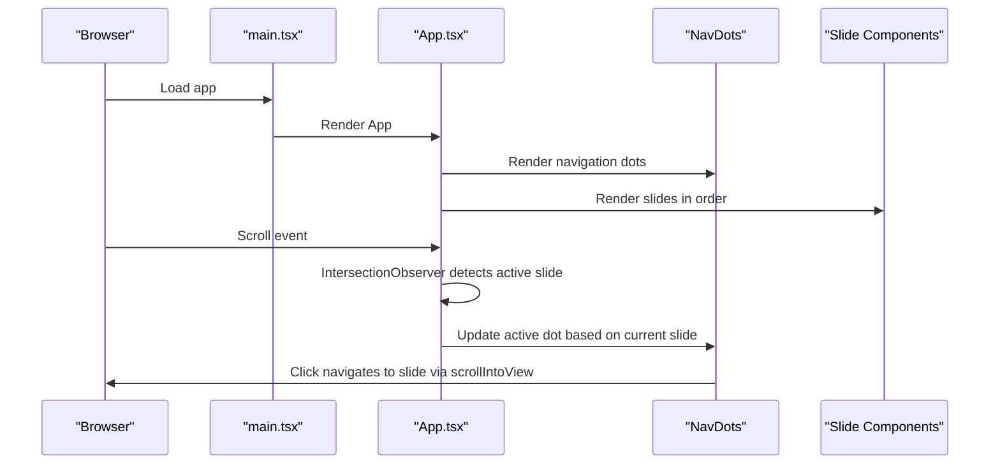
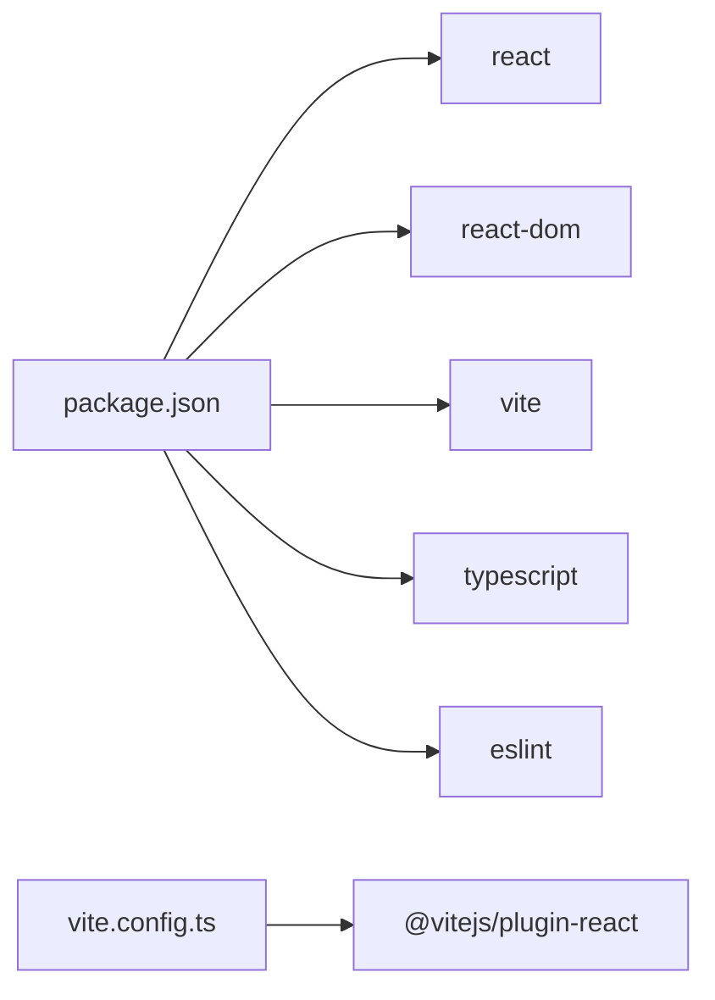

# Customization & Extension

<cite>
**Referenced Files in This Document**
- [src/App.tsx](file://src/App.tsx)
- [src/main.tsx](file://src/main.tsx)
- [src/index.css](file://src/index.css)
- [src/App.css](file://src/App.css)
- [package.json](file://package.json)
- [vite.config.ts](file://vite.config.ts)
- [tsconfig.json](file://tsconfig.json)
- [README.md](file://README.md)
</cite>

## Table of Contents
1. [Introduction](#introduction)
2. [Project Structure](#project-structure)
3. [Core Components](#core-components)
4. [Architecture Overview](#architecture-overview)
5. [Detailed Component Analysis](#detailed-component-analysis)
6. [Dependency Analysis](#dependency-analysis)
7. [Performance Considerations](#performance-considerations)
8. [Troubleshooting Guide](#troubleshooting-guide)
9. [Conclusion](#conclusion)
10. [Appendices](#appendices)

## Introduction
This document provides a comprehensive guide to customizing and extending the Patent Drawing Application. It focuses on:
- Adding new slide components
- Modifying existing slide content
- Customizing the theme system via CSS custom properties
- Extending navigation functionality
- Integrating external content
- Maintaining compatibility when extending the application

The application is a React + TypeScript + Vite project with a single-page presentation built from modular slide components and a shared CSS theme system.

## Project Structure
The project follows a straightforward structure:
- Entry point renders the application root
- Application layout and slides are defined in a single module
- Global styles are centralized in a CSS file
- Build and tooling are configured via Vite and TypeScript

**Diagram sources**
- [src/main.tsx:1-11](file://src/main.tsx#L1-L11)
- [src/App.tsx:401-444](file://src/App.tsx#L401-L444)
- [src/index.css:1-15](file://src/index.css#L1-L15)
- [vite.config.ts:1-8](file://vite.config.ts#L1-L8)
- [package.json:1-31](file://package.json#L1-L31)
- [tsconfig.json:1-8](file://tsconfig.json#L1-L8)

**Section sources**
- [src/main.tsx:1-11](file://src/main.tsx#L1-L11)
- [src/App.tsx:401-444](file://src/App.tsx#L401-L444)
- [src/index.css:1-15](file://src/index.css#L1-L15)
- [vite.config.ts:1-8](file://vite.config.ts#L1-L8)
- [package.json:1-31](file://package.json#L1-L31)
- [tsconfig.json:1-8](file://tsconfig.json#L1-L8)

## Core Components
- Slide components: Each slide is a dedicated React functional component exporting JSX. Examples include the title slide, architecture slide, innovation slide, feasibility slide, user value slide, research matrix slide, cross-disciplinary slide, team slide, and thank-you slide.
- Navigation: A dot-based navigation bar with tooltips and click handlers to jump to slides. The navigation labels are defined as a constant array and mapped to slide IDs.
- Theme system: CSS custom properties define primary colors, gradients, backgrounds, and text colors. Slides apply background gradients and card styles using these variables.

Key integration points:
- Slide IDs: Each slide has a unique ID used by navigation and intersection observer.
- Intersection observer: Tracks which slide is currently visible to update the active navigation dot.
- CSS variables: Centralized theming via :root variables consumed by slide-specific styles.

**Section sources**
- [src/App.tsx:4-28](file://src/App.tsx#L4-L28)
- [src/App.tsx:31-79](file://src/App.tsx#L31-L79)
- [src/App.tsx:82-132](file://src/App.tsx#L82-L132)
- [src/App.tsx:135-192](file://src/App.tsx#L135-L192)
- [src/App.tsx:195-246](file://src/App.tsx#L195-L246)
- [src/App.tsx:249-287](file://src/App.tsx#L249-L287)
- [src/App.tsx:290-323](file://src/App.tsx#L290-L323)
- [src/App.tsx:326-368](file://src/App.tsx#L326-L368)
- [src/App.tsx:371-379](file://src/App.tsx#L371-L379)
- [src/App.tsx:384-398](file://src/App.tsx#L384-L398)
- [src/App.tsx:401-428](file://src/App.tsx#L401-L428)
- [src/index.css:1-15](file://src/index.css#L1-L15)
- [src/index.css:72-125](file://src/index.css#L72-L125)

## Architecture Overview
The application architecture is a single-page React app with:
- A root renderer mounting the App component
- A set of slide components rendered sequentially
- A navigation bar bound to slide visibility via an intersection observer

**Diagram sources**
- [src/main.tsx:6-10](file://src/main.tsx#L6-L10)
- [src/App.tsx:401-428](file://src/App.tsx#L401-L428)
- [src/App.tsx:384-398](file://src/App.tsx#L384-L398)
- [src/App.tsx:433-441](file://src/App.tsx#L433-L441)

## Detailed Component Analysis

### Slide Components
Each slide component encapsulates:
- Content structure (headings, lists, grids, tables)
- Unique slide ID for navigation and intersection detection
- Styling via slide-specific CSS classes

Common patterns:
- Slide numbering via a top-left element
- Section titles and subtitles
- Grids and cards for structured content
- Hover effects and transitions for interactive elements

Extensibility tips:
- Keep slide IDs unique and incrementally numbered
- Use consistent class naming for slide types
- Leverage CSS variables for colors and gradients

**Section sources**
- [src/App.tsx:4-28](file://src/App.tsx#L4-L28)
- [src/App.tsx:31-79](file://src/App.tsx#L31-L79)
- [src/App.tsx:82-132](file://src/App.tsx#L82-L132)
- [src/App.tsx:135-192](file://src/App.tsx#L135-L192)
- [src/App.tsx:195-246](file://src/App.tsx#L195-L246)
- [src/App.tsx:249-287](file://src/App.tsx#L249-L287)
- [src/App.tsx:290-323](file://src/App.tsx#L290-L323)
- [src/App.tsx:326-368](file://src/App.tsx#L326-L368)
- [src/App.tsx:371-379](file://src/App.tsx#L371-L379)

### Navigation Component
The navigation dots:
- Are generated from a label array
- Apply an active state when the corresponding slide is visible
- Provide tooltip labels on hover
- Trigger smooth scrolling to target slides

Integration points:
- The label array drives the number and order of navigation dots
- Click handlers rely on slide IDs to scroll into view

**Section sources**
- [src/App.tsx:382-383](file://src/App.tsx#L382-L383)
- [src/App.tsx:384-398](file://src/App.tsx#L384-L398)

### Theme System
The theme system is driven by CSS custom properties defined in the root scope:
- Primary and accent colors
- Backgrounds and card backgrounds
- Gradients for slide backgrounds
- Text and border colors

Slides consume these variables for:
- Background gradients
- Card backgrounds and borders
- Hover states and accents
- Typography and contrast

Customization steps:
- Modify variables in the root scope to change global palette
- Override slide-specific variables for targeted themes
- Add new variables for additional brand elements

**Section sources**
- [src/index.css:1-15](file://src/index.css#L1-L15)
- [src/index.css:247-288](file://src/index.css#L247-L288)
- [src/index.css:329-382](file://src/index.css#L329-L382)
- [src/index.css:417-477](file://src/index.css#L417-L477)
- [src/index.css:479-580](file://src/index.css#L479-L580)
- [src/index.css:582-638](file://src/index.css#L582-L638)
- [src/index.css:640-710](file://src/index.css#L640-L710)
- [src/index.css:712-799](file://src/index.css#L712-L799)

### Intersection Observer and Scrolling
The application uses an intersection observer to track the active slide and updates the navigation accordingly. Smooth scrolling is supported via scrollIntoView.

Extension opportunities:
- Adjust thresholds for intersection observer
- Add keyboard navigation alongside dots
- Integrate hash-based routing for deep linking

**Section sources**
- [src/App.tsx:405-428](file://src/App.tsx#L405-L428)

## Dependency Analysis
External dependencies and tooling:
- React and ReactDOM for rendering
- Vite for development and build
- TypeScript for type checking
- ESLint for code quality

**Diagram sources**
- [package.json:12-29](file://package.json#L12-L29)
- [vite.config.ts:1-8](file://vite.config.ts#L1-L8)

**Section sources**
- [package.json:12-29](file://package.json#L12-L29)
- [vite.config.ts:1-8](file://vite.config.ts#L1-L8)
- [tsconfig.json:1-8](file://tsconfig.json#L1-L8)

## Performance Considerations
- Minimize heavy computations inside render loops; keep slide content declarative
- Use CSS transitions and transforms for animations to leverage GPU acceleration
- Avoid unnecessary re-renders by keeping props stable and using memoization where appropriate
- Keep slide content responsive and avoid excessive DOM nesting

## Troubleshooting Guide
Common issues and resolutions:
- Navigation dots not updating: Verify slide IDs match the intersection observer targets and that the observer is observing all slides
- Styles not applying: Ensure CSS variables are defined in the root scope and that slide classes are present
- Scroll snapping not working: Confirm scroll-snap properties are applied to the slide container and body
- Build errors: Validate TypeScript configuration and ensure all referenced tsconfig files exist

**Section sources**
- [src/App.tsx:405-428](file://src/App.tsx#L405-L428)
- [src/index.css:23-27](file://src/index.css#L23-L27)
- [src/index.css:37-47](file://src/index.css#L37-L47)
- [tsconfig.json:1-8](file://tsconfig.json#L1-L8)

## Conclusion
The Patent Drawing Application offers a clean, extensible foundation for presentations. By leveraging modular slide components, a robust theme system, and a simple navigation mechanism, teams can rapidly add new slides, adjust content, and tailor the visual identity while maintaining performance and accessibility.

## Appendices

### Step-by-Step Customization Guides

- Add a New Slide Component
  1. Define a new slide component with a unique ID and content structure
  2. Import the component into the main App render list
  3. Update the navigation labels array to include the new slide label
  4. Style the slide using existing CSS classes or add new ones
  5. Verify intersection observer detects the new slide and navigation highlights it

  **Section sources**
  - [src/App.tsx:401-444](file://src/App.tsx#L401-L444)
  - [src/App.tsx:382-383](file://src/App.tsx#L382-L383)

- Modify Existing Slide Content
  1. Locate the slide component in the main module
  2. Update the JSX content and data structures
  3. Adjust CSS classes if layout or spacing changes
  4. Test scrolling and navigation behavior

  **Section sources**
  - [src/App.tsx:4-28](file://src/App.tsx#L4-L28)
  - [src/App.tsx:31-79](file://src/App.tsx#L31-L79)

- Customize the Theme System
  1. Edit CSS variables in the root scope to change global palette
  2. Override slide-specific variables for targeted themes
  3. Add new variables for additional brand elements
  4. Update gradients and backgrounds consistently across slides

  **Section sources**
  - [src/index.css:1-15](file://src/index.css#L1-L15)
  - [src/index.css:247-288](file://src/index.css#L247-L288)

- Extend Navigation Functionality
  1. Add keyboard shortcuts or additional controls
  2. Integrate hash-based routing for deep links
  3. Enhance tooltip labels or add slide descriptions
  4. Ensure smooth scrolling remains functional

  **Section sources**
  - [src/App.tsx:384-398](file://src/App.tsx#L384-L398)

- Integrate External Content
  1. Fetch external data in a useEffect hook within a slide component
  2. Normalize data into the existing slide structures
  3. Add loading states and error boundaries
  4. Keep content updates reactive and performant

  **Section sources**
  - [src/App.tsx:405-428](file://src/App.tsx#L405-L428)

- Best Practices for Compatibility
  - Maintain consistent slide IDs and navigation labels
  - Use CSS variables for all colors and gradients
  - Keep component props minimal and stable
  - Avoid inline styles; prefer CSS classes
  - Test across browsers and devices

  **Section sources**
  - [src/index.css:1-15](file://src/index.css#L1-L15)
  - [src/App.tsx:401-444](file://src/App.tsx#L401-L444)