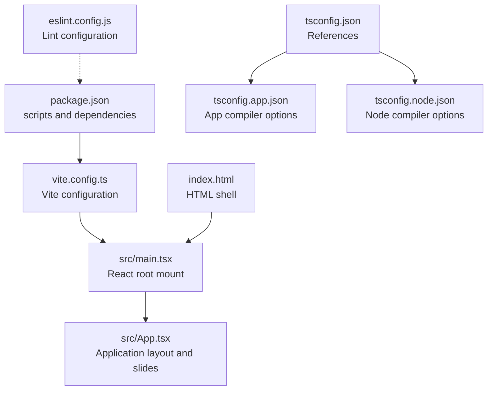
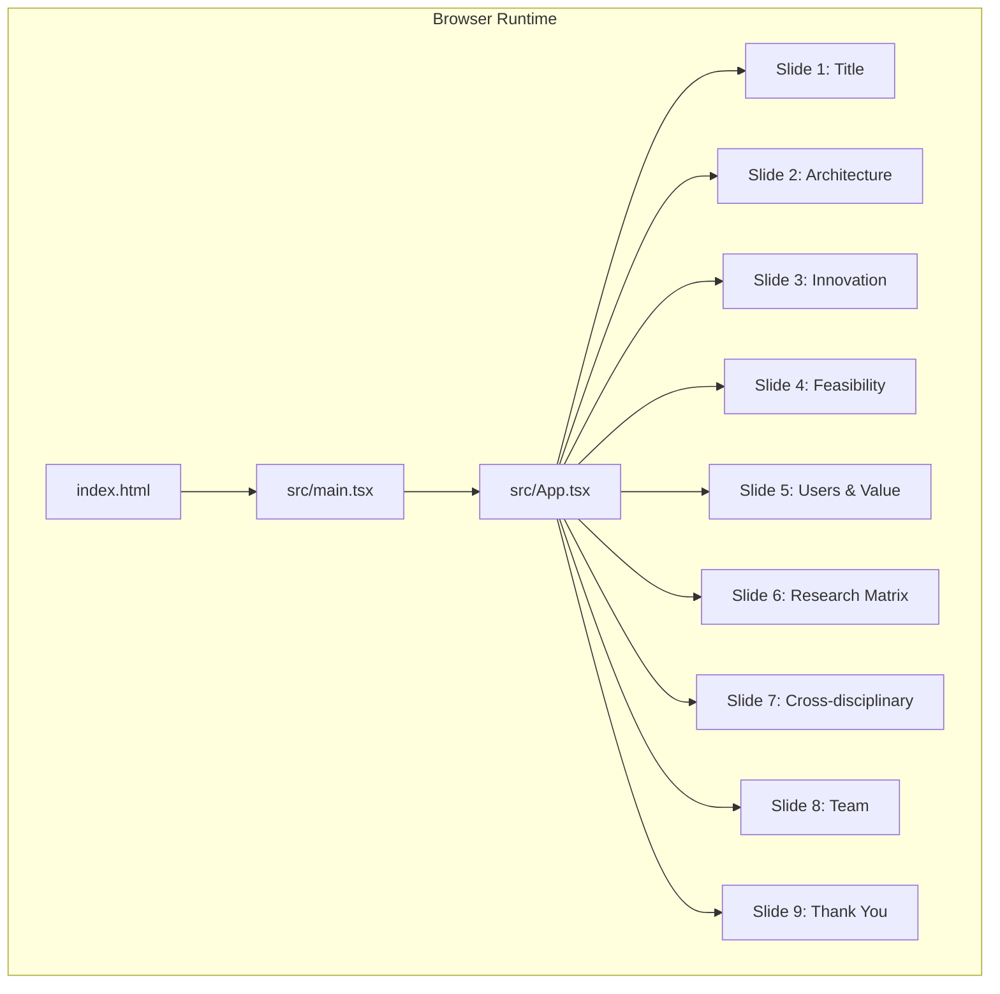
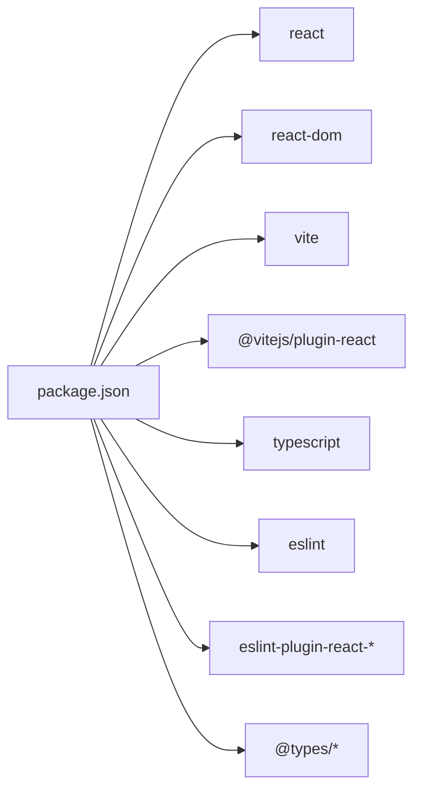

# Deployment & Production

<cite>
**Referenced Files in This Document**
- [package.json](file://package.json)
- [vite.config.ts](file://vite.config.ts)
- [README.md](file://README.md)
- [index.html](file://index.html)
- [tsconfig.json](file://tsconfig.json)
- [tsconfig.app.json](file://tsconfig.app.json)
- [tsconfig.node.json](file://tsconfig.node.json)
- [eslint.config.js](file://eslint.config.js)
- [src/main.tsx](file://src/main.tsx)
- [src/App.tsx](file://src/App.tsx)
</cite>

## Table of Contents
1. [Introduction](#introduction)
2. [Project Structure](#project-structure)
3. [Core Components](#core-components)
4. [Architecture Overview](#architecture-overview)
5. [Detailed Component Analysis](#detailed-component-analysis)
6. [Dependency Analysis](#dependency-analysis)
7. [Performance Considerations](#performance-considerations)
8. [Troubleshooting Guide](#troubleshooting-guide)
9. [Conclusion](#conclusion)
10. [Appendices](#appendices)

## Introduction
This document provides comprehensive deployment and production guidance for the Patent Drawing Application. It covers the build process using Vite, production optimization techniques, deployment strategies across common hosting platforms, and operational practices for monitoring and maintenance. It also documents configuration options relevant to production builds, asset optimization, and CDN integration, along with practical checklists and troubleshooting steps.

## Project Structure
The application is a React + TypeScript project configured with Vite. The build pipeline is orchestrated via npm scripts and Vite, with TypeScript configurations split into app and node contexts. The HTML entry point mounts the React root and loads the application bundle.

**Diagram sources**
- [package.json:1-31](file://package.json#L1-L31)
- [vite.config.ts:1-8](file://vite.config.ts#L1-L8)
- [src/main.tsx:1-11](file://src/main.tsx#L1-L11)
- [src/App.tsx:1-445](file://src/App.tsx#L1-L445)
- [index.html:1-14](file://index.html#L1-L14)
- [tsconfig.json:1-8](file://tsconfig.json#L1-L8)
- [tsconfig.app.json:1-26](file://tsconfig.app.json#L1-L26)
- [tsconfig.node.json:1-25](file://tsconfig.node.json#L1-L25)
- [eslint.config.js:1-23](file://eslint.config.js#L1-L23)

**Section sources**
- [package.json:1-31](file://package.json#L1-L31)
- [vite.config.ts:1-8](file://vite.config.ts#L1-L8)
- [index.html:1-14](file://index.html#L1-L14)
- [tsconfig.json:1-8](file://tsconfig.json#L1-L8)
- [tsconfig.app.json:1-26](file://tsconfig.app.json#L1-L26)
- [tsconfig.node.json:1-25](file://tsconfig.node.json#L1-L25)
- [eslint.config.js:1-23](file://eslint.config.js#L1-L23)

## Core Components
- Build and development scripts: The project defines scripts for development, building, linting, and previewing. The build script invokes TypeScript compilation followed by Vite’s production build.
- Vite configuration: Minimal configuration enables the React plugin; production defaults apply unless extended.
- TypeScript configuration: Two TS projects are referenced—one for the app and one for node tooling—ensuring strict bundler-mode resolution and JSX emit control.
- Linting: ESLint is configured with recommended sets and React-specific plugins.

Key production-relevant observations:
- The build command compiles TypeScript and then runs Vite build, ensuring type-safe production bundles.
- Vite’s default behavior is used for bundling and asset handling; production optimizations can be introduced via Vite plugins and configuration.

**Section sources**
- [package.json:6-11](file://package.json#L6-L11)
- [vite.config.ts:5-7](file://vite.config.ts#L5-L7)
- [tsconfig.app.json:10-16](file://tsconfig.app.json#L10-L16)
- [tsconfig.node.json:10-15](file://tsconfig.node.json#L10-L15)
- [eslint.config.js:8-22](file://eslint.config.js#L8-L22)

## Architecture Overview
The runtime architecture is a single-page application served statically. The browser loads index.html, which mounts the React root and executes the bundled application code. The application renders a multi-slide presentation with navigation and intersection observers for slide awareness.

**Diagram sources**
- [index.html:9-12](file://index.html#L9-L12)
- [src/main.tsx:6-10](file://src/main.tsx#L6-L10)
- [src/App.tsx:401-444](file://src/App.tsx#L401-L444)

**Section sources**
- [index.html:1-14](file://index.html#L1-L14)
- [src/main.tsx:1-11](file://src/main.tsx#L1-L11)
- [src/App.tsx:1-445](file://src/App.tsx#L1-L445)

## Detailed Component Analysis

### Build Pipeline and Production Optimization
- Build command: The build script performs type checking/bundling via TypeScript and then executes Vite’s production build. This ensures type safety and emits optimized assets.
- Vite defaults: Without explicit plugins, Vite applies standard minification and chunking. For production, consider adding plugins for advanced optimizations (code splitting, polyfills, image optimization, and CDN integration).
- Asset handling: Vite resolves and emits assets referenced by the application. Static assets should be placed under the public directory for cache-friendly URLs and direct serving.

Recommended production enhancements (to be implemented in Vite config):
- Code splitting: Route-based dynamic imports to reduce initial payload.
- Asset optimization: Image compression and modern formats (AVIF/WEBP) via plugins.
- Polyfills: Conditional polyfills based on target browsers.
- CDN integration: Configure base path and asset CDN URLs for static assets and vendor chunks.
- HTML transforms: Minify and inject critical CSS/JS placeholders.

**Section sources**
- [package.json:8](file://package.json#L8)
- [vite.config.ts:5-7](file://vite.config.ts#L5-L7)

### Vite Configuration Extension for Production
Current configuration enables the React plugin. For production, extend the configuration to:
- Set mode to production for minification and tree-shaking.
- Add plugins for asset optimization and CDN integration.
- Configure base path for CDN deployments.
- Optimize chunking strategy and external dependencies.

Implementation guidance:
- Add a production-only vite.config entry that merges with the existing plugin setup.
- Use environment variables to toggle CDN base and asset paths.
- Keep development and production builds separate to avoid accidental dev-time features in production.

**Section sources**
- [vite.config.ts:1-8](file://vite.config.ts#L1-L8)

### TypeScript Configuration for Production
- App configuration enforces bundler mode and JSX emit control, ensuring compatibility with Vite’s module resolution and minimizing emitted artifacts.
- Node configuration isolates tooling types and targets, keeping dev toolchain separate from app runtime.

Production considerations:
- Keep bundler mode for both projects to align with Vite’s expectations.
- Maintain strict unused-local checks to prevent dead code in production builds.

**Section sources**
- [tsconfig.app.json:10-16](file://tsconfig.app.json#L10-L16)
- [tsconfig.node.json:10-15](file://tsconfig.node.json#L10-L15)

### HTML Shell and Root Mount
- The HTML shell sets the document title, viewport, and favicon, then mounts the React root.
- The root mount script loads the application entry point.

Production considerations:
- Ensure the HTML shell remains minimal and free of heavy inline scripts.
- Keep the root element id consistent with the mount target.

**Section sources**
- [index.html:3-12](file://index.html#L3-L12)
- [src/main.tsx:6-10](file://src/main.tsx#L6-L10)

### Application Layout and Navigation
- The application composes nine distinct slides and a navigation bar with dots indicating the current slide.
- An intersection observer tracks which slide is currently visible, enabling smooth navigation and state updates.

Production considerations:
- Keep slide components self-contained and lazy-load heavy assets.
- Use CSS-in-JS or scoped styles carefully to avoid bloating the initial bundle.

**Section sources**
- [src/App.tsx:384-444](file://src/App.tsx#L384-L444)

### Deployment Strategies Across Hosting Platforms
- Static hosting (GitHub Pages, Netlify, Vercel): Build the project and serve the dist folder. Configure base path if deploying under a subpath.
- CDN-backed hosting: Point CDN origin to the dist folder and configure caching headers for static assets.
- Containerized deployment: Package dist as a static site inside a lightweight container (e.g., nginx) and expose port 80.

Platform-specific tips:
- GitHub Pages: Use a publishing action to build and deploy the dist folder to the pages branch.
- Netlify/Vercel: Connect your repository and set the build command and publish directory. Configure environment variables for CDN base if needed.
- Cloud storage (S3/GCS): Upload dist to a bucket, enable static website hosting, and configure CORS and caching.

[No sources needed since this section provides general guidance]

### Monitoring and Maintenance Procedures
- Health checks: Serve a simple endpoint or static health page to confirm service availability.
- Logging: Capture client-side errors via a reporting library and forward logs to a backend or logging service.
- Rollback: Maintain immutable artifact versions and a simple rollback mechanism (redeploy previous version).
- Security headers: Enforce Content-Security-Policy, HSTS, and X-Content-Type-Options via server headers or CDN policies.
- Observability: Instrument key metrics (time-to-first-byte, first-contentful-paint) and set up alerts for anomalies.

[No sources needed since this section provides general guidance]

## Dependency Analysis
The application relies on React and Vite with a minimal plugin surface. Dependencies are declared in package.json, and TypeScript configurations isolate app and node concerns.

**Diagram sources**
- [package.json:12-29](file://package.json#L12-L29)

**Section sources**
- [package.json:12-29](file://package.json#L12-L29)

## Performance Considerations
- Bundle size: Prefer dynamic imports for non-critical routes and defer heavy assets until needed.
- Asset optimization: Compress images and vector graphics; leverage modern formats and responsive image strategies.
- Caching: Set long-term caching for immutable assets and short-lived caching for HTML. Use cache-busting filenames.
- Network: Enable HTTP/2 or HTTP/3; preconnect to CDNs; preload critical fonts and icons.
- Rendering: Keep the initial render lightweight; defer non-critical work to idle callbacks.
- Observability: Measure and track Core Web Vitals; alert on regressions.

[No sources needed since this section provides general guidance]

## Troubleshooting Guide
- Build failures: Verify TypeScript configuration and ensure the build script runs in order (TypeScript then Vite).
- Missing assets: Confirm asset paths and public directory placement; ensure CDN base path is correct in production builds.
- Lint errors: Align lint configuration with the project’s TS setups and enable type-aware rules for stricter checks.
- Runtime issues: Inspect the React root mount and HTML shell; verify the root element exists and matches the mount target.

**Section sources**
- [package.json:8](file://package.json#L8)
- [eslint.config.js:8-22](file://eslint.config.js#L8-L22)
- [index.html:9-12](file://index.html#L9-L12)
- [src/main.tsx:6-10](file://src/main.tsx#L6-L10)

## Conclusion
The Patent Drawing Application is a straightforward React + TypeScript + Vite project suitable for static hosting. By extending Vite configuration for production optimizations, integrating CDN assets, and adopting robust deployment and monitoring practices, the application can be reliably delivered and maintained in production environments.

[No sources needed since this section summarizes without analyzing specific files]

## Appendices

### A. Production Build Checklist
- Run type checks and tests locally.
- Build the project using the production command.
- Validate the dist folder contents and asset integrity.
- Configure CDN base path and cache headers.
- Deploy to the chosen platform and verify routing and assets.
- Set up health checks and basic monitoring.

[No sources needed since this section provides general guidance]

### B. Environment Variables Reference
- Define environment variables for CDN base path and feature flags.
- Keep secrets out of the client bundle; expose only necessary configuration.

[No sources needed since this section provides general guidance]

### C. Example Vite Production Configuration Outline
- Extend the existing Vite config with:
  - Mode set to production.
  - Plugins for asset optimization and CDN integration.
  - Base path configuration for CDN deployments.
  - Target browsers and polyfills as needed.

[No sources needed since this section provides general guidance]