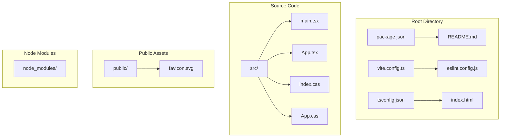
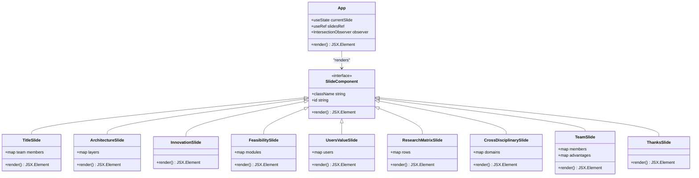
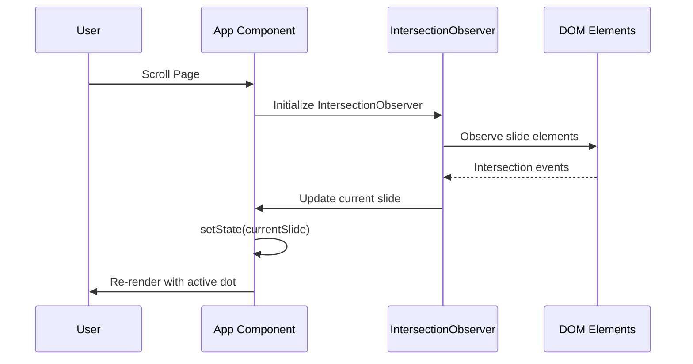
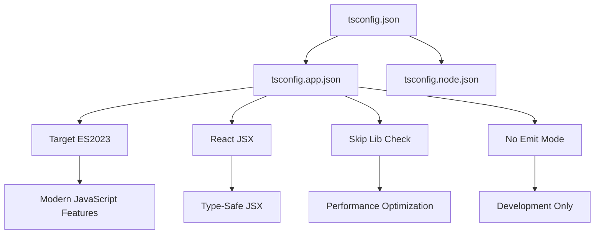
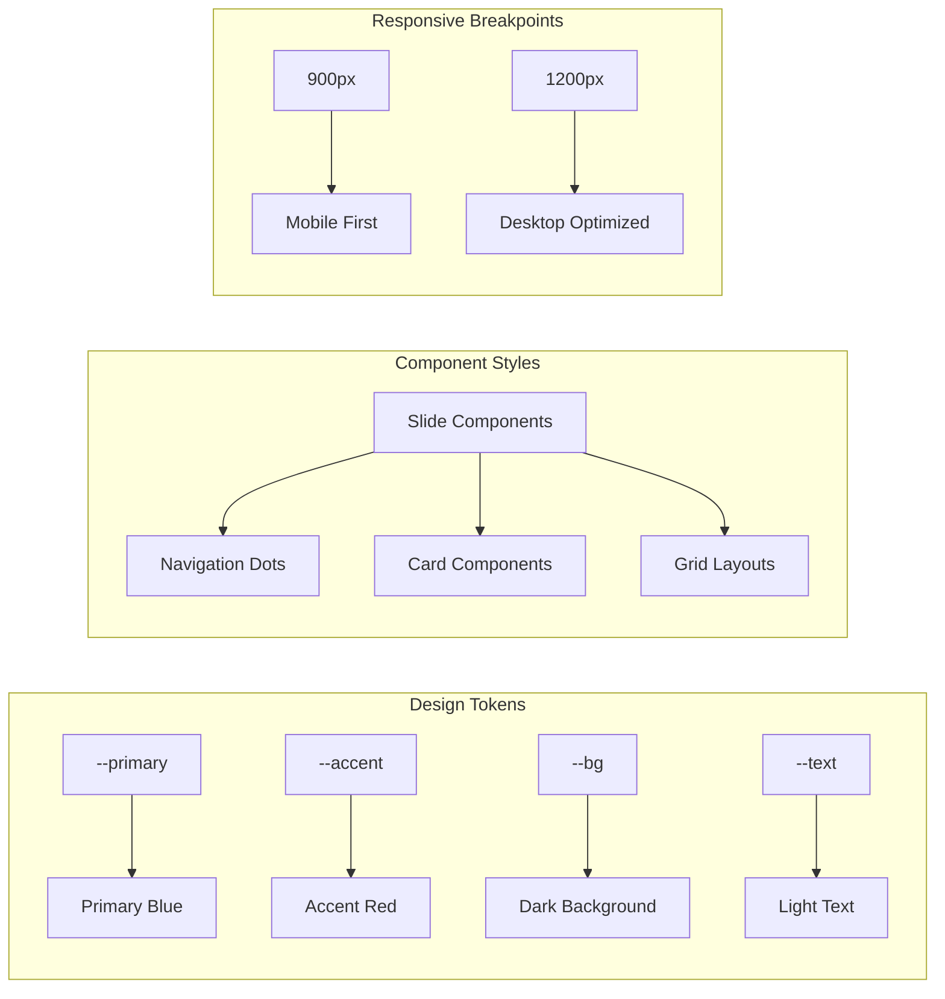
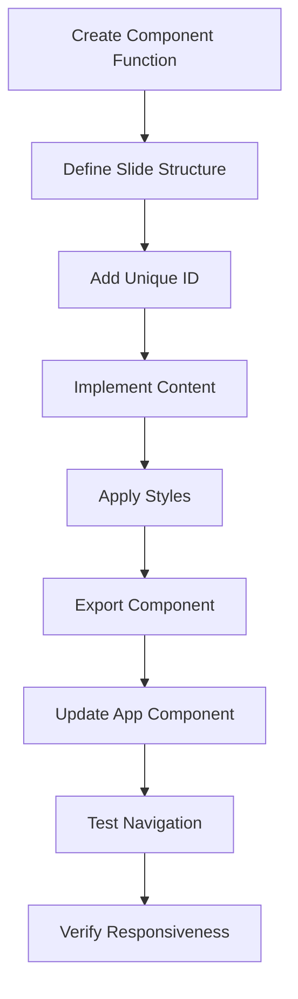
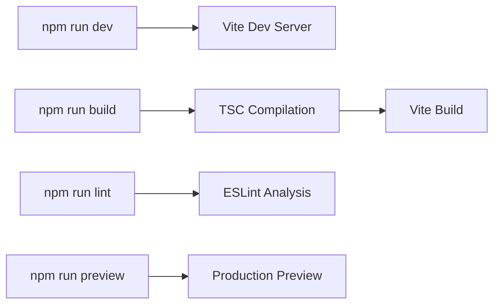

# Development Guide

<cite>
**Referenced Files in This Document**
- [package.json](file://patent-drawing-app/package.json)
- [README.md](file://patent-drawing-app/README.md)
- [vite.config.ts](file://patent-drawing-app/vite.config.ts)
- [eslint.config.js](file://patent-drawing-app/eslint.config.js)
- [tsconfig.app.json](file://patent-drawing-app/tsconfig.app.json)
- [tsconfig.json](file://patent-drawing-app/tsconfig.json)
- [index.html](file://patent-drawing-app/index.html)
- [src/main.tsx](file://patent-drawing-app/src/main.tsx)
- [src/App.tsx](file://patent-drawing-app/src/App.tsx)
- [src/index.css](file://patent-drawing-app/src/index.css)
- [src/App.css](file://patent-drawing-app/src/App.css)
</cite>

## Table of Contents
1. [Introduction](#introduction)
2. [Project Structure](#project-structure)
3. [Code Organization Standards](#code-organization-standards)
4. [Component Development Best Practices](#component-development-best-practices)
5. [TypeScript Integration Patterns](#typescript-integration-patterns)
6. [Styling Conventions](#styling-conventions)
7. [Performance Optimization](#performance-optimization)
8. [Accessibility Considerations](#accessibility-considerations)
9. [Cross-Browser Compatibility](#cross-browser-compatibility)
10. [Adding New Slides](#adding-new-slides)
11. [Modifying Existing Components](#modifying-existing-components)
12. [Debugging Approaches](#debugging-approaches)
13. [Testing Strategies](#testing-strategies)
14. [Development Workflow](#development-workflow)
15. [Conclusion](#conclusion)

## Introduction

The Patent Drawing Application is a modern React presentation system built with TypeScript and Vite. It showcases a nine-slide presentation about a patent drawing generation system, featuring a scroll-snap navigation interface with animated transitions and responsive design. The application demonstrates best practices in component architecture, styling organization, and development workflow.

## Project Structure

The project follows a clean, modular structure optimized for rapid development and maintainability:

**Diagram sources**
- [package.json:1-31](file://patent-drawing-app/package.json#L1-L31)
- [vite.config.ts:1-8](file://patent-drawing-app/vite.config.ts#L1-L8)
- [src/main.tsx:1-11](file://patent-drawing-app/src/main.tsx#L1-L11)

**Section sources**
- [package.json:1-31](file://patent-drawing-app/package.json#L1-L31)
- [index.html:1-14](file://patent-drawing-app/index.html#L1-L14)

## Code Organization Standards

### File Naming Conventions

- **Entry Points**: `main.tsx` and `App.tsx` for application bootstrap and root component
- **Configuration**: `vite.config.ts`, `eslint.config.js`, `tsconfig.json` for build and development setup
- **Assets**: `index.css` for global styles, `App.css` for component-specific styles
- **Public Resources**: `favicon.svg` in public directory

### Component Architecture Pattern

The application employs a slide-based architecture where each slide is a self-contained React component:

**Diagram sources**
- [src/App.tsx:1-445](file://patent-drawing-app/src/App.tsx#L1-L445)

### Module Import Organization

- **React Core**: Standard React imports with hooks
- **TypeScript Types**: Automatic type inference and explicit typing where needed
- **CSS Modules**: Scoped styling with CSS custom properties
- **External Dependencies**: Managed through npm packages

**Section sources**
- [src/App.tsx:1-445](file://patent-drawing-app/src/App.tsx#L1-L445)

## Component Development Best Practices

### Slide Component Structure

Each slide component follows a consistent pattern:

1. **Named Function Export**: Each slide is exported as a named function
2. **Consistent Props Interface**: Navigation dots accept a `current` prop
3. **Unique Identifiers**: Each slide has a unique ID (`slide-1`, `slide-2`, etc.)
4. **Standardized Classes**: Each slide uses a standardized class naming convention

### State Management Patterns

The application uses React's built-in state management:

**Diagram sources**
- [src/App.tsx:401-428](file://patent-drawing-app/src/App.tsx#L401-L428)

### Performance Optimization Techniques

- **Intersection Observer**: Efficient scroll-based state updates
- **Minimal Re-renders**: State updates only when crossing slide thresholds
- **CSS Transitions**: Hardware-accelerated animations
- **Lazy Loading**: Images and content loaded as needed

**Section sources**
- [src/App.tsx:405-428](file://patent-drawing-app/src/App.tsx#L405-L428)

## TypeScript Integration Patterns

### Type Safety Implementation

The project leverages TypeScript for enhanced development experience:

- **Strict Type Checking**: Enabled through compiler options
- **Automatic Type Inference**: React hooks and props inferred automatically
- **Explicit Typing**: Critical types like `HTMLElement` and `number[]` explicitly typed
- **Module Resolution**: Proper bundler mode configuration

### Configuration Setup

**Diagram sources**
- [tsconfig.json:1-8](file://patent-drawing-app/tsconfig.json#L1-L8)
- [tsconfig.app.json:1-26](file://patent-drawing-app/tsconfig.app.json#L1-L26)

### Build Configuration

The TypeScript configuration ensures optimal development experience:

- **Target Environment**: ES2023 for modern browser support
- **Module System**: ESNext with bundler resolution
- **JSX Processing**: React JSX transformation
- **Linting**: Comprehensive type checking and unused code detection

**Section sources**
- [tsconfig.app.json:1-26](file://patent-drawing-app/tsconfig.app.json#L1-L26)

## Styling Conventions

### Design System Architecture

The application implements a comprehensive design system using CSS custom properties:

**Diagram sources**
- [src/index.css:1-15](file://patent-drawing-app/src/index.css#L1-L15)
- [src/index.css:830-851](file://patent-drawing-app/src/index.css#L830-L851)

### CSS Architecture Pattern

The styling follows a structured approach:

1. **Global Variables**: Centralized theme variables in `:root`
2. **Component Scoping**: Slide-specific styles with unique class prefixes
3. **Utility Classes**: Reusable layout and typography utilities
4. **Responsive Design**: Mobile-first approach with desktop enhancements

### Color Palette System

The application uses a carefully curated color palette:

- **Primary Colors**: Deep blues (`--primary`, `--primary-light`) for professional appearance
- **Accent Colors**: Reds (`--accent`, `--accent-light`) for emphasis and highlights
- **Background Colors**: Dark grays (`--bg`, `--bg-card`) for contrast and readability
- **Text Colors**: Light grays (`--text`, `--text-muted`) for hierarchy and accessibility

**Section sources**
- [src/index.css:1-15](file://patent-drawing-app/src/index.css#L1-L15)
- [src/index.css:37-47](file://patent-drawing-app/src/index.css#L37-L47)

## Performance Optimization

### Scroll Performance

The application optimizes scroll performance through several mechanisms:

- **Intersection Observer**: Efficiently detects slide visibility without polling
- **Hardware Acceleration**: CSS transforms and opacity changes for smooth animations
- **Minimal DOM Manipulation**: Navigation dots update via class changes rather than complex DOM operations
- **Scroll Snap**: Native browser scroll snapping for smooth page transitions

### Memory Management

- **Observer Cleanup**: Proper cleanup of IntersectionObserver instances
- **Event Listener Management**: Clean removal of event listeners on component unmount
- **Reference Management**: useRef for DOM element caching to avoid repeated queries

### Bundle Optimization

- **Tree Shaking**: ES module imports enable dead code elimination
- **Modern Target**: ES2023 target allows modern JavaScript features
- **TypeScript No-Emit**: Development-only type checking without bundle overhead

**Section sources**
- [src/App.tsx:405-428](file://patent-drawing-app/src/App.tsx#L405-L428)

## Accessibility Considerations

### Semantic HTML Structure

Each slide component uses semantic HTML elements:

- **Section Elements**: Proper semantic grouping for screen readers
- **Heading Hierarchy**: Logical heading progression (h1-h6)
- **List Structures**: Unordered lists for feature lists and challenge items
- **Table Semantics**: Proper table structure for research matrix

### Keyboard Navigation

- **Focus Management**: Interactive elements support keyboard navigation
- **Tab Order**: Logical tab order through the presentation
- **Focus Indicators**: Visible focus states for interactive elements
- **Accessible Names**: Tooltip elements provide context for navigation dots

### Screen Reader Support

- **Descriptive Labels**: Tooltips provide context for navigation dots
- **Content Structure**: Clear content hierarchy aids screen reader navigation
- **Alternative Text**: Icons are represented as text for screen readers
- **ARIA Compliance**: Semantic HTML provides ARIA benefits automatically

### Color Contrast

The design maintains sufficient color contrast ratios:

- **Text-to-Background**: Maintains WCAG AA contrast ratios
- **Accent Elements**: High contrast between accent colors and backgrounds
- **Interactive States**: Sufficient contrast for hover and active states
- **Focus States**: Clear visual indication of focus

## Cross-Browser Compatibility

### Modern Browser Support

The application targets modern browsers with ES2023 features:

- **React JSX**: Latest JSX transformation for optimal performance
- **CSS Custom Properties**: Used extensively for theming and dynamic styling
- **Intersection Observer**: Modern API for scroll detection
- **Flexbox Grid**: Flexible layouts with fallback support

### Feature Detection

- **Conditional Loading**: Graceful degradation for unsupported features
- **Polyfill Strategy**: Minimal polyfills required for core functionality
- **Progressive Enhancement**: Core content works without advanced features
- **Fallback Content**: Alternative presentations for older browsers

### Responsive Design

The application implements a mobile-first responsive strategy:

- **Flexible Units**: Rem and percentage-based sizing
- **Media Queries**: Strategic breakpoints at 900px and 1200px
- **Touch Targets**: Sufficiently sized interactive elements
- **Viewport Meta Tag**: Proper mobile viewport configuration

**Section sources**
- [src/index.css:830-851](file://patent-drawing-app/src/index.css#L830-L851)
- [index.html:6](file://patent-drawing-app/index.html#L6)

## Adding New Slides

### Step-by-Step Process

1. **Create Slide Component**: Add a new function component following the established pattern
2. **Add Unique Identifier**: Assign a unique slide number and ID
3. **Implement Content Structure**: Use the standardized slide layout
4. **Style Integration**: Add CSS classes following the naming convention
5. **Update Navigation**: Register the slide in the main App component
6. **Test Responsiveness**: Verify mobile and desktop layouts

### Slide Component Template

### Content Organization Guidelines

- **Consistent Typography**: Use established heading sizes and weights
- **Standardized Layouts**: Follow grid and card patterns
- **Color Consistency**: Use the established color palette
- **Spacing Standards**: Maintain consistent margins and padding
- **Icon Usage**: Limit to emoji icons for simplicity

**Section sources**
- [src/App.tsx:382-444](file://patent-drawing-app/src/App.tsx#L382-L444)

## Modifying Existing Components

### Component Modification Strategy

When modifying existing components:

1. **Identify Impact Areas**: Determine which styles and functionality are affected
2. **Maintain Backward Compatibility**: Preserve existing APIs and class names
3. **Update Related Styles**: Modify associated CSS classes consistently
4. **Test Across Devices**: Verify changes on mobile and desktop
5. **Document Changes**: Update component documentation and comments

### Style Modification Guidelines

- **Preserve Class Names**: Maintain existing class names for styling continuity
- **Extend with New Classes**: Add new utility classes rather than modifying existing ones
- **Update CSS Variables**: Adjust theme variables if color changes are needed
- **Test Responsive Behavior**: Ensure modifications work across breakpoints

### State Management Updates

When updating component state:

- **Hook Placement**: Keep hooks at the component top level
- **Dependency Arrays**: Properly configure useEffect dependencies
- **Cleanup Functions**: Always provide cleanup in effect hooks
- **State Updates**: Use functional updates when state depends on previous state

**Section sources**
- [src/App.tsx:401-444](file://patent-drawing-app/src/App.tsx#L401-L444)

## Debugging Approaches

### Development Tools

The project leverages modern debugging tools:

- **Vite Dev Server**: Hot module replacement and fast rebuilds
- **React Developer Tools**: Component inspection and state debugging
- **ESLint Integration**: Real-time code quality feedback
- **TypeScript Diagnostics**: Compile-time error detection

### Common Debugging Scenarios

1. **Navigation Issues**: Check IntersectionObserver configuration and element IDs
2. **Styling Problems**: Verify CSS class names and specificity
3. **Performance Bottlenecks**: Monitor scroll performance and memory usage
4. **Build Errors**: Review TypeScript configuration and module resolution

### Performance Profiling

- **Chrome DevTools**: Timeline and performance profiling
- **React Profiler**: Component rendering performance analysis
- **Memory Profiling**: Long-term memory usage monitoring
- **Network Analysis**: Asset loading and caching performance

### Error Handling

The application includes basic error boundaries:

- **Graceful Degradation**: Components continue functioning with reduced features
- **Console Logging**: Development errors logged to console
- **User Feedback**: Clear error messages for critical failures
- **Recovery Mechanisms**: Automatic retry for transient failures

**Section sources**
- [eslint.config.js:1-23](file://patent-drawing-app/eslint.config.js#L1-L23)

## Testing Strategies

### Unit Testing Approach

While the current project doesn't include unit tests, the architecture supports testing:

- **Component Isolation**: Each slide component is independently testable
- **Props Validation**: TypeScript provides compile-time props checking
- **State Testing**: React hooks can be tested with React Testing Library
- **Styling Verification**: CSS class names can be verified through snapshots

### Integration Testing

- **Navigation Testing**: End-to-end testing of slide transitions
- **Responsive Testing**: Cross-device compatibility verification
- **Performance Testing**: Load time and scroll performance metrics
- **Accessibility Testing**: Automated accessibility compliance checks

### Test Environment Setup

Recommended testing stack:

- **React Testing Library**: Component testing utilities
- **Jest**: Test runner and assertion library
- **Testing Playground**: Visual regression testing
- **Cypress**: End-to-end browser testing

### Quality Assurance

- **Code Coverage**: Maintain high test coverage for critical components
- **Performance Budgets**: Set performance benchmarks for builds
- **Accessibility Audits**: Regular automated accessibility testing
- **Cross-browser Testing**: Validation across target browser versions

## Development Workflow

### Project Setup

1. **Install Dependencies**: Run `npm install` to install all required packages
2. **Environment Configuration**: Verify TypeScript and ESLint configurations
3. **Development Server**: Start with `npm run dev` for hot reloading
4. **Build Process**: Use `npm run build` for production deployment
5. **Preview**: Test production build with `npm run preview`

### Development Commands

**Diagram sources**
- [package.json:6-11](file://patent-drawing-app/package.json#L6-L11)

### Code Quality Standards

- **ESLint Configuration**: Comprehensive linting rules for TypeScript and React
- **TypeScript Strict Mode**: Enhanced type safety and error detection
- **Commit Standards**: Consistent commit message format
- **Branch Naming**: Descriptive branch names for feature development
- **Pull Request Reviews**: Code review process for all changes

### Continuous Integration

Recommended CI/CD pipeline:

- **Build Verification**: Automated build process on every commit
- **Code Quality Checks**: ESLint and TypeScript compilation
- **Security Scanning**: Dependency vulnerability scanning
- **Performance Monitoring**: Build size and performance metrics
- **Automated Testing**: Unit and integration test execution

### Deployment Strategy

- **Static Hosting**: Suitable for GitHub Pages, Netlify, or Vercel
- **CDN Optimization**: Asset optimization and caching strategies
- **Progressive Web App**: Optional PWA configuration for offline support
- **Analytics Integration**: Performance and usage analytics
- **Monitoring Setup**: Error tracking and performance monitoring

**Section sources**
- [package.json:6-11](file://patent-drawing-app/package.json#L6-L11)
- [README.md:14-74](file://patent-drawing-app/README.md#L14-L74)

## Conclusion

The Patent Drawing Application demonstrates modern React development practices with TypeScript, Vite, and comprehensive styling architecture. The project provides a solid foundation for presentation applications with its slide-based architecture, performance optimizations, and accessibility considerations.

Key strengths of the implementation include:

- **Clean Architecture**: Modular component structure with clear separation of concerns
- **Performance Focus**: Efficient scroll handling and hardware-accelerated animations
- **Accessibility Compliant**: Semantic HTML and proper ARIA attributes
- **Modern Tooling**: TypeScript, ESLint, and Vite for optimal developer experience
- **Responsive Design**: Mobile-first approach with strategic desktop enhancements

The development guidelines provided here ensure consistent code quality, maintainable architecture, and scalable development practices for future enhancements to the patent drawing presentation system.