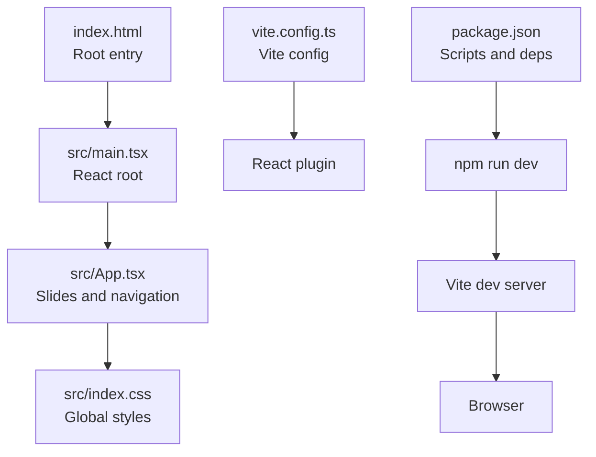
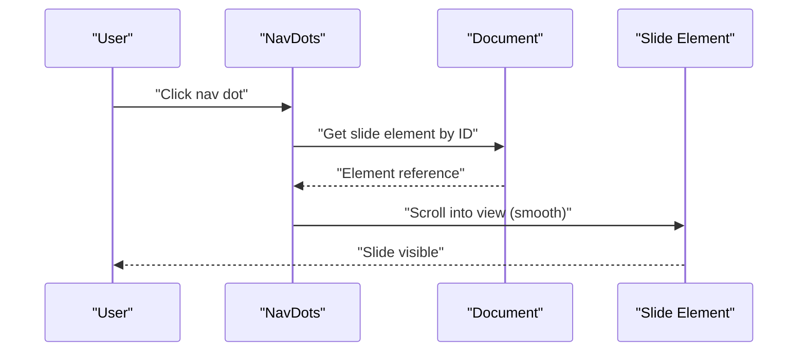

# Getting Started

<cite>
**Referenced Files in This Document**
- [package.json](file://patent-drawing-app/package.json)
- [README.md](file://patent-drawing-app/README.md)
- [vite.config.ts](file://patent-drawing-app/vite.config.ts)
- [index.html](file://patent-drawing-app/index.html)
- [src/main.tsx](file://patent-drawing-app/src/main.tsx)
- [src/App.tsx](file://patent-drawing-app/src/App.tsx)
- [src/index.css](file://patent-drawing-app/src/index.css)
- [tsconfig.json](file://patent-drawing-app/tsconfig.json)
- [tsconfig.app.json](file://patent-drawing-app/tsconfig.app.json)
- [tsconfig.node.json](file://patent-drawing-app/tsconfig.node.json)
- [eslint.config.js](file://patent-drawing-app/eslint.config.js)
</cite>

## Table of Contents
1. [Introduction](#introduction)
2. [Prerequisites](#prerequisites)
3. [Installation](#installation)
4. [Development Environment Setup](#development-environment-setup)
5. [Running Locally](#running-locally)
6. [Project Structure](#project-structure)
7. [Key Dependencies](#key-dependencies)
8. [Build Process](#build-process)
9. [Presentation Interface and Navigation](#presentation-interface-and-navigation)
10. [Verification Steps](#verification-steps)
11. [Troubleshooting Guide](#troubleshooting-guide)
12. [Conclusion](#conclusion)

## Introduction
This guide helps you set up and run the Patent Drawing Application locally. It is a React + TypeScript + Vite project designed as a presentation deck with nine interactive slides covering the architecture, innovation, feasibility, and team behind a patent drawing generation system. The application uses modern tooling for fast development and efficient builds.

## Prerequisites
Before installing and running the application, ensure you have the following installed on your machine:
- Node.js (version compatible with the project dependencies)
- npm (comes bundled with Node.js)

These tools are required to install dependencies, run the development server, and build the project.

**Section sources**
- [package.json:12-29](file://patent-drawing-app/package.json#L12-L29)

## Installation
Follow these steps to install the project locally:

1. **Clone or download the repository** to your local machine.
2. **Navigate to the project directory**:
   ```bash
   cd patent-drawing-app
   ```
3. **Install dependencies**:
   ```bash
   npm install
   ```
   This command reads the dependencies and devDependencies from the package manifest and installs them.

4. **Verify installation**:
   After installation completes, confirm that the node_modules folder exists and contains the installed packages.

**Section sources**
- [package.json:6-11](file://patent-drawing-app/package.json#L6-L11)

## Development Environment Setup
The project is configured with TypeScript and Vite for a modern development experience. Here's what you need to know:

- **TypeScript Configuration**:
  - Root tsconfig references app and node configurations.
  - App configuration targets modern JavaScript and JSX for React.
  - Node configuration targets Node.js runtime for Vite config.

- **Vite Configuration**:
  - Uses the React plugin for fast refresh and JSX transformations.
  - No additional build plugins are configured beyond the React plugin.

- **ESLint Configuration**:
  - Recommended TypeScript and React hooks rules are enabled.
  - Browser globals are configured for linting.

- **HTML Entry Point**:
  - The HTML file defines the root element and loads the main script module.

- **CSS Styling**:
  - Global styles define theme variables, layout, navigation, and slide-specific styles.

**Section sources**
- [tsconfig.json:1-8](file://patent-drawing-app/tsconfig.json#L1-L8)
- [tsconfig.app.json:1-26](file://patent-drawing-app/tsconfig.app.json#L1-L26)
- [tsconfig.node.json:1-25](file://patent-drawing-app/tsconfig.node.json#L1-L25)
- [vite.config.ts:1-8](file://patent-drawing-app/vite.config.ts#L1-L8)
- [eslint.config.js:1-23](file://patent-drawing-app/eslint.config.js#L1-L23)
- [index.html:1-14](file://patent-drawing-app/index.html#L1-L14)
- [src/index.css:1-851](file://patent-drawing-app/src/index.css#L1-L851)

## Running Locally
To run the application in development mode:

1. **Start the development server**:
   ```bash
   npm run dev
   ```
   This starts Vite’s development server with hot module replacement (HMR).

2. **Open the browser**:
   Visit the URL shown in the terminal (typically http://localhost:5173) to view the presentation.

3. **Stop the server**:
   Press Ctrl+C in the terminal to stop the development server.

**Section sources**
- [package.json:6-11](file://patent-drawing-app/package.json#L6-L11)

## Project Structure
The project follows a standard React + TypeScript + Vite layout with a focus on a single-page presentation application:

- Root-level configuration files:
  - package.json: Defines scripts, dependencies, and devDependencies.
  - vite.config.ts: Configures the Vite build tool with the React plugin.
  - tsconfig.json: References app and node TypeScript configurations.
  - tsconfig.app.json: App-side TypeScript compiler options.
  - tsconfig.node.json: Node-side TypeScript compiler options for Vite config.
  - eslint.config.js: ESLint configuration with recommended rules.
  - index.html: Minimal HTML entry point with a root div and script tag.

- Source code:
  - src/main.tsx: Bootstraps the React root and renders the App component.
  - src/App.tsx: Contains nine slide components and navigation logic.
  - src/index.css: Global styles for themes, layouts, navigation, and slide-specific styling.

- Assets:
  - src/assets/: Placeholder for static assets (images, icons, etc.).

- Public assets:
  - public/: Static assets served at the root (e.g., favicon).



**Diagram sources**
- [index.html:1-14](file://patent-drawing-app/index.html#L1-L14)
- [src/main.tsx:1-11](file://patent-drawing-app/src/main.tsx#L1-L11)
- [src/App.tsx:1-445](file://patent-drawing-app/src/App.tsx#L1-L445)
- [src/index.css:1-851](file://patent-drawing-app/src/index.css#L1-L851)
- [vite.config.ts:1-8](file://patent-drawing-app/vite.config.ts#L1-L8)
- [package.json:6-11](file://patent-drawing-app/package.json#L6-L11)

**Section sources**
- [index.html:1-14](file://patent-drawing-app/index.html#L1-L14)
- [src/main.tsx:1-11](file://patent-drawing-app/src/main.tsx#L1-L11)
- [src/App.tsx:1-445](file://patent-drawing-app/src/App.tsx#L1-L445)
- [src/index.css:1-851](file://patent-drawing-app/src/index.css#L1-L851)
- [vite.config.ts:1-8](file://patent-drawing-app/vite.config.ts#L1-L8)
- [package.json:6-11](file://patent-drawing-app/package.json#L6-L11)

## Key Dependencies
The project relies on the following core dependencies:

- **Runtime**:
  - react: ^19.2.6
  - react-dom: ^19.2.6

- **Build and Tooling**:
  - vite: ^8.0.12
  - @vitejs/plugin-react: ^6.0.1

- **TypeScript and Type Definitions**:
  - typescript: ~6.0.2
  - @types/react: ^19.2.14
  - @types/react-dom: ^19.2.3
  - @types/node: ^24.12.3

- **Linting**:
  - eslint: ^10.3.0
  - @eslint/js: ^10.0.1
  - eslint-plugin-react-hooks: ^7.1.1
  - eslint-plugin-react-refresh: ^0.5.2
  - typescript-eslint: ^8.59.2
  - globals: ^17.6.0

These dependencies are declared in the package manifest and are installed automatically during setup.

**Section sources**
- [package.json:12-29](file://patent-drawing-app/package.json#L12-L29)

## Build Process
The project uses Vite for building the application. The build pipeline is defined in the package manifest:

- **Build Script**:
  - tsc -b && vite build
  - First compiles TypeScript declarations, then bundles the application with Vite.

- **Preview Script**:
  - vite preview
  - Starts a local static server to preview the built application.

- **Lint Script**:
  - eslint .
  - Runs ESLint across the project to enforce code quality.

- **Dev Script**:
  - vite
  - Starts the development server with HMR.

After running the build script, the output is served via the preview script for testing.

**Section sources**
- [package.json:6-11](file://patent-drawing-app/package.json#L6-L11)

## Presentation Interface and Navigation
The application presents nine slides organized as React components. Navigation is handled through a floating navigation bar on the right side of the screen:

- **Navigation Bar**:
  - Nine dots correspond to each slide.
  - Hovering over a dot shows a tooltip with the slide label.
  - Clicking a dot smoothly scrolls to the associated slide.

- **Slides**:
  - Title slide: Introduces the project and team.
  - Architecture slide: Explains the three-layer architecture.
  - Innovation slide: Highlights paradigm shifts and comparative advantages.
  - Feasibility slide: Evaluates technical maturity and challenges.
  - Users & Value slide: Describes target users and quantified benefits.
  - Research Matrix slide: Outlines research directions and outcomes.
  - Cross-disciplinary slide: Emphasizes multidisciplinary collaboration.
  - Team slide: Introduces team members and roles.
  - Thanks slide: Closing message.

- **Scroll Behavior**:
  - Smooth scrolling and scroll snap alignment ensure a polished presentation experience.

- **Styling**:
  - Theme variables and responsive layouts provide a cohesive look across slides.



**Diagram sources**
- [src/App.tsx:384-398](file://patent-drawing-app/src/App.tsx#L384-L398)
- [src/App.tsx:401-444](file://patent-drawing-app/src/App.tsx#L401-L444)

**Section sources**
- [src/App.tsx:381-444](file://patent-drawing-app/src/App.tsx#L381-L444)
- [src/index.css:72-125](file://patent-drawing-app/src/index.css#L72-L125)

## Verification Steps
To ensure the application is installed and running correctly:

1. **Install Dependencies**:
   - Confirm node_modules exists after running npm install.

2. **Start Development Server**:
   - Run npm run dev and verify the server starts without errors.
   - Open the displayed URL in a browser.

3. **Test Navigation**:
   - Click the navigation dots to move between slides.
   - Verify smooth scrolling and tooltips appear on hover.

4. **Build Preview**:
   - Run npm run build to compile the project.
   - Run npm run preview to serve the built output locally.
   - Confirm the presentation renders correctly in the preview server.

5. **Lint Check**:
   - Run npm run lint to verify code quality rules pass.

6. **TypeScript Compilation**:
   - Confirm TypeScript configuration files exist and are correctly referenced.

**Section sources**
- [package.json:6-11](file://patent-drawing-app/package.json#L6-L11)
- [src/App.tsx:381-444](file://patent-drawing-app/src/App.tsx#L381-L444)
- [src/index.css:72-125](file://patent-drawing-app/src/index.css#L72-L125)

## Troubleshooting Guide
Common issues and their solutions:

- **Node.js or npm not installed**:
  - Install Node.js LTS from the official website. npm is included with Node.js.

- **Port already in use**:
  - The development server runs on port 5173 by default. Close any conflicting applications or change the port in Vite configuration.

- **Missing dependencies**:
  - Re-run npm install to ensure all dependencies are installed according to package.json.

- **TypeScript errors**:
  - Verify TypeScript configuration files are present and correctly referenced by tsconfig.json.

- **ESLint warnings**:
  - Address linting issues reported by npm run lint or configure ESLint rules as needed.

- **Build failures**:
  - Clean the build cache and reinstall dependencies if the build fails after dependency updates.

- **Navigation not working**:
  - Ensure slide IDs match the navigation logic and that each slide has a unique ID.

- **CSS not applying**:
  - Confirm src/index.css is imported in src/main.tsx and that theme variables are defined.

**Section sources**
- [package.json:6-11](file://patent-drawing-app/package.json#L6-L11)
- [tsconfig.json:1-8](file://patent-drawing-app/tsconfig.json#L1-L8)
- [tsconfig.app.json:1-26](file://patent-drawing-app/tsconfig.app.json#L1-L26)
- [tsconfig.node.json:1-25](file://patent-drawing-app/tsconfig.node.json#L1-L25)
- [eslint.config.js:1-23](file://patent-drawing-app/eslint.config.js#L1-L23)
- [src/main.tsx:1-11](file://patent-drawing-app/src/main.tsx#L1-L11)
- [src/index.css:1-851](file://patent-drawing-app/src/index.css#L1-L851)

## Conclusion
You now have everything needed to install, run, and verify the Patent Drawing Application locally. Use the development server for rapid iteration, the build pipeline for production-ready output, and the navigation system to explore the nine-slide presentation. If you encounter issues, refer to the troubleshooting section and ensure your environment meets the prerequisites.