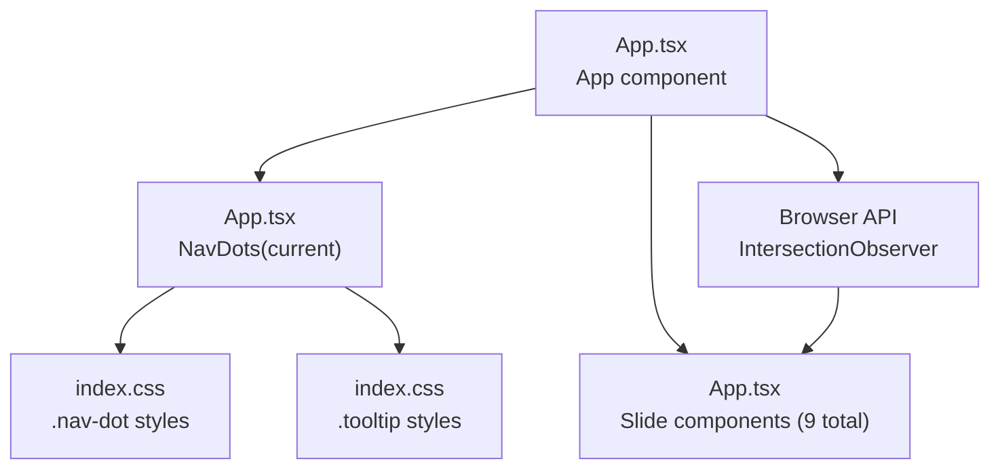
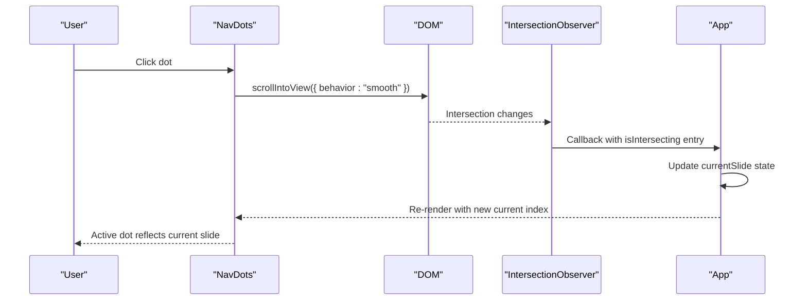
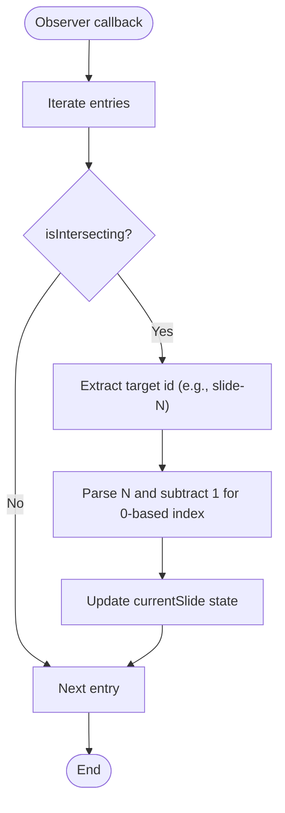
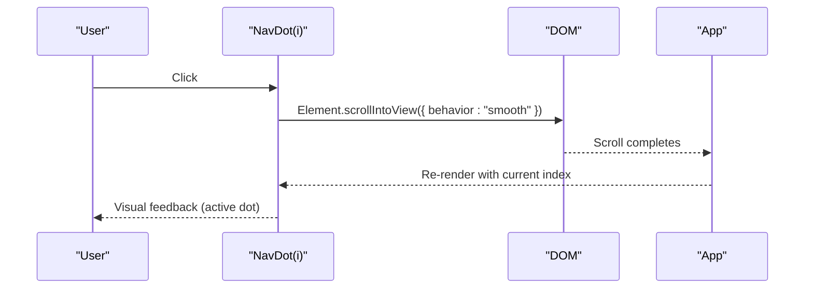
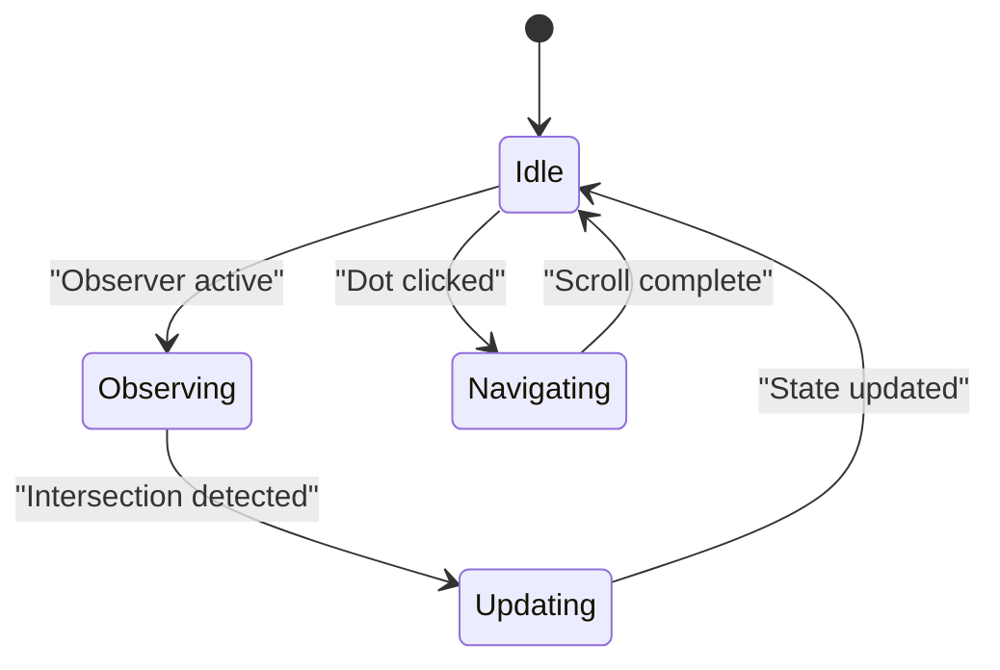
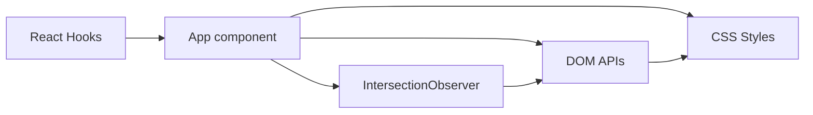

# Navigation System

<cite>
**Referenced Files in This Document**
- [App.tsx](file://src/App.tsx)
- [index.css](file://src/index.css)
</cite>

## Table of Contents
1. [Introduction](#introduction)
2. [Project Structure](#project-structure)
3. [Core Components](#core-components)
4. [Architecture Overview](#architecture-overview)
5. [Detailed Component Analysis](#detailed-component-analysis)
6. [Dependency Analysis](#dependency-analysis)
7. [Performance Considerations](#performance-considerations)
8. [Troubleshooting Guide](#troubleshooting-guide)
9. [Conclusion](#conclusion)

## Introduction
This document explains the navigation system used in the presentation application. It covers how automatic slide detection is implemented using the Intersection Observer API, how manual navigation is supported via clickable dots, and how smooth scrolling behavior is achieved. It also documents slide detection logic, state management for tracking the current slide, visual feedback mechanisms, configuration options, customization possibilities, integration patterns, performance optimization techniques, and cross-browser compatibility considerations.

## Project Structure
The navigation system is implemented within a single React component file and styled with CSS. The structure centers around:
- A navigation bar composed of clickable dots
- A set of slide sections
- A state variable tracking the currently visible slide
- An Intersection Observer observing slide visibility thresholds
- CSS styles for dot appearance, tooltips, and hover effects

**Diagram sources**
- [App.tsx](file://src/App.tsx)
- [index.css](file://src/index.css)

**Section sources**
- [App.tsx](file://src/App.tsx)
- [index.css](file://src/index.css)

## Core Components
- App component
  - Manages current slide index state
  - Initializes and disposes an Intersection Observer
  - Observes nine slide elements by ID
  - Renders the navigation dots and all slide components
- NavDots component
  - Receives the current slide index
  - Renders a dot per slide with tooltip labels
  - Triggers smooth scroll to the selected slide on click
- Slide components
  - Nine distinct sections with IDs from slide-1 to slide-9
  - Each slide displays content appropriate to its topic

Key behaviors:
- Automatic detection updates the current slide when a slide crosses the intersection threshold
- Manual navigation updates the current slide immediately upon clicking a dot
- Smooth scrolling ensures a polished user experience during navigation

**Section sources**
- [App.tsx](file://src/App.tsx)
- [index.css](file://src/index.css)

## Architecture Overview
The navigation system integrates three primary concerns:
- Detection: Intersection Observer monitors slide visibility
- Control: Dots provide manual navigation
- Feedback: Visual indicators reflect the current slide

**Diagram sources**
- [App.tsx](file://src/App.tsx)
- [index.css](file://src/index.css)

## Detailed Component Analysis

### Intersection Observer Implementation
Automatic slide detection relies on the Intersection Observer API:
- Threshold: configured to trigger when half of a slide is visible
- Behavior: on intersecting entries, extracts the slide ID, computes the zero-based index, and updates the current slide state
- Lifecycle: observer is created in a setup effect and disconnected on unmount to prevent leaks

**Diagram sources**
- [App.tsx](file://src/App.tsx)

**Section sources**
- [App.tsx](file://src/App.tsx)

### Manual Navigation Controls (Dots)
Manual navigation is implemented via clickable dots:
- Each dot corresponds to a slide index
- On click, the associated slide scrolls smoothly into view
- Tooltips provide slide labels on hover
- Active dot styling indicates the current slide

**Diagram sources**
- [App.tsx](file://src/App.tsx)
- [index.css](file://src/index.css)

**Section sources**
- [App.tsx](file://src/App.tsx)
- [index.css](file://src/index.css)

### Slide Detection Logic and State Management
- State: A single integer tracks the current slide index
- Detection: Observer updates state when a slide becomes sufficiently visible
- Rendering: NavDots receives the current index and applies active styling to the matching dot
- Consistency: Both automatic and manual navigation update the same state, ensuring UI consistency

**Diagram sources**
- [App.tsx](file://src/App.tsx)

**Section sources**
- [App.tsx](file://src/App.tsx)

### Visual Feedback Mechanisms
Visual feedback includes:
- Active dot highlighting for the current slide
- Hover effects for dots and tooltips
- Smooth transitions for interactive states
- Tooltip labels positioned adjacent to dots

These are implemented via CSS classes and pseudo-states.

**Section sources**
- [index.css](file://src/index.css)

### Configuration Options and Customization
- Threshold tuning: adjust the intersection threshold to require more or less visibility
- Tooltip labels: customize slide labels by editing the label array
- Dot styling: modify dot size, colors, borders, and shadows through CSS
- Tooltip appearance: adjust positioning, background, and transitions
- Smooth scroll behavior: configure scroll options for different UX preferences

Practical customization locations:
- Threshold configuration in the observer initialization
- Tooltip label array for slide names
- CSS variables and selectors for dot and tooltip styles

**Section sources**
- [App.tsx](file://src/App.tsx)
- [index.css](file://src/index.css)

### Integration Patterns
- Slide IDs: ensure each slide has a unique ID in the form slide-N
- Observer registration: register each slide element with the observer during mount
- Dot rendering: render dots based on the total number of slides and current index
- Event-driven updates: keep state updates synchronized with both automatic and manual triggers

**Section sources**
- [App.tsx](file://src/App.tsx)

## Dependency Analysis
The navigation system depends on:
- React hooks for state and lifecycle management
- Browser Intersection Observer API for automatic detection
- DOM APIs for smooth scrolling and element targeting
- CSS for visual styling and responsive layout

**Diagram sources**
- [App.tsx](file://src/App.tsx)
- [index.css](file://src/index.css)

**Section sources**
- [App.tsx](file://src/App.tsx)
- [index.css](file://src/index.css)

## Performance Considerations
- Observer threshold: a 50% threshold balances responsiveness with stability; lowering it increases sensitivity but may cause flicker
- Minimal re-renders: state updates occur only on intersection changes or explicit clicks
- Efficient DOM queries: cache slide references and avoid repeated lookups
- Smooth scroll cost: smooth scrolling is generally lightweight; consider disabling for very large pages if needed
- Cleanup: disconnect the observer on unmount to prevent memory leaks

[No sources needed since this section provides general guidance]

## Troubleshooting Guide
Common issues and resolutions:
- Dots not updating:
  - Verify the observer is connected and registered for all slide elements
  - Confirm the threshold is appropriate for the viewport and slide sizes
- Click navigation not working:
  - Ensure slide IDs match the expected pattern slide-N
  - Check that scrollIntoView is supported in the target browser
- Visual feedback not appearing:
  - Confirm the active class is applied to the correct dot index
  - Verify CSS variables and selectors are defined and not overridden

**Section sources**
- [App.tsx](file://src/App.tsx)
- [index.css](file://src/index.css)

## Conclusion
The navigation system combines automatic slide detection with manual dot-based navigation to deliver a robust, visually appealing experience. Its modular design allows straightforward customization of labels, styling, and behavior while maintaining strong performance characteristics. By understanding the observer configuration, state management, and visual feedback mechanisms, developers can extend and adapt the system to diverse presentation needs.