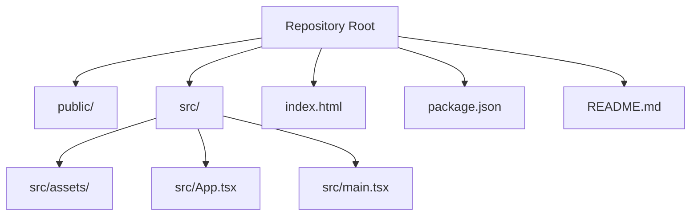
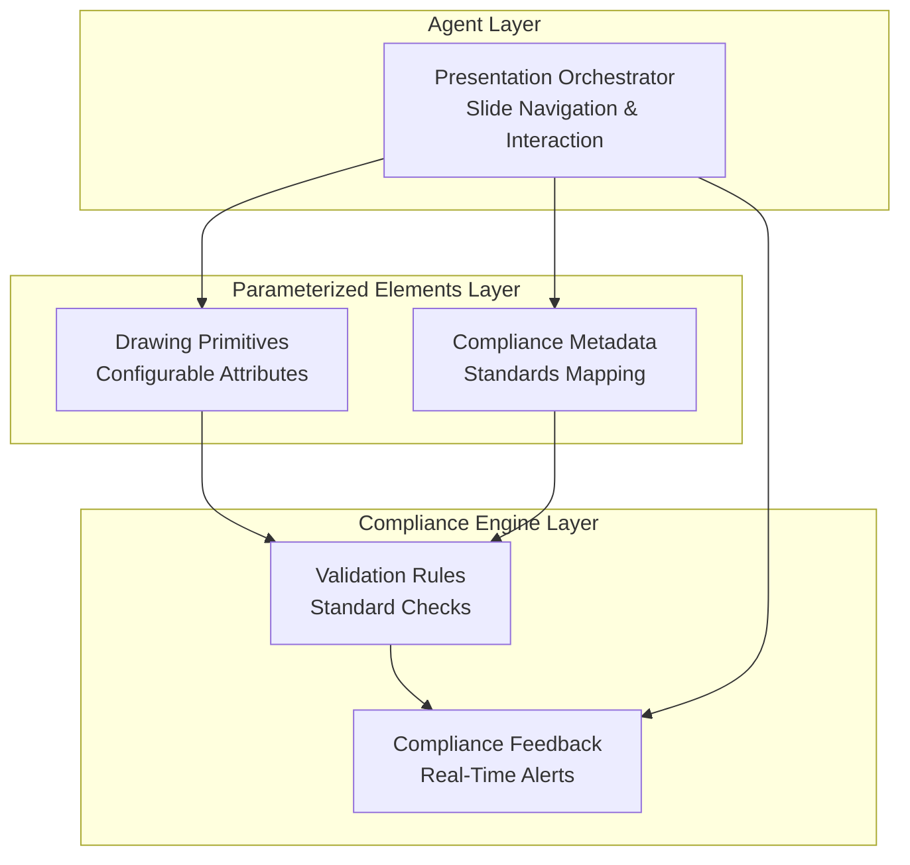
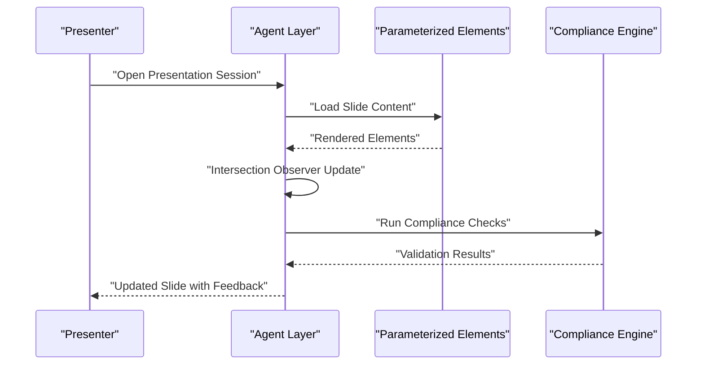
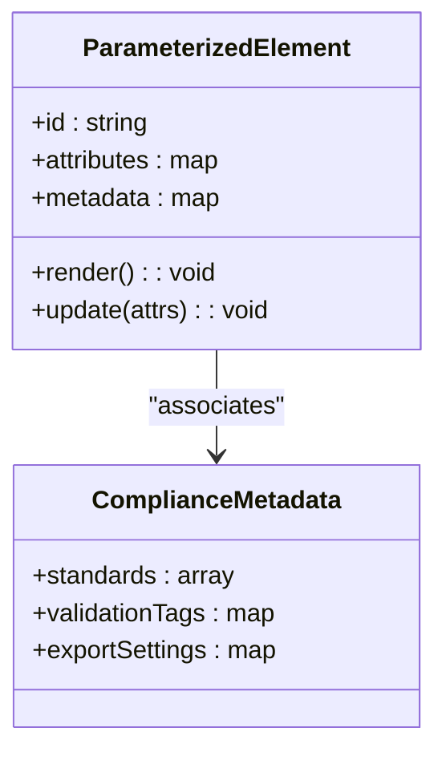
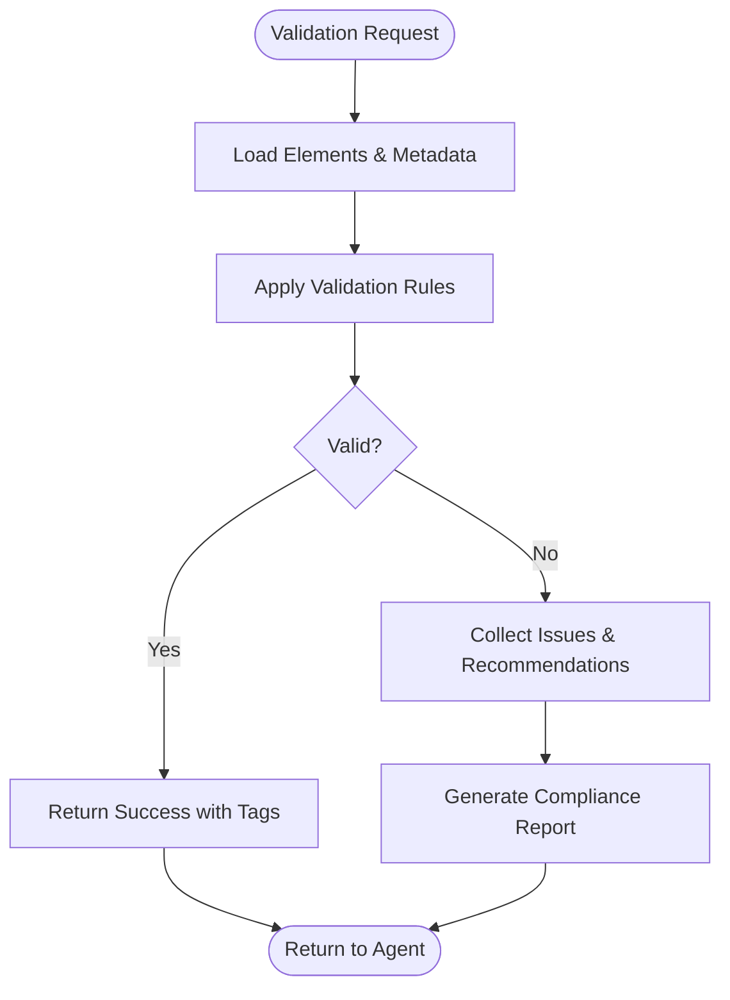
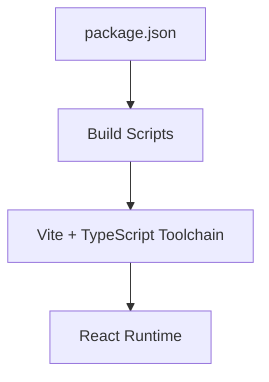

# Project Overview

<cite>
**Referenced Files in This Document**
- [README.md](file://README.md)
- [package.json](file://package.json)
- [src/App.tsx](file://src/App.tsx)
- [src/main.tsx](file://src/main.tsx)
</cite>

## Table of Contents
1. [Introduction](#introduction)
2. [Project Structure](#project-structure)
3. [Core Components](#core-components)
4. [Architecture Overview](#architecture-overview)
5. [Detailed Component Analysis](#detailed-component-analysis)
6. [Dependency Analysis](#dependency-analysis)
7. [Performance Considerations](#performance-considerations)
8. [Troubleshooting Guide](#troubleshooting-guide)
9. [Conclusion](#conclusion)

## Introduction
This project is a Patent Drawing Application designed as a three-layer hybrid architecture presentation system for generating patent drawings. It targets presenters and stakeholders who need a slide-based presentation workflow to visualize, review, and iterate on patent-related figures and compliance metadata. The system’s core value proposition lies in combining structured parameterization with automated compliance checks to streamline the creation of standardized patent materials while maintaining flexibility for customization.

The application follows a hybrid architecture that separates concerns across:
- Agent Layer: orchestrates high-level presentation logic and user interactions
- Parameterized Elements Layer: manages reusable, configurable drawing components
- Compliance Engine Layer: enforces standards and validations during rendering

These layers work together to support a slide-based presentation model, enabling incremental updates and real-time feedback via intersection observer patterns for responsive rendering.

## Project Structure
At a high level, the project is a frontend application bootstrapped with Vite and TypeScript. The runtime entry initializes the React application, which renders the main application shell. The repository also includes a README with project goals and a package manifest defining build tooling and dependencies.

**Diagram sources**
- [src/App.tsx](file://src/App.tsx)
- [src/main.tsx](file://src/main.tsx)
- [package.json](file://package.json)
- [README.md](file://README.md)

**Section sources**
- [src/App.tsx](file://src/App.tsx)
- [src/main.tsx](file://src/main.tsx)
- [package.json](file://package.json)
- [README.md](file://README.md)

## Core Components
- Slide-Based Presentation Shell: The application provides a presentation framework suitable for patent drawing slides, enabling sequential navigation and interactive updates.
- Intersection Observer Integration: Rendering responsiveness is supported through intersection observer patterns, allowing components to adapt based on visibility and viewport changes.
- Hybrid Architecture Foundation: The layered design supports modular development, testability, and scalability across the Agent, Parameterized Elements, and Compliance Engine layers.

Practical example of the presentation workflow:
- Start a new slide-based session
- Add parameterized drawing elements (e.g., shapes, annotations) with adjustable attributes
- Trigger compliance checks to validate against standards
- Iterate on the slide until compliant and ready for stakeholder review

Benefits:
- Consistent rendering pipeline across slides
- Real-time feedback via intersection observer-based visibility handling
- Clear separation of concerns enabling independent evolution of each layer

**Section sources**
- [src/App.tsx](file://src/App.tsx)
- [src/main.tsx](file://src/main.tsx)
- [README.md](file://README.md)

## Architecture Overview
The Patent Drawing Application adopts a three-layer hybrid architecture tailored for slide-based presentations:

- Agent Layer: Manages presentation orchestration, user interactions, and slide lifecycle
- Parameterized Elements Layer: Provides reusable, configurable drawing primitives and metadata
- Compliance Engine Layer: Enforces standards and validations during rendering and export

[No sources needed since this diagram shows conceptual architecture, not a direct code mapping]

## Detailed Component Analysis
This section provides a conceptual deep dive into the three-layer hybrid architecture and how it enables a robust slide-based presentation system.

### Agent Layer
Responsibilities:
- Slide orchestration and navigation
- User interaction handling
- Integration with intersection observer for responsive rendering
- Coordination with Parameterized Elements and Compliance Engine layers

Conceptual workflow:
- Initialize presentation session
- Render current slide with parameterized elements
- Observe element visibility and adjust rendering accordingly
- Collect compliance feedback and update slide state

[No sources needed since this diagram shows conceptual workflow, not actual code structure]

### Parameterized Elements Layer
Responsibilities:
- Provide reusable drawing primitives with adjustable attributes
- Maintain compliance metadata alongside visual elements
- Support incremental updates and batch operations

Conceptual data model:
- Elements: configurable shapes, lines, and annotations
- Metadata: standards mapping, validation tags, and export settings

[No sources needed since this diagram shows conceptual model, not actual code structure]

### Compliance Engine Layer
Responsibilities:
- Enforce standards and validation rules
- Provide real-time feedback during rendering
- Integrate with export pipelines for compliant outputs

Conceptual flow:
- Receive elements and metadata from Parameterized Elements
- Apply validation rules and generate compliance report
- Return feedback to Agent Layer for presentation updates

[No sources needed since this diagram shows conceptual flow, not actual code structure]

## Dependency Analysis
The project relies on modern frontend tooling and a minimal React-based runtime. The package manifest defines build scripts and toolchain dependencies that support TypeScript compilation and Vite-based bundling.

**Diagram sources**
- [package.json](file://package.json)

**Section sources**
- [package.json](file://package.json)

## Performance Considerations
- Intersection Observer Responsiveness: Use intersection observer patterns to defer rendering of offscreen elements and reduce layout thrashing during slide transitions.
- Parameterized Element Caching: Cache frequently used parameterized elements to minimize recomputation and improve slide switching performance.
- Compliance Engine Batching: Batch validation requests to avoid redundant checks and leverage incremental updates for faster feedback loops.

[No sources needed since this section provides general guidance]

## Troubleshooting Guide
Common issues and resolutions:
- Presentation not initializing: Verify the main entrypoint and ensure the application shell is mounted correctly.
- Elements not rendering: Confirm parameterized elements are properly configured and metadata is attached.
- Compliance checks failing: Review validation rules and ensure standards mapping aligns with the current slide content.

[No sources needed since this section provides general guidance]

## Conclusion
The Patent Drawing Application demonstrates a practical three-layer hybrid architecture tailored for slide-based patent drawing workflows. By separating orchestration, parameterization, and compliance into distinct layers, the system delivers a scalable, maintainable foundation for presenters and stakeholders to collaborate on standardized patent materials. The integration of intersection observer patterns and a parameterized element model ensures responsive, efficient rendering and iteration.

[No sources needed since this section summarizes without analyzing specific files]