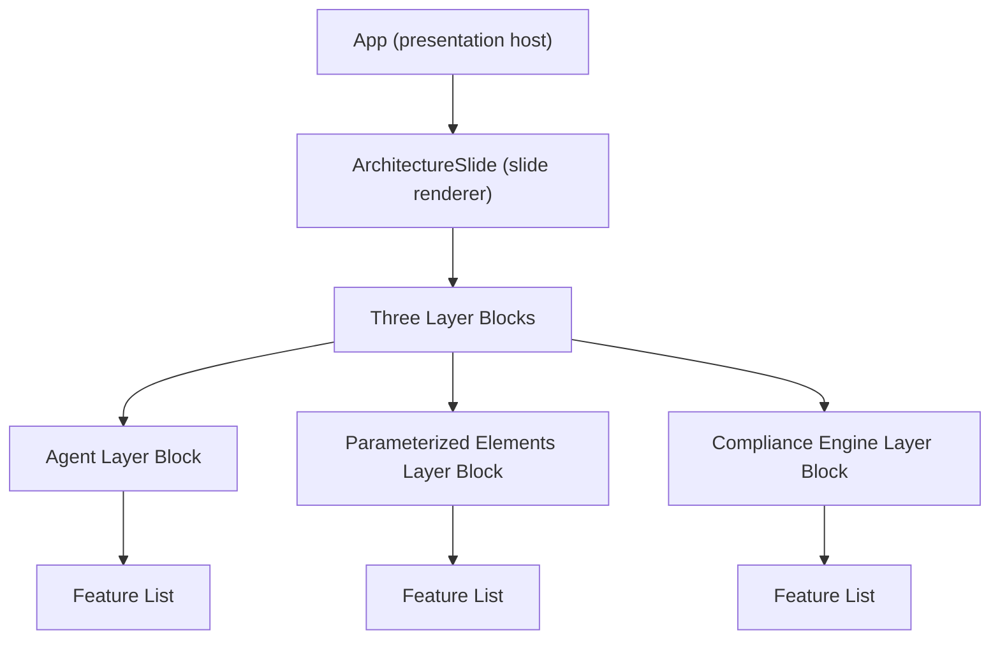
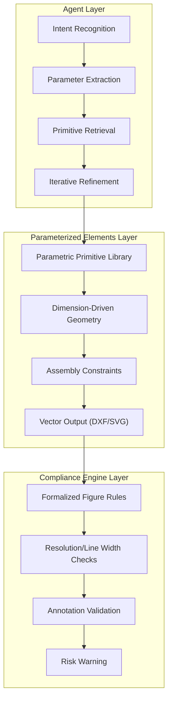
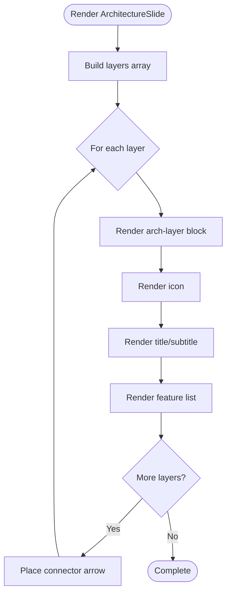
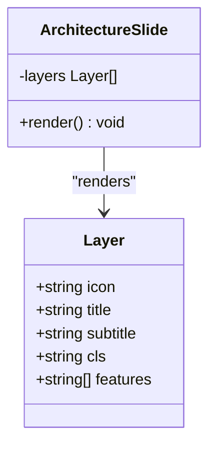
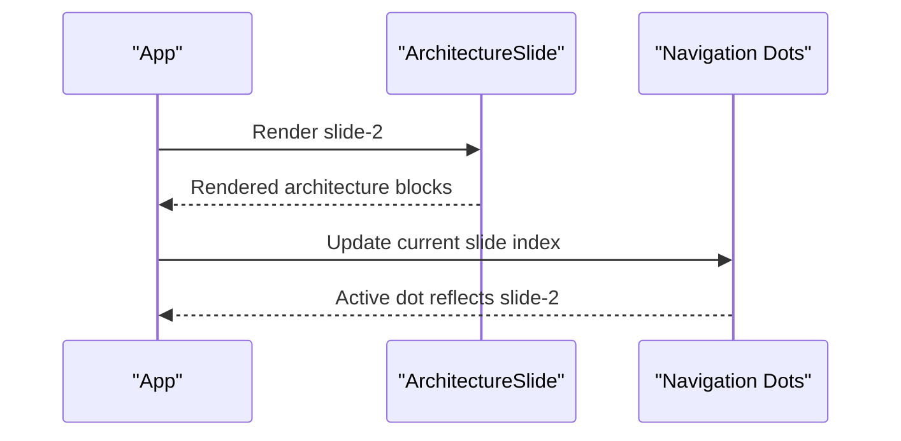
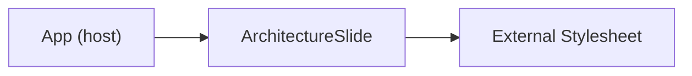

# Architecture Slide Component

<cite>
**Referenced Files in This Document**
- [App.tsx](file://src/App.tsx)
</cite>

## Table of Contents
1. [Introduction](#introduction)
2. [Project Structure](#project-structure)
3. [Core Components](#core-components)
4. [Architecture Overview](#architecture-overview)
5. [Detailed Component Analysis](#detailed-component-analysis)
6. [Dependency Analysis](#dependency-analysis)
7. [Performance Considerations](#performance-considerations)
8. [Troubleshooting Guide](#troubleshooting-guide)
9. [Conclusion](#conclusion)

## Introduction
This document explains the Architecture Slide component that presents a three-layer hybrid architecture for a patent drawing generation system. The slide communicates a clear technical foundation by visualizing the Agent layer (natural language interaction), the Parameterized Elements layer (parametric CAD primitives and vector output), and the Compliance Engine layer (automated patent figure validation). It demonstrates architectural visualization techniques, technical complexity, and the innovation paradigm behind combining conversational AI, parametric modeling, and rule-based validation.

## Project Structure
The architecture slide is implemented as a React functional component within the main application. It leverages a simple, declarative data model to render layered content with icons, titles, subtitles, and feature lists. The slide is integrated into the full-page presentation via the App component’s slide navigation system.

**Diagram sources**
- [App.tsx:30-79](file://src/App.tsx#L30-L79)

**Section sources**
- [App.tsx:30-79](file://src/App.tsx#L30-L79)

## Core Components
- ArchitectureSlide: Renders the three-layer architecture visualization with icons, titles, subtitles, and feature bullets. It defines the layer data structure and composes the visual layout with inter-layer connectors.
- App: Hosts the slide deck and orchestrates navigation. The architecture slide is included among nine total slides.

Key implementation details:
- Layer data model: Each layer includes an icon, title, subtitle, CSS class for styling, and a list of features.
- Layout: Uses a horizontal flex arrangement with inter-layer connectors to imply data flow and collaboration.
- Styling hooks: CSS classes per layer enable consistent visual hierarchy and color coding.

**Section sources**
- [App.tsx:30-79](file://src/App.tsx#L30-L79)
- [App.tsx:401-444](file://src/App.tsx#L401-L444)

## Architecture Overview
The three-layer hybrid architecture is presented as a cohesive pipeline:
- Agent layer: Natural language understanding and instruction orchestration.
- Parameterized Elements layer: Parametric primitives, constraint solving, and vector output.
- Compliance Engine layer: Automated validation against patent figure standards.

**Diagram sources**
- [App.tsx:32-53](file://src/App.tsx#L32-L53)

## Detailed Component Analysis

### ArchitectureSlide Component
The component encapsulates the slide rendering logic:
- Data-driven rendering: Iterates over the layers array to render each block.
- Visual connectors: Places inter-layer arrows between blocks to indicate flow.
- Feature lists: Renders each layer’s features as bullet points.

**Diagram sources**
- [App.tsx:30-79](file://src/App.tsx#L30-L79)

**Section sources**
- [App.tsx:30-79](file://src/App.tsx#L30-L79)

### Data Model and Rendering Logic
The component’s data model is a simple array of layer objects. Each object contains:
- icon: Emoji icon representing the layer.
- title: Primary layer name.
- subtitle: Short descriptor.
- cls: CSS class for styling.
- features: Array of feature strings.

Rendering logic:
- Map over layers to produce blocks.
- Conditionally render inter-layer connectors.
- Render feature bullets using a nested map.

**Diagram sources**
- [App.tsx:32-53](file://src/App.tsx#L32-L53)

**Section sources**
- [App.tsx:32-53](file://src/App.tsx#L32-L53)

### Integration with Presentation Host
The slide participates in the full-page presentation:
- App maintains a list of slides and renders them sequentially.
- Navigation dots reflect the current slide index.
- The architecture slide is the second slide in the sequence.

**Diagram sources**
- [App.tsx:401-444](file://src/App.tsx#L401-L444)

**Section sources**
- [App.tsx:401-444](file://src/App.tsx#L401-L444)

## Dependency Analysis
- Internal dependencies: ArchitectureSlide depends on its internal data model and React rendering. It does not import external modules.
- Presentation host: App manages slide lifecycle and navigation; ArchitectureSlide is one of nine slides rendered by App.
- Styling: Uses CSS classes defined elsewhere in the project to achieve visual separation and color coding per layer.

**Diagram sources**
- [App.tsx:401-444](file://src/App.tsx#L401-L444)
- [App.tsx:30-79](file://src/App.tsx#L30-L79)

**Section sources**
- [App.tsx:401-444](file://src/App.tsx#L401-L444)
- [App.tsx:30-79](file://src/App.tsx#L30-L79)

## Performance Considerations
- Rendering cost: The component uses small arrays and simple maps; rendering cost is negligible.
- Reusability: The data model pattern allows easy extension or modification of layers without changing rendering logic.
- No heavy computations: The slide is static content; no intensive calculations occur during render.

## Troubleshooting Guide
Common issues and resolutions:
- Missing icons or inconsistent styling: Verify CSS class names and ensure the stylesheet defines styles for the layer classes and feature lists.
- Connector placement: Confirm that inter-layer arrows are only rendered between adjacent layers.
- Data mismatches: Ensure the layers array length matches expectations; verify that each layer object includes required fields (icon, title, subtitle, cls, features).

**Section sources**
- [App.tsx:30-79](file://src/App.tsx#L30-L79)

## Conclusion
The Architecture Slide component effectively communicates a three-layer hybrid architecture through a clean, data-driven React implementation. It emphasizes the innovation paradigm of combining conversational AI, parametric modeling, and automated compliance validation. The slide’s structure and rendering logic provide a clear, extensible foundation for presenting the system’s technical architecture and complexity.