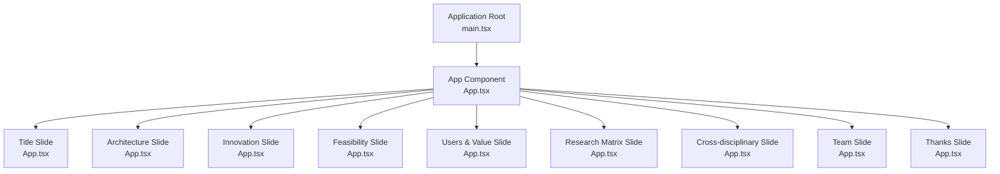
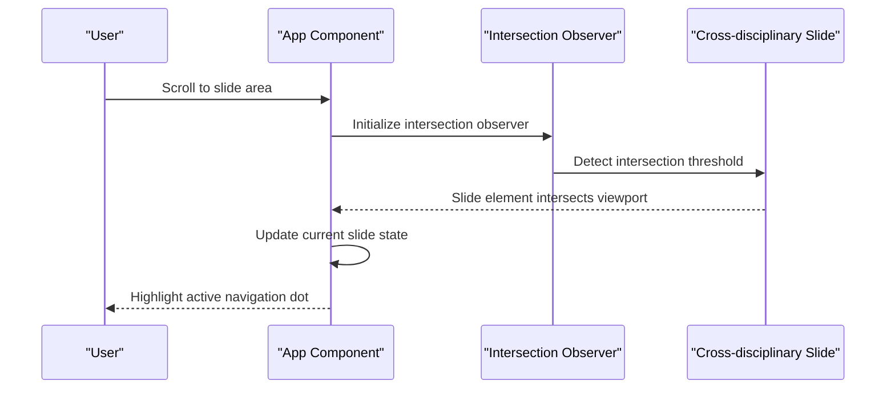
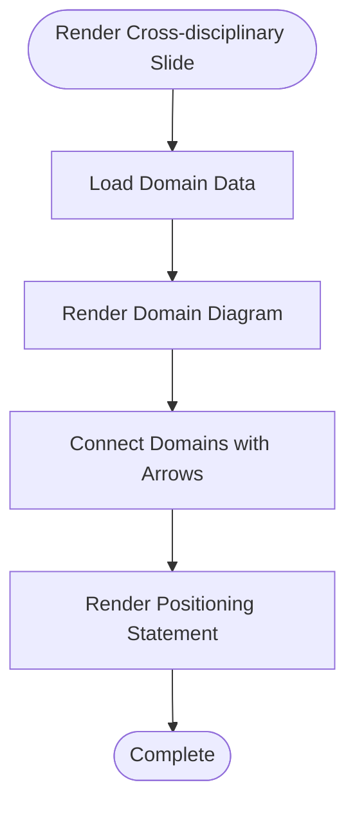
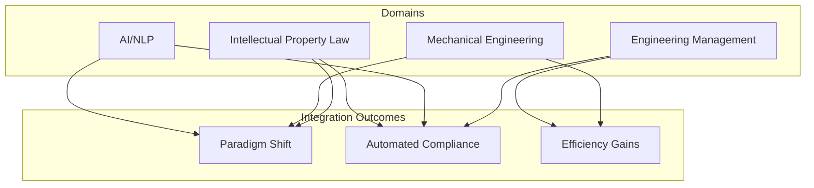
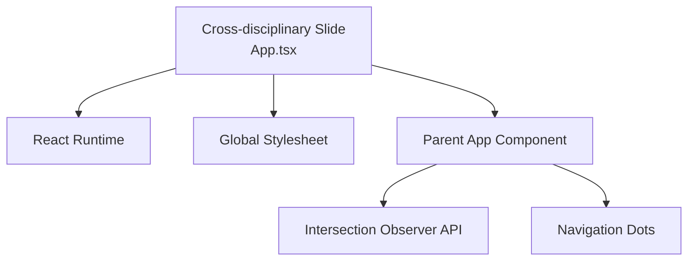

# Cross-disciplinary Slide Component

<cite>
**Referenced Files in This Document**
- [App.tsx](file://src/App.tsx)
- [main.tsx](file://src/main.tsx)
- [package.json](file://package.json)
- [README.md](file://README.md)
</cite>

## Table of Contents
1. [Introduction](#introduction)
2. [Project Structure](#project-structure)
3. [Core Components](#core-components)
4. [Architecture Overview](#architecture-overview)
5. [Detailed Component Analysis](#detailed-component-analysis)
6. [Dependency Analysis](#dependency-analysis)
7. [Performance Considerations](#performance-considerations)
8. [Troubleshooting Guide](#troubleshooting-guide)
9. [Conclusion](#conclusion)

## Introduction
This document provides comprehensive documentation for the Cross-disciplinary Slide component within the Patent Drawing Application. The component focuses on showcasing multi-disciplinary integration, collaboration strategies, and diverse expertise that collectively demonstrate how the system bridges different fields to create innovative solutions. It highlights the synthesis of AI/NLP, mechanical engineering, intellectual property law, and engineering management to deliver a cohesive, cross-domain solution.

## Project Structure
The application is a React + TypeScript project built with Vite. The presentation is composed of nine distinct slides, each encapsulated as a dedicated component. The Cross-disciplinary Slide (Slide 7) specifically emphasizes the integration of four key domains: AI/NLP, mechanical engineering, intellectual property law, and engineering management. The slide visually represents the interconnections among these domains and positions the project as an architecture-innovation topic that leverages AI software development capabilities.

**Diagram sources**
- [main.tsx:1-11](file://src/main.tsx#L1-L11)
- [App.tsx:401-444](file://src/App.tsx#L401-L444)

**Section sources**
- [main.tsx:1-11](file://src/main.tsx#L1-L11)
- [package.json:1-31](file://package.json#L1-L31)

## Core Components
The Cross-disciplinary Slide component is implemented as a standalone React functional component. It renders a structured layout that includes:
- A domain diagram showing four interconnected domains: AI/NLP, mechanical engineering, intellectual property law, and engineering management.
- A positioning statement that elevates the project's scope from an engineering application to an architecture-innovation topic, emphasizing the unique paradigm and alignment with AI software development backgrounds.

Key implementation characteristics:
- Uses a mapping pattern to iterate over domain data and render interactive domain cards.
- Employs directional arrows to indicate relationships and collaboration pathways between domains.
- Includes a highlighted positioning box that communicates strategic value and innovation framing.

**Section sources**
- [App.tsx:289-323](file://src/App.tsx#L289-L323)

## Architecture Overview
The Cross-disciplinary Slide integrates with the broader application architecture by participating in the slide navigation system. The main App component orchestrates slide visibility using an intersection observer and exposes navigation dots for user control. The Cross-disciplinary Slide is positioned as the seventh slide in the sequence, following the Research Matrix Slide and preceding the Team Slide.

**Diagram sources**
- [App.tsx:401-444](file://src/App.tsx#L401-L444)
- [App.tsx:405-428](file://src/App.tsx#L405-L428)

**Section sources**
- [App.tsx:401-444](file://src/App.tsx#L401-L444)

## Detailed Component Analysis

### Cross-disciplinary Slide Implementation
The Cross-disciplinary Slide component encapsulates the multi-domain integration narrative through:
- Domain representation: Four domains are rendered as cards with icons, names, and descriptions.
- Interdomain connections: Arrows visually connect domains to illustrate collaborative pathways.
- Strategic positioning: A dedicated box communicates how the project's scope has evolved to an architecture-innovation topic, highlighting paradigm uniqueness and AI software development alignment.

**Diagram sources**
- [App.tsx:289-323](file://src/App.tsx#L289-L323)

**Section sources**
- [App.tsx:289-323](file://src/App.tsx#L289-L323)

### Collaboration Strategies and Expertise Showcase
The component demonstrates collaboration strategies by:
- Presenting a balanced view of four distinct domains, each contributing specialized knowledge.
- Emphasizing the interplay between technical capabilities (AI/NLP), design expertise (mechanical engineering), legal compliance (intellectual property law), and organizational coordination (engineering management).
- Framing the project as a paradigm shift that leverages AI software development strengths while addressing real-world engineering and legal needs.

Examples of cross-domain applications highlighted in the component:
- AI/NLP + Mechanical Engineering: Natural language-driven parameterized drawing generation.
- AI/NLP + Intellectual Property Law: Automated compliance checking aligned with patent review guidelines.
- Mechanical Engineering + Intellectual Property Law: Parameterized drawing outputs that satisfy formal requirements.
- Engineering Management + AI Software Development: Coordinated project execution and delivery.

Collaborative success stories showcased:
- The project's positioning as an architecture-innovation topic, indicating successful integration of diverse expertise.
- The emphasis on paradigm uniqueness and alignment with AI software development backgrounds, reflecting effective cross-domain collaboration.

**Section sources**
- [App.tsx:289-323](file://src/App.tsx#L289-L323)

### Multi-disciplinary Integration Approach
The component illustrates a multi-disciplinary integration approach through:
- Visual mapping of domain contributions and their relationships.
- Strategic positioning that elevates the project scope to an architecture-innovation topic.
- Clear communication of how each domain contributes to the overall solution and how they work together to address complex requirements.

**Diagram sources**
- [App.tsx:289-323](file://src/App.tsx#L289-L323)

**Section sources**
- [App.tsx:289-323](file://src/App.tsx#L289-L323)

## Dependency Analysis
The Cross-disciplinary Slide component relies on the shared application infrastructure:
- React runtime for component rendering and state management.
- CSS classes defined in the global stylesheet for styling and layout.
- Navigation and intersection observer logic managed by the parent App component.

External dependencies (as declared in the project configuration):
- React and React DOM for UI rendering.
- Vite for development server and build tooling.
- TypeScript for type safety and enhanced developer experience.

**Diagram sources**
- [App.tsx:401-444](file://src/App.tsx#L401-L444)
- [package.json:12-29](file://package.json#L12-L29)

**Section sources**
- [package.json:12-29](file://package.json#L12-L29)

## Performance Considerations
- Rendering efficiency: The component uses simple mapping patterns over small datasets, minimizing re-render overhead.
- Intersection observer: The parent App component efficiently manages slide visibility detection, reducing unnecessary computations.
- Styling: CSS-based animations and transitions are used sparingly to maintain smooth scrolling and navigation experiences.

## Troubleshooting Guide
Common issues and resolutions:
- Slide not visible: Ensure the slide element exists in the DOM and the intersection observer threshold is configured appropriately.
- Navigation dots not highlighting: Verify that the current slide index updates correctly when the slide enters the viewport.
- Styling inconsistencies: Confirm that global CSS classes match the component's expected selectors and that responsive styles are applied.

**Section sources**
- [App.tsx:405-428](file://src/App.tsx#L405-L428)

## Conclusion
The Cross-disciplinary Slide component serves as a focal point for demonstrating how the Patent Drawing Application integrates diverse expertise across AI/NLP, mechanical engineering, intellectual property law, and engineering management. By visually connecting these domains and articulating the project's positioning as an architecture-innovation topic, the component effectively communicates the system's capability to bridge different fields and create innovative solutions through interdisciplinary collaboration. The implementation leverages React's component model and the parent App's navigation infrastructure to deliver a cohesive, cross-domain narrative that aligns with the project's strategic goals.