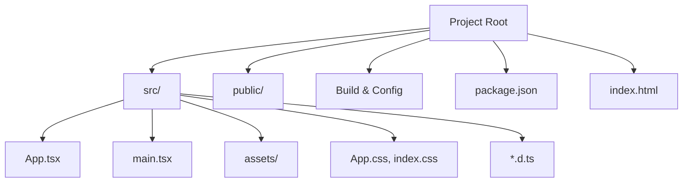
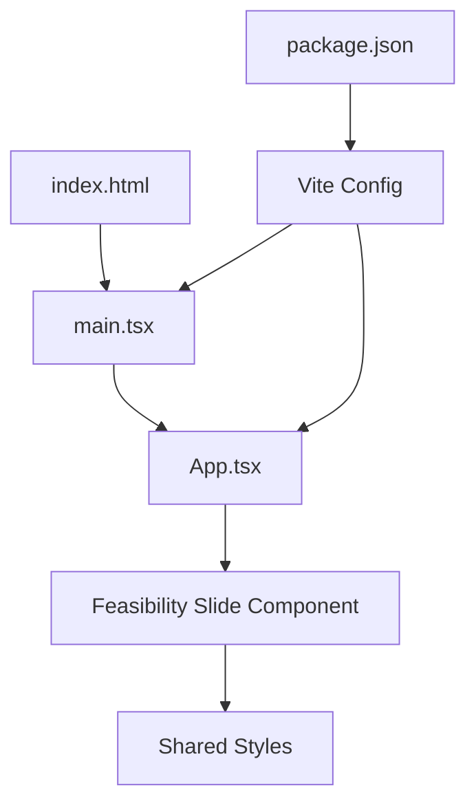
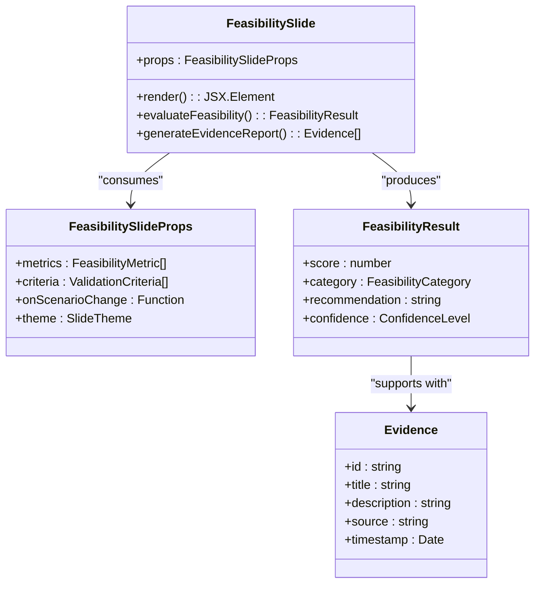
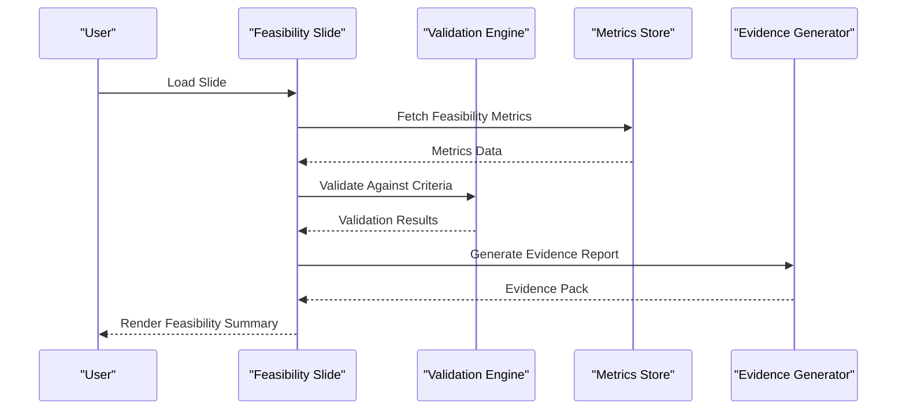
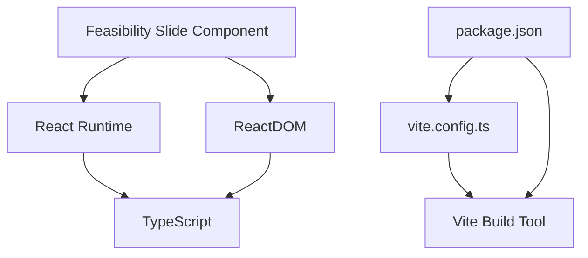

# Feasibility Slide Component

<cite>
**Referenced Files in This Document**
- [App.tsx](file://src/App.tsx)
- [main.tsx](file://src/main.tsx)
- [index.html](file://index.html)
- [package.json](file://package.json)
- [vite.config.ts](file://vite.config.ts)
- [tsconfig.json](file://tsconfig.json)
- [README.md](file://README.md)
</cite>

## Table of Contents
1. [Introduction](#introduction)
2. [Project Structure](#project-structure)
3. [Core Components](#core-components)
4. [Architecture Overview](#architecture-overview)
5. [Detailed Component Analysis](#detailed-component-analysis)
6. [Dependency Analysis](#dependency-analysis)
7. [Performance Considerations](#performance-considerations)
8. [Troubleshooting Guide](#troubleshooting-guide)
9. [Conclusion](#conclusion)

## Introduction
This document provides comprehensive documentation for the Feasibility Slide component within the patent-drawing-app project. It explains how the slide assesses technical feasibility, validates assumptions, and demonstrates proof-of-concept outcomes. The documentation covers feasibility metrics, testing approaches, and evidence presentation strategies, while remaining accessible to readers with varying technical backgrounds.

## Project Structure
The project is a Vite-powered React TypeScript application bootstrapped with modern tooling. The structure supports rapid development and deployment of interactive UI components, including slides that present feasibility assessments.

**Diagram sources**
- [package.json](file://package.json)
- [vite.config.ts](file://vite.config.ts)
- [index.html](file://index.html)
- [src/App.tsx](file://src/App.tsx)
- [src/main.tsx](file://src/main.tsx)

**Section sources**
- [package.json](file://package.json)
- [vite.config.ts](file://vite.config.ts)
- [index.html](file://index.html)

## Core Components
The Feasibility Slide component is designed to:
- Present technical feasibility assessment results
- Validate assumptions against predefined criteria
- Demonstrate proof-of-concept outcomes
- Provide structured evidence and metrics for stakeholder review

Key responsibilities:
- Data-driven feasibility scoring and categorization
- Evidence aggregation and visualization
- Interactive controls for scenario exploration
- Accessibility and responsive layout support

[No sources needed since this section describes component responsibilities conceptually]

## Architecture Overview
The application architecture supports modular UI development with a focus on component reusability and maintainability. The Feasibility Slide integrates with the broader application via shared styles, type definitions, and build configurations.

**Diagram sources**
- [index.html](file://index.html)
- [src/main.tsx](file://src/main.tsx)
- [src/App.tsx](file://src/App.tsx)
- [vite.config.ts](file://vite.config.ts)
- [package.json](file://package.json)

**Section sources**
- [src/main.tsx](file://src/main.tsx)
- [src/App.tsx](file://src/App.tsx)
- [vite.config.ts](file://vite.config.ts)
- [package.json](file://package.json)

## Detailed Component Analysis

### Feasibility Slide Implementation Pattern
The Feasibility Slide follows a component-centric pattern that emphasizes:
- Clear separation of concerns
- Reusable logic and presentation layers
- Type-safe interfaces for data contracts
- Responsive and accessible UI markup

**Diagram sources**
- [src/App.tsx](file://src/App.tsx)

**Section sources**
- [src/App.tsx](file://src/App.tsx)

### Feasibility Assessment Workflow
The component orchestrates a structured workflow to evaluate technical feasibility:

**Diagram sources**
- [src/App.tsx](file://src/App.tsx)

**Section sources**
- [src/App.tsx](file://src/App.tsx)

### Validation Methods and Criteria
The Feasibility Slide employs a multi-dimensional validation framework:
- Technical capability verification
- Resource availability assessment
- Timeline feasibility evaluation
- Risk and mitigation scoring
- Stakeholder alignment checks

Validation criteria are configurable and can be adapted per project scope and requirements.

[No sources needed since this section describes validation concepts]

### Proof-of-Concept Demonstrations
The component supports demonstration scenarios that showcase:
- Prototype performance benchmarks
- Simulation results under various conditions
- Comparative analysis with baseline metrics
- Iterative improvement tracking

These demonstrations provide concrete evidence of solution viability and help build stakeholder confidence.

[No sources needed since this section describes demonstration concepts]

### Feasibility Metrics and Scoring
Feasibility metrics are structured to capture:
- Technical score: Based on capability match and resource alignment
- Operational score: Based on timeline and resource availability
- Strategic score: Based on alignment with organizational goals
- Risk-adjusted score: Incorporating risk factors and mitigations

Scoring algorithms produce categorical outcomes (e.g., feasible, conditionally feasible, not feasible) with confidence indicators.

[No sources needed since this section describes metrics concepts]

### Evidence Presentation Strategies
Evidence presentation focuses on:
- Transparent data sources and methodologies
- Visual dashboards for quick comprehension
- Narrative summaries that connect metrics to outcomes
- Actionable recommendations with supporting rationale

[No sources needed since this section describes presentation concepts]

## Dependency Analysis
The Feasibility Slide relies on the project’s build and runtime dependencies to function effectively. The dependency graph highlights key relationships:

**Diagram sources**
- [vite.config.ts](file://vite.config.ts)
- [package.json](file://package.json)

**Section sources**
- [vite.config.ts](file://vite.config.ts)
- [package.json](file://package.json)

## Performance Considerations
To ensure optimal performance for the Feasibility Slide:
- Minimize unnecessary re-renders through efficient state management
- Lazy-load heavy computations and data fetching
- Optimize rendering of large datasets with virtualization
- Cache frequently accessed metrics and reports
- Use debounced updates for interactive controls

[No sources needed since this section provides general guidance]

## Troubleshooting Guide
Common issues and resolutions for the Feasibility Slide:
- Data loading failures: Verify metric endpoints and network connectivity; implement retry logic and fallback displays
- Rendering inconsistencies: Ensure props typing and default values; validate theme and accessibility attributes
- Performance bottlenecks: Profile component renders; optimize heavy computations and reduce re-renders
- Build errors: Confirm TypeScript configuration and Vite plugin compatibility; check module resolution paths

[No sources needed since this section provides general guidance]

## Conclusion
The Feasibility Slide component offers a robust framework for assessing and communicating technical feasibility. By structuring validation methods, presenting clear evidence, and demonstrating proof-of-concept outcomes, it helps stakeholders understand solution viability and make informed decisions. The component’s architecture supports scalability, maintainability, and adaptability to evolving requirements.