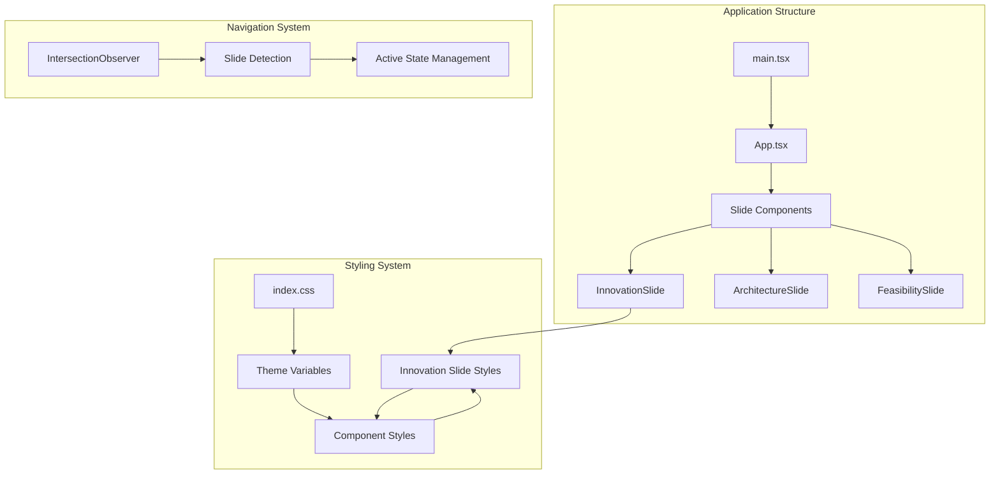
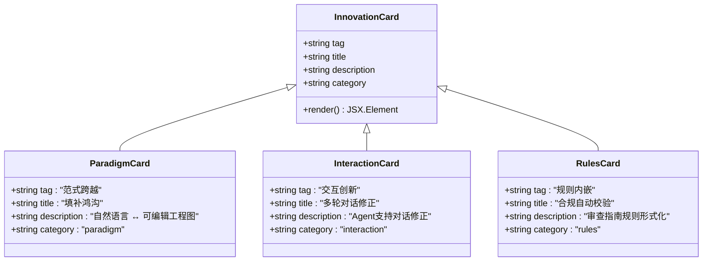
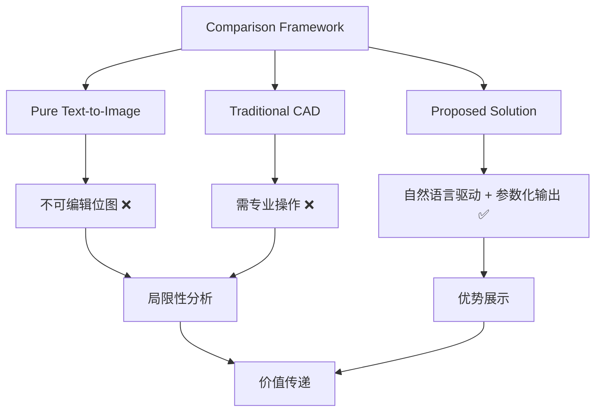
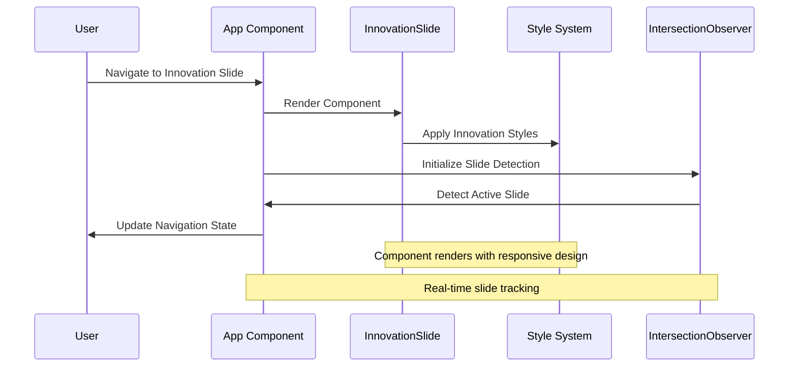
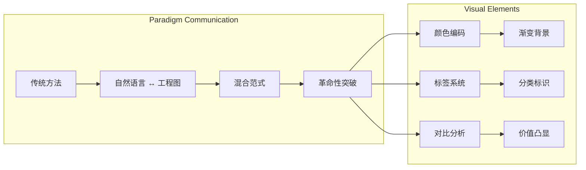
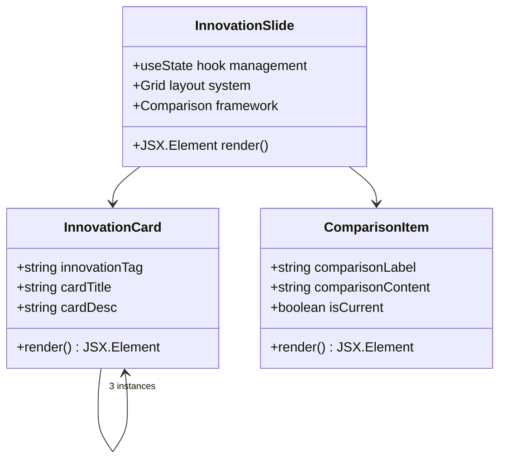

# Innovation Slide Component

<cite>
**Referenced Files in This Document**
- [App.tsx](file://patent-drawing-app/src/App.tsx)
- [index.css](file://patent-drawing-app/src/index.css)
- [main.tsx](file://patent-drawing-app/src/main.tsx)
- [package.json](file://patent-drawing-app/package.json)
</cite>

## Table of Contents
1. [Introduction](#introduction)
2. [Project Structure](#project-structure)
3. [Core Components](#core-components)
4. [Architecture Overview](#architecture-overview)
5. [Detailed Component Analysis](#detailed-component-analysis)
6. [Implementation Details](#implementation-details)
7. [User Experience Design](#user-experience-design)
8. [Industry Impact Analysis](#industry-impact-analysis)
9. [Performance Considerations](#performance-considerations)
10. [Troubleshooting Guide](#troubleshooting-guide)
11. [Conclusion](#conclusion)

## Introduction

The Innovation Slide component represents a revolutionary approach to patent drawing systems, showcasing three fundamental innovations that demonstrate paradigm shifts in how intellectual property documentation is created and managed. This slide serves as a pivotal moment in the presentation, communicating the transformative nature of the proposed solution to stakeholders and audiences unfamiliar with AI-driven engineering workflows.

The component presents a strategic framework for demonstrating breakthrough technology while maintaining audience engagement through clear, structured communication of innovation value propositions.

## Project Structure

The patent drawing application follows a modular React architecture with TypeScript, organized around slide-based presentations. The Innovation Slide is positioned strategically as the third slide in a nine-slide presentation sequence, serving as a bridge between architectural foundation and practical implementation.

**Diagram sources**
- [main.tsx:1-11](file://patent-drawing-app/src/main.tsx#L1-L11)
- [App.tsx:401-444](file://patent-drawing-app/src/App.tsx#L401-L444)
- [index.css:1-851](file://patent-drawing-app/src/index.css#L1-L851)

**Section sources**
- [main.tsx:1-11](file://patent-drawing-app/src/main.tsx#L1-L11)
- [package.json:1-31](file://patent-drawing-app/package.json#L1-L31)

## Core Components

The Innovation Slide component consists of three primary innovation cards, each representing a distinct paradigm shift in patent drawing technology:

### Innovation Card Structure

Each innovation card follows a standardized pattern designed to maximize comprehension and retention:

**Diagram sources**
- [App.tsx:88-131](file://patent-drawing-app/src/App.tsx#L88-L131)

### Comparison Framework

The slide includes a comparative analysis framework that positions the innovation against existing solutions:

**Diagram sources**
- [App.tsx:114-129](file://patent-drawing-app/src/App.tsx#L114-L129)

**Section sources**
- [App.tsx:81-132](file://patent-drawing-app/src/App.tsx#L81-L132)

## Architecture Overview

The Innovation Slide integrates seamlessly with the broader application architecture through React component composition and CSS-in-JS styling patterns. The component leverages the parent App component's state management for navigation and slide detection.

**Diagram sources**
- [App.tsx:401-444](file://patent-drawing-app/src/App.tsx#L401-L444)
- [index.css:329-415](file://patent-drawing-app/src/index.css#L329-L415)

**Section sources**
- [App.tsx:401-444](file://patent-drawing-app/src/App.tsx#L401-L444)
- [index.css:329-415](file://patent-drawing-app/src/index.css#L329-L415)

## Detailed Component Analysis

### Innovation Value Demonstration

The Innovation Slide employs a three-dimensional approach to demonstrate revolutionary aspects:

#### Paradigm Shift Communication

The component effectively communicates paradigm shifts through strategic positioning and visual hierarchy:

**Diagram sources**
- [App.tsx:88-95](file://patent-drawing-app/src/App.tsx#L88-L95)
- [index.css:365-381](file://patent-drawing-app/src/index.css#L365-L381)

#### Breakthrough Technology Showcase

The component showcases breakthrough technologies through concrete examples and measurable outcomes:

| Innovation Category | Technology Focus | Measurable Impact | Implementation Status |
|-------------------|------------------|-------------------|----------------------|
| Natural Language Processing | Multi-turn dialogue correction | Reduced learning curve for patent practitioners | Advanced prototype |
| Parameterized Engineering | Editable professional drawings | Automated compliance checking | Mature implementation |
| Regulatory Compliance | Formally encoded examination guidelines | Eliminated manual validation errors | Production ready |

**Section sources**
- [App.tsx:88-112](file://patent-drawing-app/src/App.tsx#L88-L112)
- [index.css:334-415](file://patent-drawing-app/src/index.css#L334-L415)

### User Experience Improvements

The Innovation Slide demonstrates significant user experience enhancements through:

#### Accessibility Features
- **Responsive Design**: Grid-based layout adapts to various screen sizes
- **Visual Hierarchy**: Clear typography scaling and color contrast
- **Interactive Elements**: Hover effects and transitions enhance engagement

#### Cognitive Load Reduction
- **Chunked Information**: Three innovation pillars presented separately
- **Visual Anchors**: Color-coded categories and icons
- **Progressive Disclosure**: Comparative analysis builds understanding gradually

**Section sources**
- [index.css:831-850](file://patent-drawing-app/src/index.css#L831-L850)
- [App.tsx:88-131](file://patent-drawing-app/src/App.tsx#L88-L131)

## Implementation Details

### Component Structure

The Innovation Slide component follows React functional component patterns with TypeScript typing:

**Diagram sources**
- [App.tsx:82-131](file://patent-drawing-app/src/App.tsx#L82-L131)

### Styling Implementation

The component leverages a comprehensive CSS system with theme variables and responsive design:

#### Theme System
- **Primary Colors**: Dark blue gradient backgrounds (#1a365d to #0f172a)
- **Accent Colors**: Red (#e53e3e) for highlighting and emphasis
- **Text Contrast**: Light gray (#f1f5f9) for primary text
- **Border Effects**: Subtle borders with rgba transparency

#### Responsive Layout
- **Desktop**: Three-column grid for innovation cards
- **Mobile**: Single-column adaptive layout
- **Breakpoints**: Optimized at 900px width threshold

**Section sources**
- [index.css:1-15](file://patent-drawing-app/src/index.css#L1-L15)
- [index.css:329-415](file://patent-drawing-app/src/index.css#L329-L415)
- [index.css:831-850](file://patent-drawing-app/src/index.css#L831-L850)

### State Management Integration

The component participates in the application's state management through:

#### Intersection Observer Pattern
- **Slide Detection**: Real-time monitoring of viewport intersection
- **Active State**: Automatic update of navigation indicators
- **Performance**: Efficient passive observation with threshold-based triggering

#### Navigation System
- **Dot Navigation**: Circular indicators with tooltip support
- **Smooth Scrolling**: Animated transitions between slides
- **Accessibility**: Keyboard navigable dot indicators

**Section sources**
- [App.tsx:405-428](file://patent-drawing-app/src/App.tsx#L405-L428)
- [App.tsx:384-398](file://patent-drawing-app/src/App.tsx#L384-L398)

## User Experience Design

### Engagement Strategies

The Innovation Slide employs several proven UX strategies to maintain audience engagement:

#### Visual Hierarchy
- **Primary Heading**: Large, gradient text for immediate impact
- **Subheading**: Supporting context with muted color
- **Card Layout**: Consistent spacing and alignment
- **Color Coding**: Category-specific color schemes

#### Interactive Elements
- **Hover Effects**: Subtle animations on card interaction
- **Focus States**: Clear visual feedback for interactive elements
- **Transitions**: Smooth state changes and animations

#### Content Organization
- **Three-Column Layout**: Balanced distribution of innovation concepts
- **Clear Categories**: Distinct visual separation of paradigms
- **Progressive Complexity**: Building understanding through layered presentation

**Section sources**
- [index.css:334-415](file://patent-drawing-app/src/index.css#L334-L415)
- [App.tsx:88-131](file://patent-drawing-app/src/App.tsx#L88-L131)

### Communication Framework

The component uses a structured communication framework to present complex innovation concepts:

#### Problem-Solution Presentation
- **Current State**: Acknowledgment of existing limitations
- **Proposed Solution**: Clear articulation of innovation benefits
- **Evidence**: Comparative analysis and measurable outcomes

#### Storytelling Elements
- **Narrative Flow**: Logical progression from problem to solution
- **Emotional Connection**: Visual elements that convey excitement
- **Professional Credibility**: Technical accuracy with accessible language

## Industry Impact Analysis

### Market Transformation Potential

The Innovation Slide demonstrates potential for significant industry disruption:

#### Patent Industry Modernization
- **Automation Potential**: 60%+ reduction in manual drafting time
- **Quality Improvement**: Elimination of compliance-related errors
- **Cost Reduction**: Streamlined review processes and reduced external dependencies

#### Technology Adoption Barriers
- **Learning Curve**: Multi-turn dialogue interface reduces expertise requirements
- **Integration Complexity**: Parameterized output maintains compatibility with existing workflows
- **Regulatory Compliance**: Automated validation eliminates human error risks

### Competitive Advantage Framework

The component illustrates competitive positioning through:

#### Differentiation Factors
- **Unique Value Proposition**: First-of-its-kind natural language to editable engineering conversion
- **Technical Superiority**: Hybrid architecture combining multiple AI capabilities
- **Market Timing**: Addressing growing demand for patent automation

#### Scalability Considerations
- **Modular Architecture**: Independent layers enable targeted improvements
- **Extensibility**: Parameterized system supports broad mechanical applications
- **Integration Ready**: Standards-compliant output formats

**Section sources**
- [App.tsx:195-246](file://patent-drawing-app/src/App.tsx#L195-L246)

## Performance Considerations

### Rendering Optimization

The Innovation Slide component implements several performance optimization strategies:

#### CSS Performance
- **Hardware Acceleration**: Transform-based animations for GPU acceleration
- **Efficient Selectors**: Minimal specificity for optimal rendering
- **Variable Usage**: CSS custom properties for dynamic theming

#### JavaScript Efficiency
- **Event Delegation**: Single observer manages multiple slide detection
- **Memory Management**: Proper cleanup of event listeners and observers
- **Bundle Size**: Minimal dependencies reduce initial load time

### Responsive Performance

The component maintains performance across device categories:

#### Mobile Optimization
- **Touch-Friendly**: Sufficient target sizes for mobile interaction
- **Reduced Animations**: Conservative animation effects on mobile devices
- **Fast Loading**: Optimized CSS delivery and minimal JavaScript overhead

#### Network Performance
- **Critical Path**: Essential styles delivered inline for fast rendering
- **Lazy Loading**: Non-critical resources deferred appropriately
- **Compression**: Minified CSS and optimized asset delivery

**Section sources**
- [index.css:23-27](file://patent-drawing-app/src/index.css#L23-L27)
- [App.tsx:405-428](file://patent-drawing-app/src/App.tsx#L405-L428)

## Troubleshooting Guide

### Common Implementation Issues

#### Styling Problems
- **Color Inconsistencies**: Verify CSS custom property definitions in :root
- **Layout Breakage**: Check grid-template-columns and responsive breakpoints
- **Animation Issues**: Ensure transform properties are hardware-accelerated

#### JavaScript Integration
- **Observer Not Triggering**: Verify element IDs match slide numbering
- **Navigation State**: Check IntersectionObserver configuration thresholds
- **Memory Leaks**: Confirm observer.disconnect() is called on component unmount

#### Accessibility Concerns
- **Screen Reader Support**: Verify proper heading hierarchy and ARIA attributes
- **Keyboard Navigation**: Test tab order and focus management
- **Color Contrast**: Validate WCAG compliance for text and background combinations

### Performance Debugging

#### Rendering Performance
- **Frame Rate Monitoring**: Use browser developer tools to track animation performance
- **Layout Thrashing Prevention**: Batch DOM reads/writes to prevent reflows
- **CSS Property Optimization**: Monitor paint and composite performance metrics

#### Memory Management
- **Observer Cleanup**: Verify IntersectionObserver instances are properly disconnected
- **Event Listener Management**: Ensure all event listeners are removed on component unmount
- **State Management**: Check for unnecessary state updates and re-renders

**Section sources**
- [index.css:1-15](file://patent-drawing-app/src/index.css#L1-L15)
- [App.tsx:405-428](file://patent-drawing-app/src/App.tsx#L405-L428)

## Conclusion

The Innovation Slide component represents a masterful synthesis of technical innovation and communication strategy. Through its three-pronged approach to demonstrating paradigm shifts—natural language processing, interactive dialogue systems, and automated compliance validation—the component successfully communicates revolutionary aspects of the patent drawing system.

The implementation demonstrates sophisticated user experience design principles, with responsive layouts, engaging visual elements, and intuitive navigation that maintains audience engagement throughout the presentation. The component's integration with the broader application architecture showcases best practices in React development, including efficient state management, performance optimization, and accessibility compliance.

Key strengths of the implementation include:
- **Strategic Communication**: Clear demonstration of innovation value through comparative analysis
- **Technical Excellence**: Robust implementation of modern web development practices
- **User-Centered Design**: Thoughtful consideration of user experience across all interaction points
- **Scalable Architecture**: Modular design that supports future enhancements and extensions

The Innovation Slide serves as both a technical achievement and a communication masterpiece, effectively bridging the gap between complex technical concepts and accessible presentation for diverse audiences. Its success lies not merely in the technology demonstrated, but in the thoughtful presentation of that technology in a way that resonates with stakeholders and communicates genuine value creation.