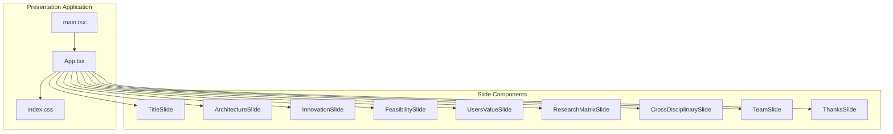
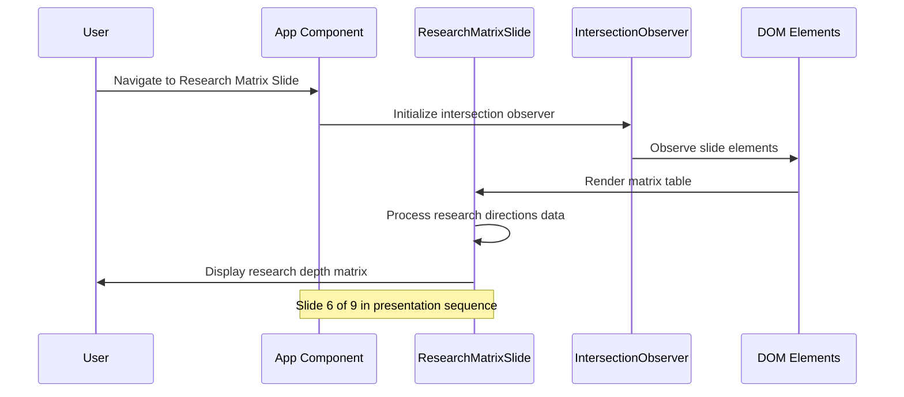
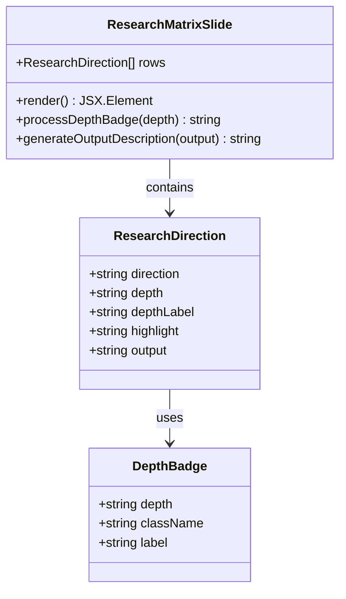
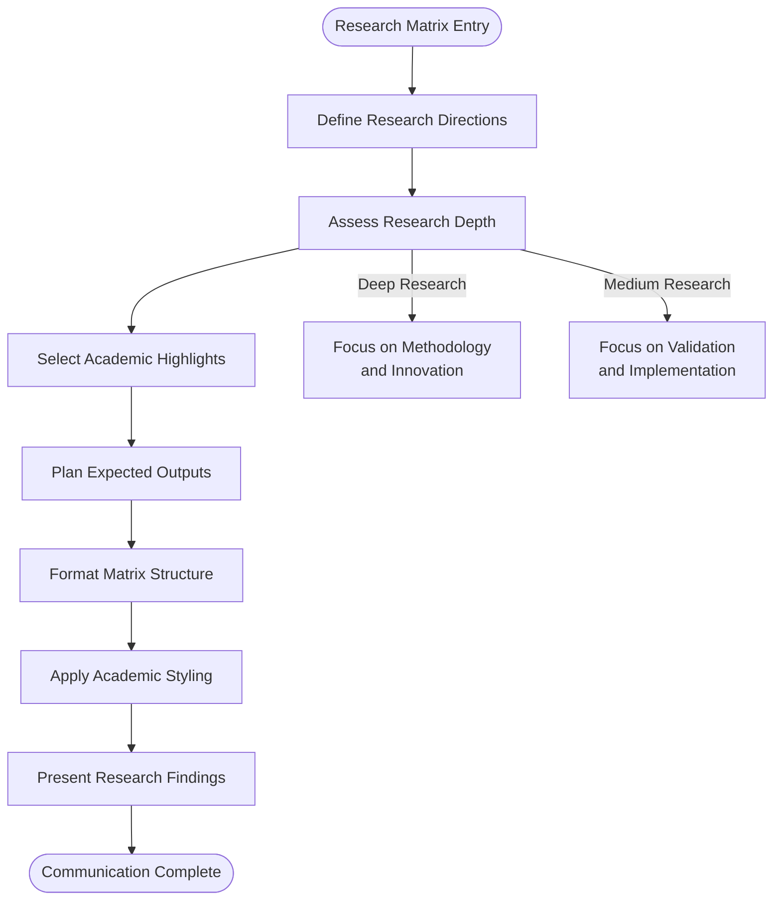
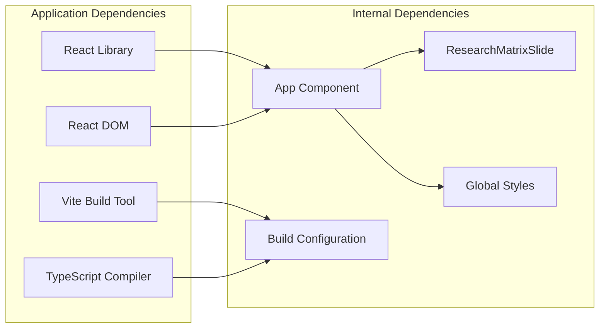

# Research Matrix Slide Component

<cite>
**Referenced Files in This Document**
- [App.tsx](file://src/App.tsx)
- [index.css](file://src/index.css)
- [main.tsx](file://src/main.tsx)
- [package.json](file://package.json)
- [tsconfig.json](file://tsconfig.json)
</cite>

## Table of Contents
1. [Introduction](#introduction)
2. [Project Structure](#project-structure)
3. [Core Components](#core-components)
4. [Architecture Overview](#architecture-overview)
5. [Detailed Component Analysis](#detailed-component-analysis)
6. [Dependency Analysis](#dependency-analysis)
7. [Performance Considerations](#performance-considerations)
8. [Troubleshooting Guide](#troubleshooting-guide)
9. [Conclusion](#conclusion)

## Introduction
This document provides comprehensive documentation for the Research Matrix Slide component within the Patent Drawing System presentation. The slide communicates the scientific rigor and academic foundation of the patent drawing system by presenting a structured research depth matrix that demonstrates the breadth and depth of academic and technical contributions across four key research directions. It showcases how the system integrates research methodology, academic partnerships, and publication achievements to establish a scholarly foundation for the proposed solution.

## Project Structure
The Research Matrix Slide is part of a React-based presentation application built with TypeScript and Vite. The project follows a modular structure where each slide is implemented as a separate functional component within the main App component. The presentation consists of nine distinct slides covering topics from project introduction to team collaboration and academic positioning.

**Diagram sources**
- [main.tsx:1-11](file://src/main.tsx#L1-L11)
- [App.tsx:401-444](file://src/App.tsx#L401-L444)

**Section sources**
- [main.tsx:1-11](file://src/main.tsx#L1-L11)
- [package.json:1-31](file://package.json#L1-L31)
- [tsconfig.json:1-8](file://tsconfig.json#L1-L8)

## Core Components
The Research Matrix Slide component is implemented as a dedicated functional component within the main App.tsx file. It presents a structured matrix that communicates the research depth, academic focus, and expected outcomes across four critical research directions. The component leverages React's functional programming model with hooks for state management and utilizes CSS classes for styling and responsive design.

Key characteristics of the component:
- **Modular Design**: Implemented as a standalone functional component
- **Data-Driven Content**: Uses a structured data array to populate matrix rows
- **Responsive Layout**: Adapts to different screen sizes and orientations
- **Visual Hierarchy**: Employs typography and spacing to emphasize research depth
- **Interactive Elements**: Includes hover effects and navigation indicators

**Section sources**
- [App.tsx:248-287](file://src/App.tsx#L248-L287)
- [index.css:581-637](file://src/index.css#L581-L637)

## Architecture Overview
The Research Matrix Slide participates in a larger presentation architecture that combines React components with CSS-in-JS styling and intersection observer technology for smooth navigation. The slide is positioned as the sixth of nine slides in the presentation sequence, strategically placed after foundational content about system architecture and innovation value.

**Diagram sources**
- [App.tsx:401-444](file://src/App.tsx#L401-L444)
- [App.tsx:248-287](file://src/App.tsx#L248-L287)

The slide architecture follows these design principles:
- **Progressive Disclosure**: Research depth increases from medium to deep across rows
- **Academic Alignment**: Each research direction corresponds to established academic domains
- **Outcome Focus**: Clear expectations for research outputs and contributions
- **Visual Differentiation**: Distinct styling for deep versus medium research depth

## Detailed Component Analysis

### Research Matrix Structure and Methodology
The Research Matrix Slide presents a systematic approach to organizing and communicating the academic rigor of the patent drawing system. The matrix follows a four-quadrant framework that demonstrates both breadth and depth of research contributions.

**Diagram sources**
- [App.tsx:249-255](file://src/App.tsx#L249-L255)

The matrix structure incorporates several methodological elements:
- **Research Depth Classification**: Clear distinction between deep and medium research depth
- **Academic Domain Coverage**: Integration of AI/NLP, mechanical engineering, intellectual property law, and engineering management
- **Expected Output Tracking**: Specific deliverables for each research area
- **Methodological Rigor**: Emphasis on formality and systematic approach

### Academic Integration Demonstration
The slide demonstrates academic integration through several key mechanisms:

**Interdisciplinary Research Framework**:
- AI and Natural Language Processing for agent interactions
- Mechanical engineering for parametric modeling
- Intellectual property law for compliance validation
- Engineering management for project coordination

**Research Methodology Components**:
- Formal research methodology with systematic approach
- Academic partnership recognition across multiple disciplines
- Publication-ready outcomes and deliverables
- Evidence-based research depth assessment

**Scholarly Contribution Showcase**:
- Expected research outputs as academic contributions
- Integration of domain expertise from multiple academic fields
- Systematic approach to problem-solving and innovation
- Demonstrated capability to bridge theoretical and practical applications

### Research Depth Communication Strategy
The slide employs a strategic communication approach to convey research depth and academic rigor:

**Diagram sources**
- [App.tsx:249-287](file://src/App.tsx#L249-L287)

The communication strategy emphasizes:
- **Clarity of Purpose**: Each research direction has a clear academic focus
- **Evidence of Depth**: Distinction between deep and medium research approaches
- **Academic Credibility**: Integration of recognized academic domains
- **Future-Oriented Outcomes**: Clear expectations for research contributions

### Visual Presentation and Academic Standards
The slide maintains academic standards through its visual presentation:

**Typography and Layout**:
- Professional heading hierarchy with clear section titles
- Consistent spacing and alignment for readability
- Academic color scheme with professional gradients
- Responsive design for various presentation contexts

**Content Organization**:
- Logical progression from research directions to outcomes
- Clear visual differentiation between research depths
- Professional table formatting for data presentation
- Consistent styling across all slide types

**Section sources**
- [App.tsx:248-287](file://src/App.tsx#L248-L287)
- [index.css:581-637](file://src/index.css#L581-L637)

## Dependency Analysis
The Research Matrix Slide component has specific dependencies and relationships within the broader application ecosystem:

**Diagram sources**
- [package.json:12-28](file://package.json#L12-L28)
- [main.tsx:1-11](file://src/main.tsx#L1-L11)

The component's dependencies include:
- **React Ecosystem**: Core React library and DOM rendering
- **Build Tools**: Vite for development and production builds
- **TypeScript Support**: Type safety and modern JavaScript features
- **Styling Infrastructure**: CSS-in-JS approach with global styles
- **Navigation System**: Intersection observer for slide management

**Section sources**
- [package.json:1-31](file://package.json#L1-L31)
- [tsconfig.json:1-8](file://tsconfig.json#L1-L8)

## Performance Considerations
The Research Matrix Slide component is designed with performance optimization in mind:

**Rendering Efficiency**:
- Pure functional component with minimal re-renders
- Efficient data structure for research directions
- CSS classes for styling rather than inline styles
- Optimized layout for different screen sizes

**Memory Management**:
- No persistent state within the component
- Lightweight data structures for research information
- Efficient event handling for navigation
- Minimal DOM manipulation

**Accessibility Considerations**:
- Semantic HTML structure for screen readers
- Sufficient color contrast for readability
- Keyboard navigable interface elements
- Responsive design for various devices

## Troubleshooting Guide
Common issues and solutions for the Research Matrix Slide component:

**Rendering Issues**:
- Verify proper data structure for research directions
- Check CSS class names for correct styling application
- Ensure intersection observer is properly initialized
- Confirm slide numbering matches presentation sequence

**Styling Problems**:
- Validate CSS variable definitions in global stylesheet
- Check for conflicting style declarations
- Verify responsive design breakpoints
- Ensure proper gradient and color scheme application

**Content Display Issues**:
- Confirm research depth classification accuracy
- Verify expected output descriptions match research goals
- Check academic highlight relevance to research directions
- Validate matrix table structure and formatting

**Section sources**
- [App.tsx:401-444](file://src/App.tsx#L401-L444)
- [index.css:581-637](file://src/index.css#L581-L637)

## Conclusion
The Research Matrix Slide component serves as a crucial element in demonstrating the scientific rigor and academic foundation of the Patent Drawing System. Through its structured presentation of research directions, depth classifications, and expected outcomes, the slide effectively communicates the interdisciplinary nature of the project and its alignment with established academic methodologies.

The component successfully bridges the gap between technical innovation and scholarly presentation, showcasing how the system integrates multiple academic domains while maintaining focus on practical application. Its design reflects both the depth of research conducted and the clarity of academic communication necessary for effective presentation to diverse audiences.

The slide's effectiveness lies in its ability to present complex research information in an organized, visually appealing format that enhances understanding while maintaining academic credibility. This approach positions the Patent Drawing System as a serious academic endeavor with substantial research backing and clear scholarly contributions.