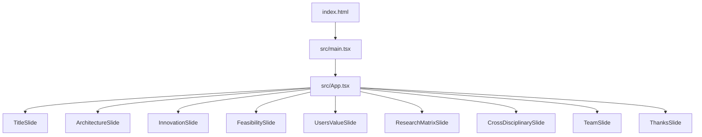
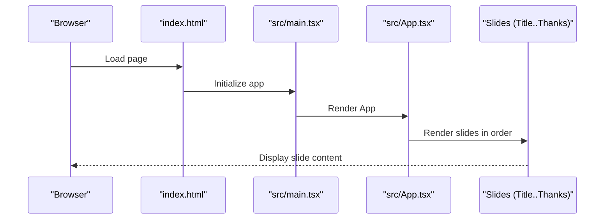
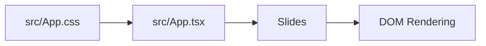

# Slide Components

<cite>
**Referenced Files in This Document**
- [App.tsx](file://src/App.tsx)
- [index.html](file://index.html)
- [main.tsx](file://src/main.tsx)
- [App.css](file://src/App.css)
- [package.json](file://package.json)
</cite>

## Table of Contents
1. [Introduction](#introduction)
2. [Project Structure](#project-structure)
3. [Core Components](#core-components)
4. [Architecture Overview](#architecture-overview)
5. [Detailed Component Analysis](#detailed-component-analysis)
6. [Dependency Analysis](#dependency-analysis)
7. [Performance Considerations](#performance-considerations)
8. [Troubleshooting Guide](#troubleshooting-guide)
9. [Conclusion](#conclusion)

## Introduction
This document describes the nine slide components used in the presentation system: TitleSlide, ArchitectureSlide, InnovationSlide, FeasibilitySlide, UsersValueSlide, ResearchMatrixSlide, CrossDisciplinarySlide, TeamSlide, and ThanksSlide. It explains each component’s purpose, content structure, styling approach, and integration within the presentation system. It also documents the slide composition pattern, prop requirements, customization options, and how components interact with the navigation system.

## Project Structure
The presentation is implemented as a React application. The slides are defined as individual functional components within the main application file and rendered in sequence. The application bootstraps via a standard Vite/React setup.

**Diagram sources**
- [index.html](file://index.html)
- [main.tsx](file://src/main.tsx)
- [App.tsx](file://src/App.tsx)

**Section sources**
- [index.html](file://index.html)
- [main.tsx](file://src/main.tsx)
- [App.tsx](file://src/App.tsx)

## Core Components
Each slide is a self-contained React functional component that renders a structured layout appropriate to its thematic focus. The slides are composed in a fixed order and presented as a single-page presentation. There are no explicit props passed to the slide components; content is embedded directly within each component.

- TitleSlide: Introduces the presentation topic and presenter identity.
- ArchitectureSlide: Presents the system architecture overview.
- InnovationSlide: Highlights innovation aspects and novel contributions.
- FeasibilitySlide: Demonstrates feasibility and practical considerations.
- UsersValueSlide: Communicates value delivered to users.
- ResearchMatrixSlide: Summarizes research matrix or framework.
- CrossDisciplinarySlide: Emphasizes cross-disciplinary collaboration.
- TeamSlide: Recognizes contributors and team roles.
- ThanksSlide: Concludes with acknowledgments.

Styling is applied globally via shared CSS rules and component-specific styles. The presentation relies on a consistent typography and spacing system, with emphasis on readability and visual hierarchy.

**Section sources**
- [App.tsx](file://src/App.tsx)
- [App.css](file://src/App.css)

## Architecture Overview
The presentation system follows a straightforward composition pattern:
- A container renders the slides in sequence.
- Navigation is implicit: the order of rendering defines the navigation flow.
- Styling is centralized in the global stylesheet with component-level overrides.

**Diagram sources**
- [index.html](file://index.html)
- [main.tsx](file://src/main.tsx)
- [App.tsx](file://src/App.tsx)

## Detailed Component Analysis

### TitleSlide
- Purpose: Establishes the presentation title, subtitle, and presenter information.
- Content structure: Header area for title and subtitle; optional presenter attribution.
- Styling approach: Centered layout with prominent typography; subtle background or border to frame content.
- Integration: First slide in the sequence; sets the stage for subsequent slides.
- Props: None.
- Customization: Adjust fonts, colors, and spacing via global CSS; add images or logos by extending the component body.

**Section sources**
- [App.tsx](file://src/App.tsx)

### ArchitectureSlide
- Purpose: Visualizes the system architecture and key components.
- Content structure: Title header; architecture diagram placeholder; brief explanatory text.
- Styling approach: Grid or flex layout to position diagram and text; maintain consistent margins and font sizes.
- Integration: Second slide; bridges introduction to technical details.
- Props: None.
- Customization: Replace placeholder with an embedded SVG or image; adjust layout classes to accommodate complex diagrams.

**Section sources**
- [App.tsx](file://src/App.tsx)

### InnovationSlide
- Purpose: Highlights novel ideas, methodologies, or technologies.
- Content structure: Title header; bullet list or icon grid of innovations; concise descriptions.
- Styling approach: Balanced white space; icons or small visuals to emphasize key points.
- Integration: Third slide; transitions from overview to specifics.
- Props: None.
- Customization: Add icons or illustrations; reorder items to prioritize most impactful innovations.

**Section sources**
- [App.tsx](file://src/App.tsx)

### FeasibilitySlide
- Purpose: Demonstrates practical feasibility and implementation readiness.
- Content structure: Title header; checklist or metrics; supporting rationale.
- Styling approach: Clean, data-oriented layout; consider using tables or progress indicators.
- Integration: Fourth slide; validates the concept introduced earlier.
- Props: None.
- Customization: Insert metrics, timelines, or capability matrices; align visuals with claims.

**Section sources**
- [App.tsx](file://src/App.tsx)

### UsersValueSlide
- Purpose: Articulates user benefits and value propositions.
- Content structure: Title header; value statements; persona or use-case scenarios.
- Styling approach: Human-centric design; emphasize benefits over features.
- Integration: Fifth slide; focuses on impact and outcomes.
- Props: None.
- Customization: Add testimonials, personas, or outcome metrics.

**Section sources**
- [App.tsx](file://src/App.tsx)

### ResearchMatrixSlide
- Purpose: Summarizes research framework, methodology, or matrix.
- Content structure: Title header; matrix or table; brief interpretation.
- Styling approach: Structured grid layout; ensure readability of rows and columns.
- Integration: Sixth slide; deepens understanding of research foundation.
- Props: None.
- Customization: Replace with charts or diagrams; annotate key cells.

**Section sources**
- [App.tsx](file://src/App.tsx)

### CrossDisciplinarySlide
- Purpose: Emphasizes collaboration across disciplines.
- Content structure: Title header; discipline icons or labels; collaborative process summary.
- Styling approach: Balanced composition; avoid visual clutter.
- Integration: Seventh slide; highlights integrative strengths.
- Props: None.
- Customization: Add institutional or partner logos; adjust layout for more disciplines.

**Section sources**
- [App.tsx](file://src/App.tsx)

### TeamSlide
- Purpose: Recognizes contributors and roles.
- Content structure: Title header; contributor list with roles; optional photos or affiliations.
- Styling approach: Consistent avatar or placeholder sizing; clear role labeling.
- Integration: Eighth slide; personalizes the achievement.
- Props: None.
- Customization: Add photos, links, or social handles; adjust grid for team size.

**Section sources**
- [App.tsx](file://src/App.tsx)

### ThanksSlide
- Purpose: Concludes the presentation with acknowledgments and contact information.
- Content structure: Title header; thanks text; contact or Q&A prompt.
- Styling approach: Calm, inclusive tone; ensure accessibility of contact details.
- Integration: Final slide; invites engagement.
- Props: None.
- Customization: Add QR codes, links, or social handles; keep layout minimal.

**Section sources**
- [App.tsx](file://src/App.tsx)

## Dependency Analysis
The slide components depend on:
- Global CSS for typography, spacing, and layout defaults.
- React runtime for rendering.
- Optional external libraries if diagrams or interactive elements are added later.

**Diagram sources**
- [App.css](file://src/App.css)
- [App.tsx](file://src/App.tsx)

**Section sources**
- [App.css](file://src/App.css)
- [App.tsx](file://src/App.tsx)
- [package.json](file://package.json)

## Performance Considerations
- Keep slide content lightweight to minimize render time.
- Prefer static images and scalable vector graphics for diagrams.
- Avoid heavy animations or third-party widgets unless necessary.
- Use CSS for layout rather than expensive JavaScript computations.

## Troubleshooting Guide
- Layout issues: Verify CSS class names and global styles; ensure responsive breakpoints are respected.
- Text overflow: Adjust font sizes or line heights; consider shorter content blocks.
- Missing images: Confirm asset paths and build configuration; use base URLs if hosted externally.
- Navigation confusion: Since navigation is implicit, maintain consistent slide ordering and clear titles.

## Conclusion
The nine slide components form a cohesive presentation system built on a simple, maintainable composition pattern. Each slide serves a distinct rhetorical purpose, with styling managed centrally for consistency. Extending or customizing the presentation involves updating component content and CSS, while preserving the overall flow and readability.