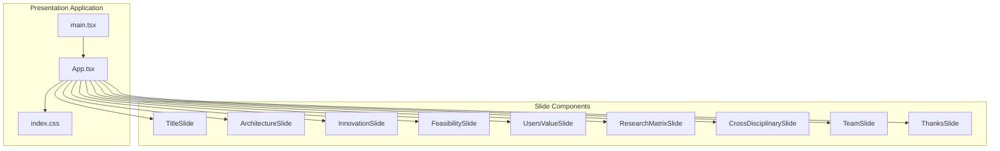
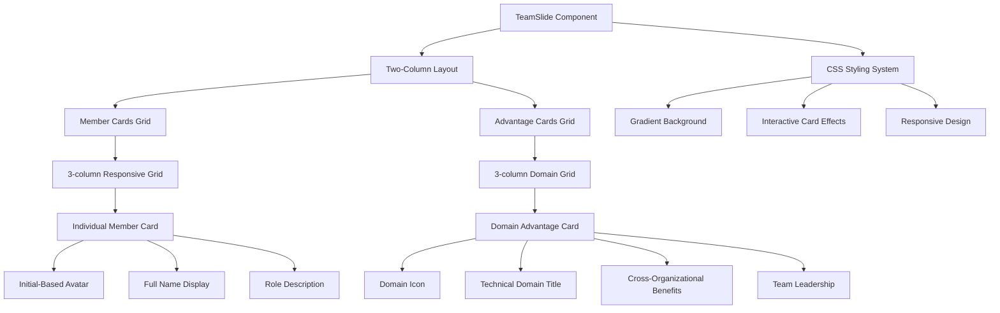
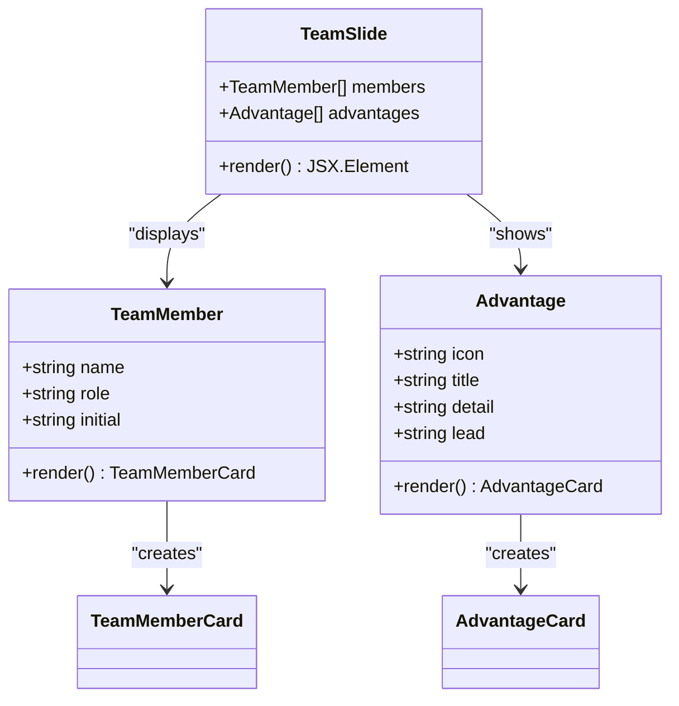
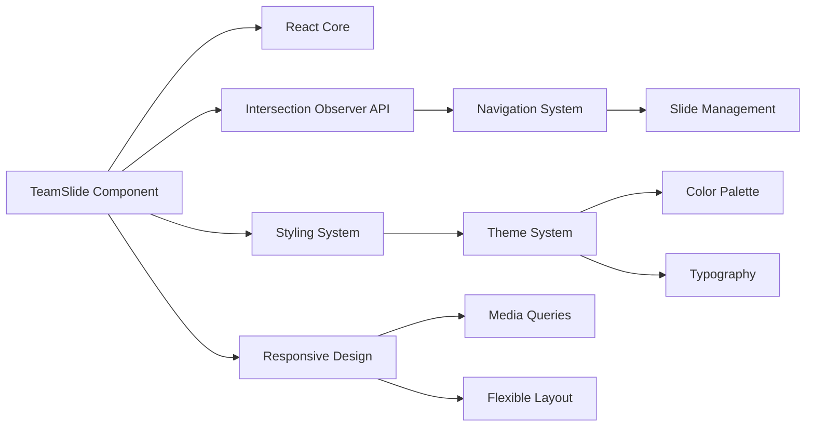

# Team Slide Component

<cite>
**Referenced Files in This Document**
- [App.tsx](file://patent-drawing-app/src/App.tsx)
- [index.css](file://patent-drawing-app/src/index.css)
- [main.tsx](file://patent-drawing-app/src/main.tsx)
- [README.md](file://patent-drawing-app/README.md)
</cite>

## Table of Contents
1. [Introduction](#introduction)
2. [Project Structure](#project-structure)
3. [Core Components](#core-components)
4. [Architecture Overview](#architecture-overview)
5. [Detailed Component Analysis](#detailed-component-analysis)
6. [Dependency Analysis](#dependency-analysis)
7. [Performance Considerations](#performance-considerations)
8. [Troubleshooting Guide](#troubleshooting-guide)
9. [Conclusion](#conclusion)

## Introduction

The Team Slide component is a crucial presentation element within the "Patent Drawing System" demonstration interface. This component serves as the human face of the project, showcasing the diverse expertise and collaborative strengths that make the patent drawing system possible. The slide effectively communicates the human capital behind the technical innovation, highlighting individual contributions while emphasizing the collective experience and organizational support that drives the project forward.

The Team Slide component is designed to demonstrate how six distinct professionals with complementary skills work together to create a comprehensive solution for automated patent drawing systems. It showcases not just individual capabilities, but the strategic alignment of technical, business, legal, and management expertise that creates a powerful cross-functional team.

## Project Structure

The Team Slide component is part of a larger presentation application built with React and TypeScript. The project follows a modular structure where each slide is implemented as a separate functional component within the main App.tsx file.

**Diagram sources**
- [App.tsx:401-445](file://patent-drawing-app/src/App.tsx#L401-L445)
- [main.tsx:1-11](file://patent-drawing-app/src/main.tsx#L1-L11)

**Section sources**
- [App.tsx:1-445](file://patent-drawing-app/src/App.tsx#L1-L445)
- [main.tsx:1-11](file://patent-drawing-app/src/main.tsx#L1-L11)

## Core Components

The Team Slide component consists of two primary structural elements that work together to communicate the team's composition and collaborative strengths:

### Team Member Cards Grid
The component presents six team members in a responsive grid layout, each displaying:
- Member initials as avatar placeholders
- Full name display
- Role description within the project
- Hover effects that enhance visual engagement

### Advantage Cards Section
This section highlights the team's cross-functional strengths across three key technical domains:
- Agent Layer (AI/Software Development)
- Parameterized Layer (Mechanical Engineering)
- Compliance Layer (Legal/IP Expertise)

Each advantage card includes:
- Domain-specific icon representation
- Technical domain title
- Detailed explanation of cross-organizational benefits
- Team leadership attribution

**Section sources**
- [App.tsx:325-368](file://patent-drawing-app/src/App.tsx#L325-L368)
- [index.css:716-807](file://patent-drawing-app/src/index.css#L716-L807)

## Architecture Overview

The Team Slide component implements a dual-column layout that balances individual recognition with collective capability demonstration. The architecture emphasizes visual hierarchy and responsive design principles.

**Diagram sources**
- [App.tsx:325-368](file://patent-drawing-app/src/App.tsx#L325-L368)
- [index.css:716-807](file://patent-drawing-app/src/index.css#L716-L807)

## Detailed Component Analysis

### Team Composition Structure

The Team Slide presents six core team members, each representing different aspects of the patent drawing system development:

**Diagram sources**
- [App.tsx:327-339](file://patent-drawing-app/src/App.tsx#L327-L339)

#### Individual Team Members

The six team members represent diverse expertise areas:

| Member | Role | Initial | Technical Domain |
|--------|------|--------|-------------------|
| 康凯 | 算法模型 | 康 | AI/Software Development |
| 孙浩 | 数据采集治理 | 孙 | Mechanical Engineering |
| 金雨闲 | 商务落地对接 | 金 | Business/Operations |
| 王墨颖 | 功能&市场调研 | 王 | Market Research |
| 何俊峰 | 项目管理 | 何 | Project Management |
| 苏瑞华 | 知识产权战略 | 苏 | Legal/IP Strategy |

#### Cross-Organizational Advantages

The component strategically demonstrates how the team's composition creates unique value:

**Agent Layer Advantage**: Combines AI/Software Development expertise with project coordination, led by康凯 and 俊峰. This represents the technical foundation of the patent drawing system's intelligent capabilities.

**Parameterized Layer Advantage**: Merges mechanical engineering background with business operations expertise, led by孙浩 and 金雨闲. This combination ensures both technical accuracy and practical implementation.

**Compliance Layer Advantage**: Integrates legal/IP expertise with market research capabilities, led by王墨颖 and 苏瑞华. This pairing guarantees regulatory compliance while maintaining market relevance.

**Section sources**
- [App.tsx:327-339](file://patent-drawing-app/src/App.tsx#L327-L339)

### Visual Design and User Experience

The Team Slide employs sophisticated visual design patterns to communicate professional competence and collaborative spirit:

#### Interactive Card System
Each team member card and advantage card features:
- Subtle hover animations that lift cards off the surface
- Enhanced shadow effects that create depth perception
- Smooth transitions that improve user engagement
- Consistent styling that maintains visual coherence

#### Responsive Grid Layout
The component adapts seamlessly across different screen sizes:
- Desktop: Three-column grid for optimal information density
- Tablet: Two-column responsive layout
- Mobile: Single-column adaptation for touch interaction

#### Visual Hierarchy
The design establishes clear visual priorities:
- Team member cards prominently display individual contributions
- Advantage cards emphasize collective capabilities
- Icons provide immediate domain recognition
- Color accents highlight key information

**Section sources**
- [index.css:716-807](file://patent-drawing-app/src/index.css#L716-L807)
- [index.css:831-851](file://patent-drawing-app/src/index.css#L831-L851)

### Communication Strategy

The Team Slide employs a multi-layered communication approach:

#### Individual Recognition
Each team member receives appropriate acknowledgment through:
- Personalized avatar representation
- Clear role definition
- Professional presentation standards

#### Collective Strength Demonstration
The advantage cards collectively showcase:
- Cross-functional expertise integration
- Strategic leadership alignment
- Domain-specific competency demonstration

#### Organizational Alignment
The component implicitly communicates:
- Institutional support and resources
- Cross-departmental collaboration
- Long-term commitment to excellence

## Dependency Analysis

The Team Slide component integrates with several system dependencies that enhance its functionality and presentation quality:

**Diagram sources**
- [App.tsx:401-445](file://patent-drawing-app/src/App.tsx#L401-L445)
- [index.css:1-15](file://patent-drawing-app/src/index.css#L1-L15)

### External Dependencies

The component relies on several external technologies:

**React Ecosystem**: Utilizes modern React patterns including hooks, functional components, and state management through the parent App component.

**Intersection Observer API**: Employs browser APIs for automatic slide detection and navigation updates, eliminating the need for manual scroll event handling.

**CSS Custom Properties**: Leverages modern CSS features including custom properties for theme management and gradient backgrounds.

**Responsive Design Framework**: Implements mobile-first responsive design principles that adapt to various screen sizes and orientations.

**Section sources**
- [App.tsx:405-428](file://patent-drawing-app/src/App.tsx#L405-L428)
- [index.css:1-15](file://patent-drawing-app/src/index.css#L1-L15)

## Performance Considerations

The Team Slide component is optimized for efficient rendering and smooth user experience:

### Rendering Optimization
- **Minimal Re-renders**: Uses functional components that only re-render when props change
- **Efficient Grid Layout**: CSS Grid provides excellent performance for responsive layouts
- **Lazy Loading**: Avatars are simple text-based, avoiding heavy image loading

### Memory Management
- **Component Lifecycle**: Proper cleanup of Intersection Observer instances
- **Event Handling**: Efficient event listeners that don't cause memory leaks
- **State Management**: Minimal state requirements reduce computational overhead

### Browser Compatibility
- **Modern API Usage**: Intersection Observer provides excellent browser support
- **Progressive Enhancement**: Falls back gracefully for older browsers
- **Performance Polyfills**: No heavy polyfills required for core functionality

## Troubleshooting Guide

Common issues and solutions for the Team Slide component:

### Layout Issues
**Problem**: Cards not displaying correctly on mobile devices
**Solution**: Verify responsive breakpoints are properly configured in CSS media queries

**Problem**: Grid layout breaking on specific screen sizes
**Solution**: Check CSS Grid properties and adjust min-width values as needed

### Visual Problems
**Problem**: Hover effects not working properly
**Solution**: Ensure CSS transitions are properly defined and browser-specific prefixes are included

**Problem**: Color contrast issues affecting readability
**Solution**: Review CSS custom properties and adjust color values for accessibility

### Functional Issues
**Problem**: Navigation dots not updating correctly
**Solution**: Verify Intersection Observer configuration and slide ID consistency

**Problem**: Team member data not rendering
**Solution**: Check data structure consistency and component prop passing

**Section sources**
- [App.tsx:405-428](file://patent-drawing-app/src/App.tsx#L405-L428)
- [index.css:831-851](file://patent-drawing-app/src/index.css#L831-L851)

## Conclusion

The Team Slide component successfully communicates the human capital behind the patent drawing system through its thoughtful design and strategic content presentation. By balancing individual recognition with collective capability demonstration, the component effectively showcases how six professionals with diverse expertise collaborate to create innovative solutions.

The component's architecture demonstrates best practices in modern web development, combining clean React patterns with sophisticated CSS design principles. Its responsive nature ensures accessibility across different devices, while its visual design communicates professionalism and competence.

Through its emphasis on cross-organizational collaboration and domain expertise integration, the Team Slide reinforces the message that successful technology development requires diverse perspectives and complementary skills working in harmony. This approach not only highlights individual contributions but also demonstrates the strategic value of interdisciplinary teamwork in achieving complex technical goals.

The component serves as an exemplary model for presenting team composition and collaborative strengths in technical presentations, offering insights applicable to various domains where cross-functional expertise is essential for success.