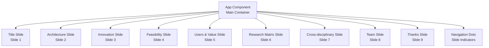
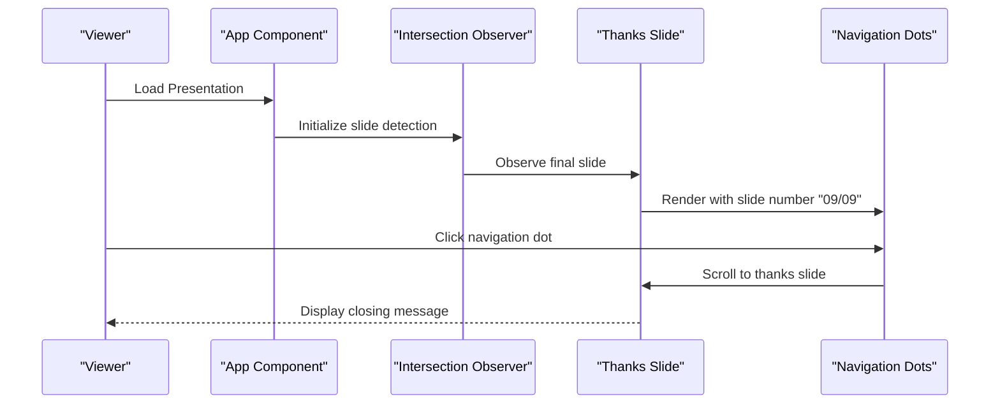
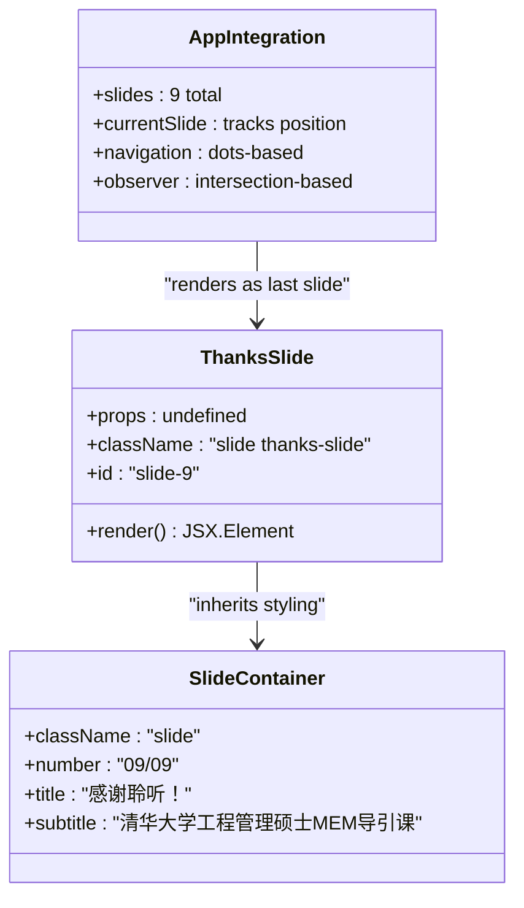
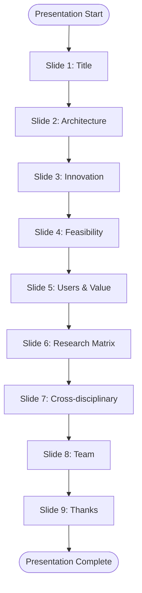
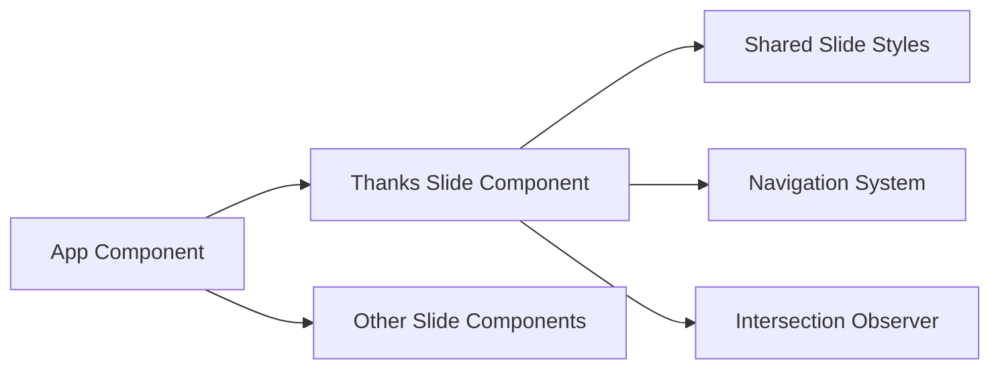

# Thanks Slide Component

<cite>
**Referenced Files in This Document**
- [App.tsx](file://src/App.tsx)
- [main.tsx](file://src/main.tsx)
- [package.json](file://package.json)
- [README.md](file://README.md)
</cite>

## Table of Contents
1. [Introduction](#introduction)
2. [Project Structure](#project-structure)
3. [Core Components](#core-components)
4. [Architecture Overview](#architecture-overview)
5. [Detailed Component Analysis](#detailed-component-analysis)
6. [Dependency Analysis](#dependency-analysis)
7. [Performance Considerations](#performance-considerations)
8. [Troubleshooting Guide](#troubleshooting-guide)
9. [Conclusion](#conclusion)

## Introduction
This document provides comprehensive documentation for the Thanks Slide component within the presentation application. The Thanks Slide serves as the closing page of the presentation, delivering a professional and graceful conclusion while maintaining a clear structure suitable for academic or professional audiences. It focuses on appreciation messaging, optional acknowledgment strategies, and audience engagement techniques that encourage continued engagement or follow-up actions.

The presentation is built with React and TypeScript, using Vite for development and build tooling. The application organizes content into nine distinct slides, with the ninth slide dedicated to the Thanks Slide. The component emphasizes simplicity, readability, and a strong closing statement to leave a lasting impression on viewers.

## Project Structure
The presentation application follows a modular React architecture with a single-page layout. The main application file defines nine slide components, each encapsulating specific content and styling. The Thanks Slide is the ninth slide and is rendered alongside the other slides within the main App component.

Key structural elements:
- Single-page application with nine slide components
- Navigation dots indicating slide positions
- Intersection Observer for slide detection
- Clean separation of concerns with dedicated components for each slide

**Diagram sources**
- [App.tsx:370-379](file://src/App.tsx#L370-L379)
- [App.tsx:401-444](file://src/App.tsx#L401-L444)

**Section sources**
- [App.tsx:1-445](file://src/App.tsx#L1-L445)
- [main.tsx:1-11](file://src/main.tsx#L1-L11)

## Core Components
The Thanks Slide component is implemented as a standalone React functional component. It renders a clean, centered layout with a prominent title and subtitle, positioned as the final slide in the presentation sequence.

Key characteristics:
- Minimalist design focused on gratitude and closure
- Consistent slide numbering and styling with other slides
- Professional typography hierarchy emphasizing the closing message
- Seamless integration with the overall presentation flow

The component leverages the shared slide infrastructure, ensuring consistent spacing, responsive behavior, and navigation compatibility.

**Section sources**
- [App.tsx:370-379](file://src/App.tsx#L370-L379)

## Architecture Overview
The presentation application employs a component-based architecture where each slide is a self-contained React element. The Thanks Slide participates in the same rendering pipeline as other slides, utilizing shared navigation and intersection observer mechanisms for smooth transitions.

**Diagram sources**
- [App.tsx:401-444](file://src/App.tsx#L401-L444)
- [App.tsx:370-379](file://src/App.tsx#L370-L379)

## Detailed Component Analysis

### Thanks Slide Implementation
The Thanks Slide component is implemented as a functional React component with the following structure:

**Diagram sources**
- [App.tsx:370-379](file://src/App.tsx#L370-L379)
- [App.tsx:401-444](file://src/App.tsx#L401-L444)

### Content Structure and Design Elements
The Thanks Slide utilizes a clean, minimalist design pattern consistent with the overall presentation theme:

- **Primary Title**: Prominent "感谢聆听！" (Thank you for listening!) message
- **Subtitle**: Course identification for contextual closure
- **Slide Number**: Maintains consistent numbering progression
- **Styling**: Inherits slide container classes for uniform appearance

### Audience Engagement Strategies
While the current implementation focuses on straightforward appreciation messaging, the component supports several engagement enhancement approaches:

#### Current Implementation Strengths
- **Professional Closure**: Clear, respectful closing message appropriate for academic contexts
- **Consistency**: Maintains visual and structural alignment with preceding slides
- **Accessibility**: Simple, readable typography optimized for presentation viewing

#### Enhancement Opportunities
The component could be extended to include:
- Contact information display for follow-up inquiries
- Next-step guidance for interested parties
- Social media links or QR codes for continued engagement
- Call-to-action buttons for feedback collection

### Integration with Presentation Flow
The Thanks Slide integrates seamlessly with the broader presentation architecture:

**Diagram sources**
- [App.tsx:382-382](file://src/App.tsx#L382-L382)
- [App.tsx:430-443](file://src/App.tsx#L430-L443)

**Section sources**
- [App.tsx:370-379](file://src/App.tsx#L370-L379)
- [App.tsx:401-444](file://src/App.tsx#L401-L444)

## Dependency Analysis
The Thanks Slide component maintains loose coupling with the broader application while leveraging shared infrastructure:

**Diagram sources**
- [App.tsx:401-444](file://src/App.tsx#L401-L444)
- [App.tsx:370-379](file://src/App.tsx#L370-L379)

### External Dependencies
The project relies on standard web technologies:
- React 19.x for component architecture
- TypeScript for type safety
- Vite for build tooling and development server
- Modern browser APIs for intersection observation

**Section sources**
- [package.json:12-29](file://package.json#L12-L29)
- [README.md:1-74](file://README.md#L1-L74)

## Performance Considerations
The Thanks Slide component is designed for optimal performance within the presentation context:

- **Minimal Rendering**: Stateless component with simple JSX structure
- **Efficient Updates**: No internal state changes during presentation
- **Memory Usage**: Lightweight component with minimal DOM footprint
- **Bundle Size**: No additional dependencies beyond standard React ecosystem

Performance characteristics align with the overall presentation's lightweight architecture, ensuring smooth transitions and responsive navigation across all slides.

## Troubleshooting Guide
Common issues and resolutions for the Thanks Slide component:

### Styling Issues
- **Problem**: Incorrect slide numbering or layout
- **Solution**: Verify slide ID assignment matches the nine-slide sequence
- **Location**: Check slide numbering consistency in the main App component

### Navigation Problems
- **Problem**: Thanks slide not detected by navigation dots
- **Solution**: Ensure proper ID formatting ("slide-9") and element visibility
- **Location**: Validate intersection observer configuration

### Content Display Issues
- **Problem**: Text not centering properly or appearing cut off
- **Solution**: Review CSS styles for slide containers and responsive breakpoints
- **Location**: Examine shared slide styling classes

**Section sources**
- [App.tsx:401-444](file://src/App.tsx#L401-L444)
- [App.tsx:370-379](file://src/App.tsx#L370-L379)

## Conclusion
The Thanks Slide component successfully delivers a professional and graceful conclusion to the presentation while maintaining consistency with the overall design language. Its minimalist approach ensures focus remains on the closing message without overwhelming viewers with excessive information.

The component's strength lies in its simplicity and seamless integration with the broader presentation architecture. While currently focused on straightforward appreciation messaging, the component provides a solid foundation for future enhancements that could incorporate contact information display, next-step guidance, and additional audience engagement mechanisms.

The implementation demonstrates effective use of React's component model, with clear separation of concerns and maintainable code structure that supports both current needs and potential future extensions.