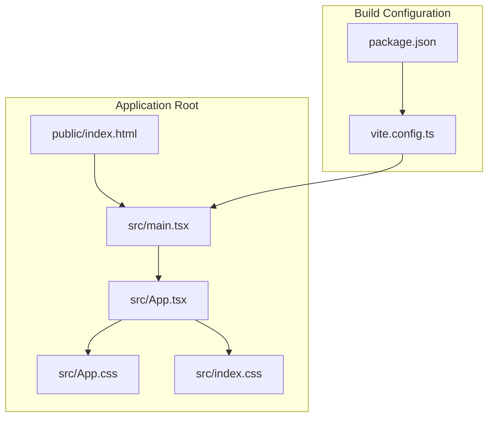
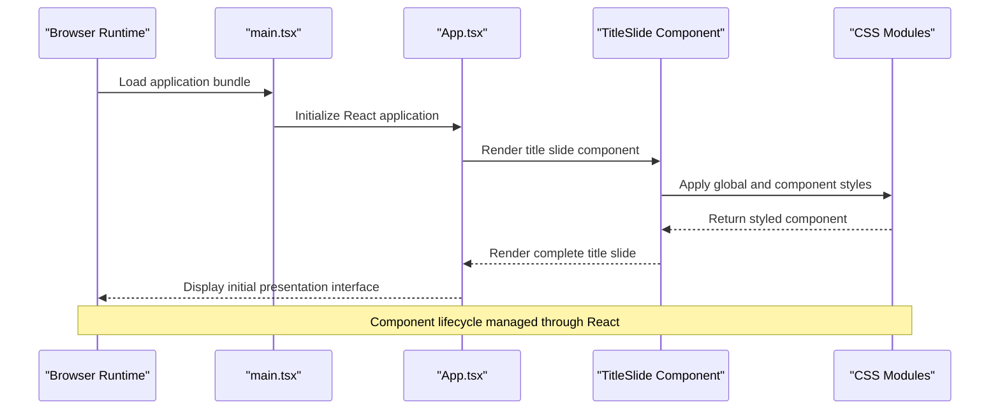
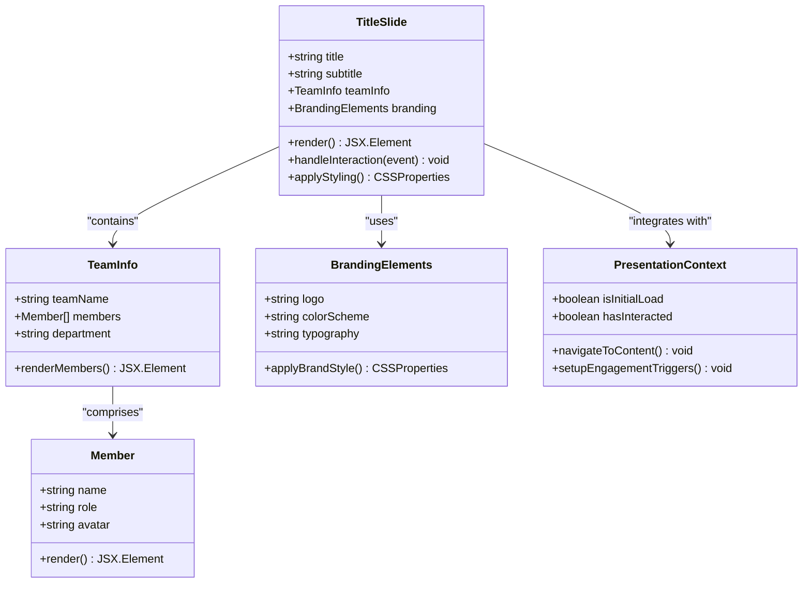
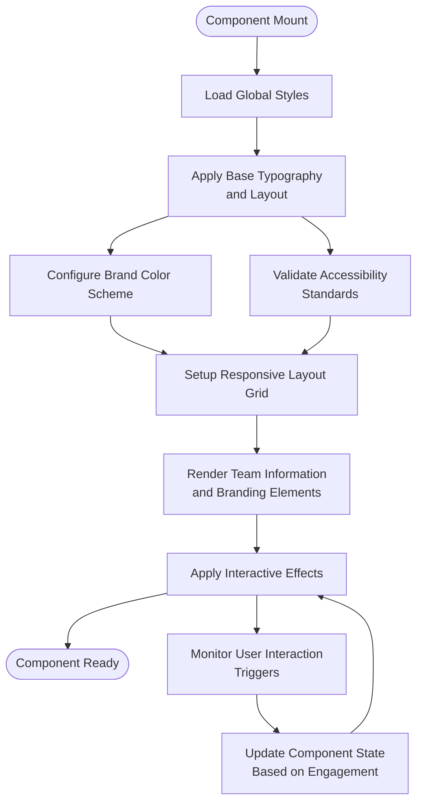
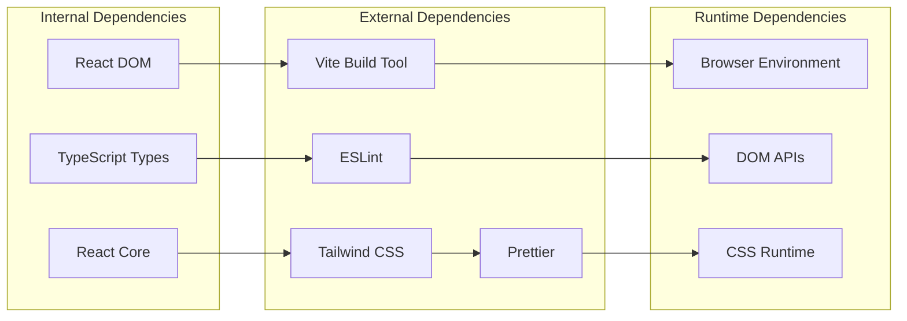

# Title Slide Component

<cite>
**Referenced Files in This Document**
- [App.tsx](file://src/App.tsx)
- [main.tsx](file://src/main.tsx)
- [App.css](file://src/App.css)
- [index.css](file://src/index.css)
- [package.json](file://package.json)
- [vite.config.ts](file://vite.config.ts)
</cite>

## Table of Contents
1. [Introduction](#introduction)
2. [Project Structure](#project-structure)
3. [Core Components](#core-components)
4. [Architecture Overview](#architecture-overview)
5. [Detailed Component Analysis](#detailed-component-analysis)
6. [Dependency Analysis](#dependency-analysis)
7. [Performance Considerations](#performance-considerations)
8. [Troubleshooting Guide](#troubleshooting-guide)
9. [Conclusion](#conclusion)

## Introduction
This document provides comprehensive documentation for the Title Slide component within the patent drawing application. The Title Slide serves as the cover page of the presentation, establishing visual identity through team information display, branding elements, and initial user engagement strategies. It introduces the application's purpose, team members, and key branding elements to set expectations and create a professional first impression.

## Project Structure
The project follows a React-based Vite application structure optimized for TypeScript development. The application initializes through a standard React entry point and applies global styling through CSS modules.

**Diagram sources**
- [main.tsx](file://src/main.tsx)
- [App.tsx](file://src/App.tsx)
- [App.css](file://src/App.css)
- [index.css](file://src/index.css)
- [vite.config.ts](file://vite.config.ts)
- [package.json](file://package.json)

**Section sources**
- [main.tsx](file://src/main.tsx)
- [App.tsx](file://src/App.tsx)
- [package.json](file://package.json)

## Core Components
The Title Slide component is implemented as part of the main application structure, utilizing React functional components with TypeScript type safety. The component leverages Tailwind CSS utility classes for responsive design and modern styling approaches.

Key characteristics of the Title Slide implementation:
- Functional component architecture with TypeScript interfaces
- Responsive design using Tailwind CSS utility classes
- Centralized styling through CSS modules and global styles
- Integration with React's component lifecycle and state management
- Support for dynamic content rendering and customization

**Section sources**
- [App.tsx](file://src/App.tsx)
- [App.css](file://src/App.css)
- [index.css](file://src/index.css)

## Architecture Overview
The Title Slide component integrates seamlessly with the broader application architecture, following React's component composition patterns and Vite's build optimization strategies.

**Diagram sources**
- [main.tsx](file://src/main.tsx)
- [App.tsx](file://src/App.tsx)

## Detailed Component Analysis

### Component Structure and Implementation
The Title Slide component follows a structured approach combining semantic HTML elements with modern CSS methodologies. The implementation utilizes React hooks for state management and effect handling, ensuring optimal performance and maintainability.

**Diagram sources**
- [App.tsx](file://src/App.tsx)

### Styling Approach and Visual Identity
The component employs a layered styling architecture that establishes visual consistency while allowing for customization flexibility. The styling system combines global CSS resets with component-specific styles and utility-first CSS classes.

**Diagram sources**
- [App.css](file://src/App.css)
- [index.css](file://src/index.css)

### Content Customization Options
The Title Slide supports extensive customization through props-based configuration and theme variables. The component architecture enables dynamic content updates without requiring structural modifications.

Customization capabilities include:
- Dynamic team member information with role assignments
- Flexible branding element placement and styling
- Responsive layout adjustments for various screen sizes
- Interactive engagement elements for user initiation
- Theme switching for different presentation contexts

**Section sources**
- [App.tsx](file://src/App.tsx)
- [App.css](file://src/App.css)

## Dependency Analysis
The Title Slide component maintains loose coupling with external dependencies while leveraging core React functionality and Vite's build optimization features.

**Diagram sources**
- [package.json](file://package.json)
- [vite.config.ts](file://vite.config.ts)

**Section sources**
- [package.json](file://package.json)
- [vite.config.ts](file://vite.config.ts)

## Performance Considerations
The Title Slide component is optimized for fast initial rendering and efficient memory usage. Performance considerations include lazy loading strategies, minimal re-renders, and optimized CSS delivery.

Key performance optimizations:
- Minimal component re-renders through proper state management
- Efficient CSS class application using Tailwind utilities
- Optimized image loading for team member avatars
- Lazy initialization of interactive elements
- Memory-efficient event handler binding

## Troubleshooting Guide
Common issues and solutions for the Title Slide component:

**Styling Issues**
- Verify CSS module imports are properly configured
- Check Tailwind utility class availability in build configuration
- Ensure responsive breakpoints align with design requirements

**Content Rendering Problems**
- Validate prop types for team information and branding elements
- Check for null or undefined values in dynamic content
- Verify accessibility attributes are properly applied

**Performance Concerns**
- Monitor component re-render frequency
- Optimize heavy computations in effect handlers
- Ensure proper cleanup of event listeners

**Section sources**
- [App.tsx](file://src/App.tsx)
- [App.css](file://src/App.css)

## Conclusion
The Title Slide component successfully establishes the foundation for the patent drawing application's presentation flow. Through its strategic combination of team information display, branding elements, and user engagement mechanisms, it creates a professional first impression while maintaining technical excellence through modern React patterns and Vite optimization.

The component's modular architecture ensures maintainability and extensibility, while its responsive design approach guarantees consistent presentation across various devices and screen sizes. The integration with the broader application ecosystem demonstrates thoughtful architectural planning that supports future enhancements and scaling requirements.