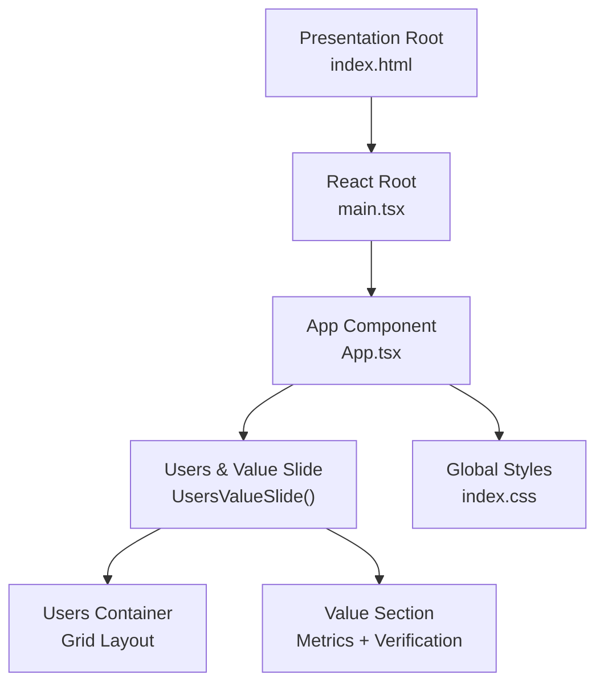
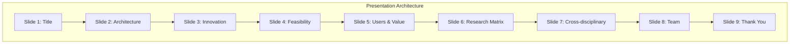
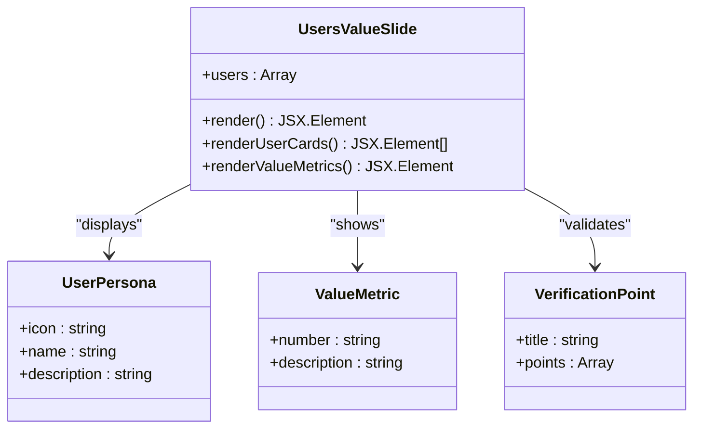
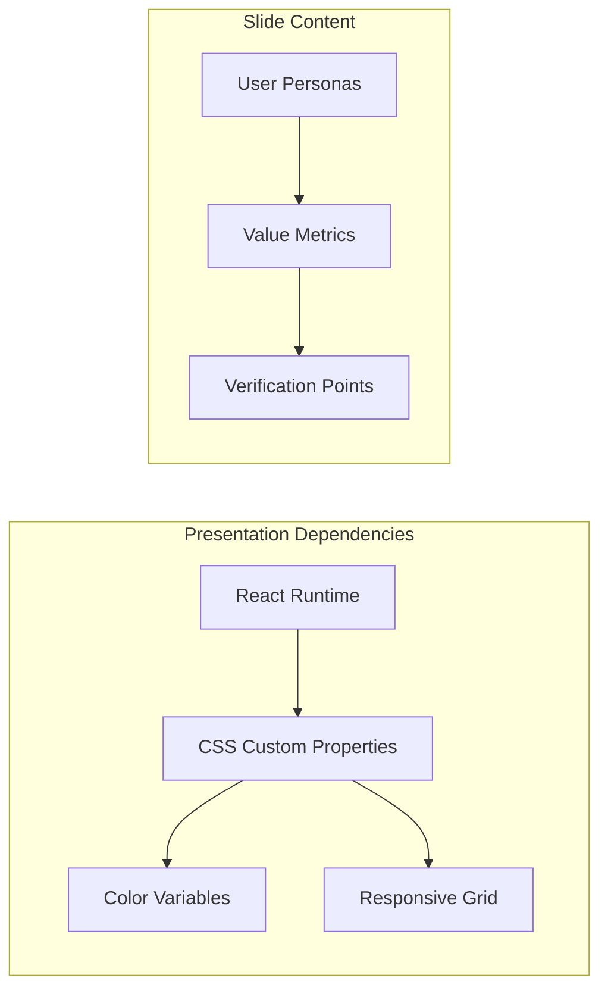

# Users & Value Slide Component

<cite>
**Referenced Files in This Document**
- [App.tsx](file://src/App.tsx)
- [index.css](file://src/index.css)
- [main.tsx](file://src/main.tsx)
- [package.json](file://package.json)
- [README.md](file://README.md)
</cite>

## Table of Contents
1. [Introduction](#introduction)
2. [Project Structure](#project-structure)
3. [Core Components](#core-components)
4. [Architecture Overview](#architecture-overview)
5. [Detailed Component Analysis](#detailed-component-analysis)
6. [Dependency Analysis](#dependency-analysis)
7. [Performance Considerations](#performance-considerations)
8. [Troubleshooting Guide](#troubleshooting-guide)
9. [Conclusion](#conclusion)

## Introduction
This document provides comprehensive documentation for the Users & Value Slide component within the Patent Drawing System presentation. The Users & Value slide focuses on three core pillars:
- Target user identification: Who will benefit from the system and in what scenarios
- Value quantification: How the system delivers measurable improvements in time, quality, and cost
- Market positioning: How the solution differentiates itself against alternatives and establishes competitive advantage

The slide is designed to demonstrate commercial viability and user benefits of the patent drawing system, supported by concrete metrics and practical verification points.

## Project Structure
The Users & Value slide is implemented as part of a multi-slide presentation built with React and styled using CSS custom properties. The presentation is structured as a single-page application with smooth scrolling navigation between slides.

**Diagram sources**
- [main.tsx:1-11](file://src/main.tsx#L1-L11)
- [App.tsx:401-445](file://src/App.tsx#L401-L445)
- [index.css:1-851](file://src/index.css#L1-L851)

**Section sources**
- [main.tsx:1-11](file://src/main.tsx#L1-L11)
- [App.tsx:401-445](file://src/App.tsx#L401-L445)
- [index.css:1-851](file://src/index.css#L1-L851)

## Core Components
The Users & Value slide is composed of two primary sections:
- Target users and scenarios: Four distinct user personas with representative use cases
- Value metrics and verification: Quantified benefits and practical validation points

Key implementation characteristics:
- Uses a responsive grid layout for optimal viewing across devices
- Implements CSS custom properties for consistent theming and accessibility
- Leverages semantic HTML and accessible navigation patterns
- Includes interactive navigation dots for slide progression

**Section sources**
- [App.tsx:194-246](file://src/App.tsx#L194-L246)
- [index.css:483-580](file://src/index.css#L483-L580)

## Architecture Overview
The Users & Value slide participates in a larger presentation architecture that supports nine distinct slides. The slide composition follows a consistent pattern of section titles, subtitles, and modular content blocks.

**Diagram sources**
- [App.tsx:382-398](file://src/App.tsx#L382-L398)
- [App.tsx:401-445](file://src/App.tsx#L401-L445)

## Detailed Component Analysis

### Target User Identification
The Users & Value slide identifies four primary user groups, each representing distinct market segments with specific pain points and use cases:

#### User Persona Development
The slide presents four user personas with detailed descriptions:

1. **Academic Research Teams**
   - Focus: Technology disclosure automation
   - Benefit: Reduced patent application cycle time
   - Scenario: Converting technical disclosures into standardized patent drawings

2. **Patent Law Firms**
   - Focus: Mechanical patent processing
   - Benefit: Significant reduction in drafting labor hours
   - Scenario: Batch processing mechanical applications with automated compliance checking

3. **Corporate IP Departments**
   - Focus: Internal pre-filing review
   - Benefit: Cost reduction through reduced external drafting services
   - Scenario: Pre-screening patent applications internally before filing

4. **Industrial Design Studios**
   - Focus: Concept design visualization
   - Benefit: Rapid iteration with editable vector graphics
   - Scenario: Early-stage design exploration with immediate engineering validation

#### Market Positioning Strategy
Each persona represents a strategic market segment with different value propositions:
- Academic: Speed and standardization for research disclosure
- Legal: Efficiency and quality for high-volume practice
- Corporate: Cost optimization and internal capability building
- Design: Speed and accuracy for creative exploration

**Section sources**
- [App.tsx:196-201](file://src/App.tsx#L196-L201)
- [App.tsx:209-218](file://src/App.tsx#L209-L218)

### Value Quantification Methods
The slide employs three primary metrics to quantify value delivery:

#### Time Efficiency Metrics
- **Target Performance**: Complex mechanical drawings reduced from 2-4 hours to under 15 minutes
- **Processing Speed**: 50%+ reduction in patent application preparation time
- **Training Acceleration**: New hires require less than 2 days of training vs. 2-3 weeks traditional

#### Quality Improvement Metrics
- **Compliance Rate**: 50%+ reduction in patent office corrective action requests
- **Consistency**: Standardized process eliminates human error variability
- **Reproducibility**: Automated compliance checking ensures consistent quality

#### Cost Impact Metrics
- **Labor Savings**: 60%+ reduction in drafting staff requirements for law firms
- **External Cost Reduction**: Decreased reliance on third-party drafting services
- **Risk Mitigation**: Elimination of costly rework due to compliance failures

#### Practical Verification Points
The slide includes three verification criteria that demonstrate real-world applicability:
- Transition from artisanal craft to standardized process
- Mandatory pre-submission compliance checking
- Dramatic reduction in onboarding time for new users

**Section sources**
- [App.tsx:222-241](file://src/App.tsx#L222-L241)
- [index.css:531-579](file://src/index.css#L531-L579)

### Competitive Advantage Presentation
The Users & Value slide positions the solution against two primary alternatives:

#### Direct Competitors Analysis
- **Text-to-Image Tools**: Produce non-editable bitmap images unsuitable for patent applications
- **Traditional CAD Software**: Requires specialized operators and extensive training

#### Unique Value Proposition
The solution offers a distinctive combination:
- **Natural Language Interface**: Eliminates technical CAD expertise requirements
- **Editable Vector Output**: Maintains professional quality while enabling iterative design
- **Automated Compliance**: Integrates patent office requirement checking into the workflow

#### Differentiation Strategy
The presentation emphasizes three key differentiators:
- **Accessibility**: Non-technical users can create professional-grade drawings
- **Efficiency**: Dramatic time reduction compared to traditional methods
- **Quality Assurance**: Built-in compliance checking prevents costly errors

**Section sources**
- [App.tsx:114-129](file://src/App.tsx#L114-L129)
- [App.tsx:224-226](file://src/App.tsx#L224-L226)

### Implementation Architecture
The Users & Value slide follows a structured implementation pattern:

**Diagram sources**
- [App.tsx:194-246](file://src/App.tsx#L194-L246)

**Section sources**
- [App.tsx:194-246](file://src/App.tsx#L194-L246)
- [index.css:483-580](file://src/index.css#L483-L580)

## Dependency Analysis
The Users & Value slide integrates with several system components:

**Diagram sources**
- [package.json:12-15](file://package.json#L12-L15)
- [index.css:1-15](file://src/index.css#L1-L15)

**Section sources**
- [package.json:12-15](file://package.json#L12-L15)
- [index.css:1-15](file://src/index.css#L1-L15)

## Performance Considerations
The Users & Value slide is designed for optimal performance and user experience:

- **Rendering Efficiency**: Single-pass rendering with minimal DOM manipulation
- **Memory Usage**: Lightweight component with no external dependencies
- **Accessibility**: Semantic HTML structure with proper ARIA attributes
- **Responsiveness**: Mobile-first design with adaptive grid layouts
- **Navigation**: Smooth scrolling with intersection observer for slide detection

## Troubleshooting Guide
Common issues and resolutions for the Users & Value slide:

### Styling Issues
- **Problem**: Incorrect color scheme or typography
- **Solution**: Verify CSS custom property definitions in :root block
- **Location**: Check color variable declarations in index.css

### Layout Problems
- **Problem**: Content not properly aligned in grid layout
- **Solution**: Ensure responsive breakpoints are correctly configured
- **Location**: Review media query definitions for tablet and mobile views

### Interactive Elements
- **Problem**: Navigation dots not responding to clicks
- **Solution**: Verify event handlers and element ID assignments
- **Location**: Check navigation dot click handlers in App.tsx

**Section sources**
- [index.css:831-851](file://src/index.css#L831-L851)
- [App.tsx:384-398](file://src/App.tsx#L384-L398)

## Conclusion
The Users & Value slide effectively communicates the commercial viability and user benefits of the patent drawing system through:
- Clear target user identification across four distinct market segments
- Quantifiable value metrics demonstrating time, quality, and cost improvements
- Strong competitive positioning against existing alternatives
- Practical verification points ensuring real-world applicability

The slide serves as a crucial bridge between technical capabilities and business value, establishing a compelling case for adoption across diverse stakeholder groups in the intellectual property ecosystem.