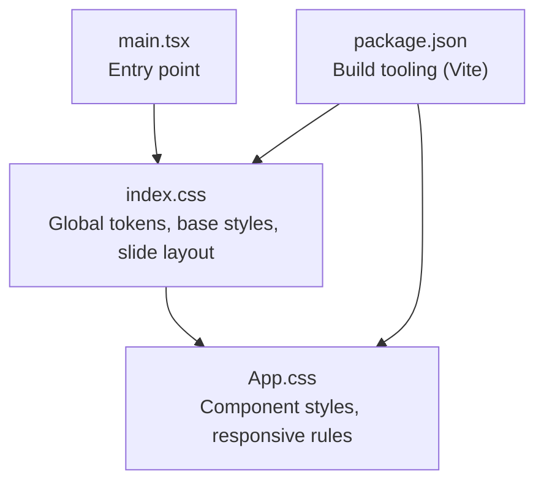
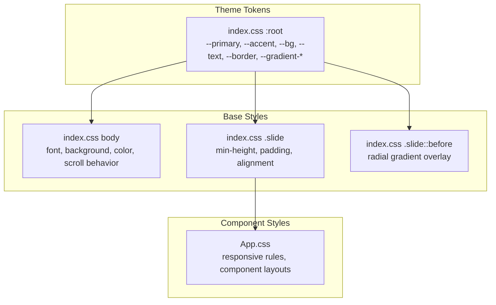
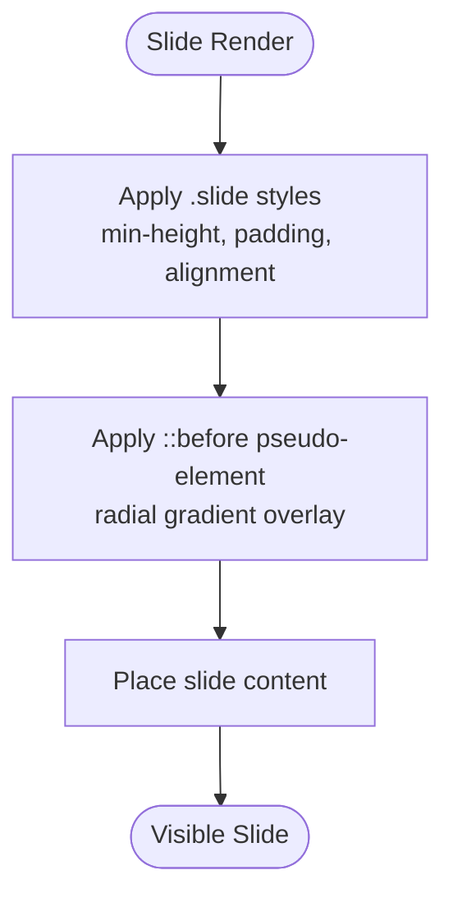
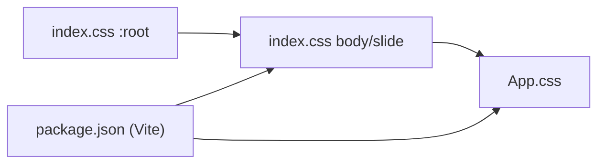

# Styling & Theming

<cite>
**Referenced Files in This Document**
- [index.css](file://src/index.css)
- [App.css](file://src/App.css)
- [main.tsx](file://src/main.tsx)
- [package.json](file://package.json)
</cite>

## Table of Contents
1. [Introduction](#introduction)
2. [Project Structure](#project-structure)
3. [Core Components](#core-components)
4. [Architecture Overview](#architecture-overview)
5. [Detailed Component Analysis](#detailed-component-analysis)
6. [Dependency Analysis](#dependency-analysis)
7. [Performance Considerations](#performance-considerations)
8. [Troubleshooting Guide](#troubleshooting-guide)
9. [Conclusion](#conclusion)
10. [Appendices](#appendices)

## Introduction
This document explains the styling and theming system of the application, focusing on the CSS architecture built around custom properties and variables, gradient backgrounds, responsive design patterns, and animation effects. It also covers the dark theme implementation, color schemes, typography choices, spacing systems, and practical guidance for customization and extension of the theme across slide components.

## Project Structure
The styling system is primarily defined in two CSS files:
- Global base styles and theme tokens: [index.css](file://src/index.css)
- Component-level and layout styles: [App.css](file://src/App.css)

These files define:
- A set of CSS custom properties for theme tokens (colors, gradients, spacing)
- Base element resets and global typography
- Slide container and background effects
- Responsive breakpoints and media queries

**Diagram sources**
- [index.css](file://src/index.css)
- [App.css](file://src/App.css)
- [main.tsx](file://src/main.tsx)
- [package.json](file://package.json)

**Section sources**
- [index.css](file://src/index.css)
- [App.css](file://src/App.css)
- [main.tsx](file://src/main.tsx)
- [package.json](file://package.json)

## Core Components
- Theme tokens via CSS custom properties
  - Primary and accent palettes
  - Backgrounds for page and cards
  - Text and muted text
  - Borders
  - Gradients for backgrounds and accents
  - Example reference: [index.css](file://src/index.css)
- Base typography and body styles
  - Font stack optimized for cross-platform readability
  - Smooth scrolling and scroll snap behavior
  - Example reference: [index.css](file://src/index.css)
- Slide layout and background effects
  - Full-viewport slides with centered content
  - Pseudo-element radial gradient overlay
  - Example reference: [index.css](file://src/index.css)
- Responsive design
  - Breakpoint at 1024px for most rules
  - Additional breakpoint at 900px for specific components
  - Example reference: [App.css](file://src/App.css)

**Section sources**
- [index.css](file://src/index.css)
- [App.css](file://src/App.css)

## Architecture Overview
The theming architecture centers on a single source of truth for design tokens (CSS custom properties) applied globally and locally across components. The slide system composes base styles with pseudo-element overlays and responsive adjustments.

**Diagram sources**
- [index.css](file://src/index.css)
- [App.css](file://src/App.css)

## Detailed Component Analysis

### Dark Theme Implementation
- The dark palette is defined in the root custom properties, including deep background, card backgrounds, and muted text tones.
- Typography and contrast are tuned for readability against dark backgrounds.
- Example reference: [index.css](file://src/index.css)

**Section sources**
- [index.css](file://src/index.css)

### Color Schemes and Gradients
- Primary/accent palettes provide emphasis and interactive states.
- Gradient tokens enable consistent background treatments across slides and cards.
- Example reference: [index.css](file://src/index.css)

**Section sources**
- [index.css](file://src/index.css)

### Typography System
- A system-friendly font stack ensures consistent rendering across platforms.
- Body text color and line height are set globally for readability.
- Example reference: [index.css](file://src/index.css)

**Section sources**
- [index.css](file://src/index.css)

### Spacing System
- Consistent padding is applied to slides for content breathing room.
- Spacing tokens are not explicitly defined as separate variables; spacing is applied directly in component rules.
- Example reference: [index.css](file://src/index.css)

**Section sources**
- [index.css](file://src/index.css)

### Slide Layout and Background Effects
- Each slide occupies the full viewport height and centers content vertically and horizontally.
- A pseudo-element radial gradient overlay softens the background for depth.
- Example reference: [index.css](file://src/index.css)

**Diagram sources**
- [index.css](file://src/index.css)

**Section sources**
- [index.css](file://src/index.css)

### Responsive Design Patterns
- Primary breakpoint at 1024px adjusts component layouts for tablets and desktops.
- Additional breakpoint at 900px fine-tunes specific components.
- Media queries are used consistently across component rules.
- Example reference: [App.css](file://src/App.css)

**Section sources**
- [App.css](file://src/App.css)

### Animation Effects
- Smooth scrolling is enabled at the HTML level for a polished navigation experience.
- Scroll snapping aligns content to the top of the viewport during navigation.
- Example reference: [index.css](file://src/index.css)

**Section sources**
- [index.css](file://src/index.css)

### Component-Specific Styling Approaches
- Component rules leverage theme tokens to maintain consistency with global colors and gradients.
- Responsive adjustments are encapsulated within media queries alongside component selectors.
- Example reference: [App.css](file://src/App.css)

**Section sources**
- [App.css](file://src/App.css)

## Dependency Analysis
The styling system depends on:
- CSS custom properties for centralized theme management
- Vite for build-time processing and asset handling
- Browser support for CSS custom properties and pseudo-elements

**Diagram sources**
- [index.css](file://src/index.css)
- [App.css](file://src/App.css)
- [package.json](file://package.json)

**Section sources**
- [index.css](file://src/index.css)
- [App.css](file://src/App.css)
- [package.json](file://package.json)

## Performance Considerations
- Prefer CSS custom properties for theme tokens to minimize cascade overrides and improve maintainability.
- Keep gradient definitions concise and reuse tokens to reduce duplication.
- Use media queries sparingly and coalesce related adjustments to avoid excessive repaints.
- Ensure smooth scrolling and scroll snapping are enabled at the base level to prevent layout shifts during navigation.

## Troubleshooting Guide
- If colors appear incorrect after switching themes, verify that the custom property values are defined in the root scope and applied consistently across components.
- If slides do not fill the viewport, confirm that the slide container has the required height and alignment rules.
- If responsive rules do not apply, check that media queries are placed after the base rules and that the intended breakpoint is used.

## Conclusion
The styling and theming system leverages a compact set of CSS custom properties to define a cohesive dark theme, complemented by carefully chosen gradients, typography, and spacing. The slide layout and responsive patterns are implemented with reusable base styles and media queries, enabling consistent visuals across components while remaining extensible for future enhancements.

## Appendices

### Theming Customization Options
- Extend the root token set with new semantic variables for additional UI roles.
- Add new gradient tokens for component-specific backgrounds.
- Introduce additional breakpoints in media queries to target more device widths.

### Best Practices for Maintaining Consistency Across Slide Components
- Always reference theme tokens for colors, backgrounds, and borders.
- Apply consistent padding and alignment rules to slide containers.
- Reuse gradient tokens for coherent visual transitions.
- Group responsive rules close to component selectors for easier maintenance.