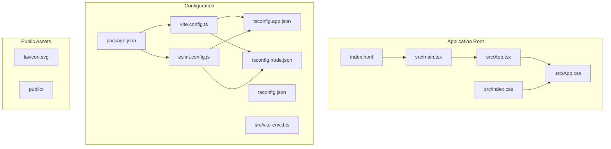
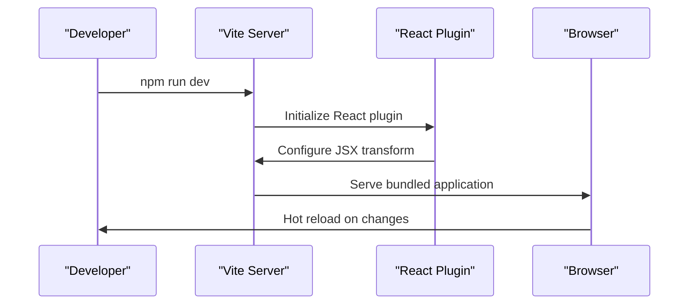
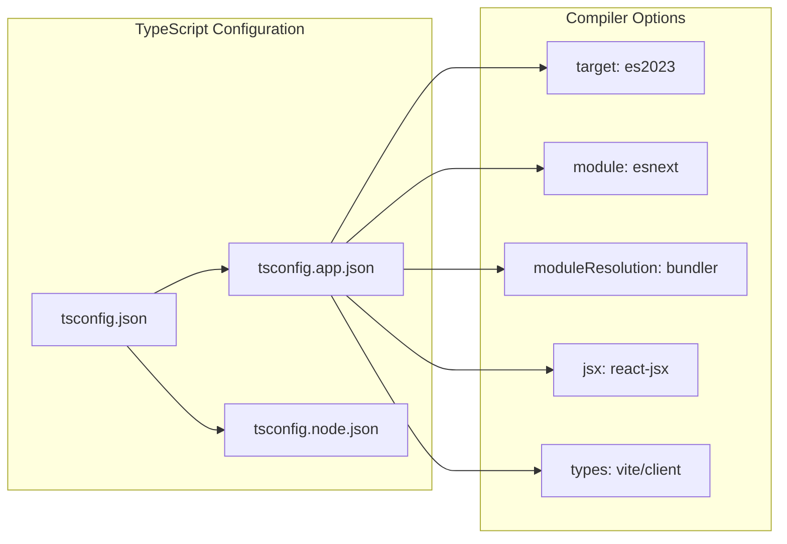
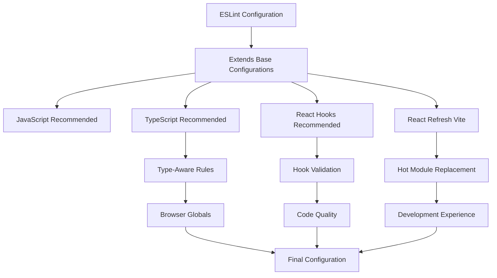
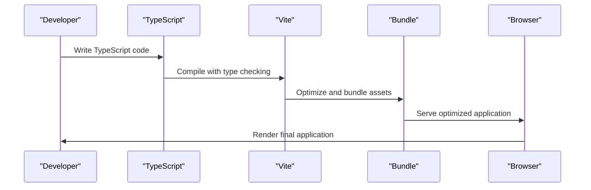

# Technology Stack & Dependencies

<cite>
**Referenced Files in This Document**
- [package.json](file://patent-drawing-app/package.json)
- [vite.config.ts](file://patent-drawing-app/vite.config.ts)
- [tsconfig.json](file://patent-drawing-app/tsconfig.json)
- [tsconfig.app.json](file://patent-drawing-app/tsconfig.app.json)
- [tsconfig.node.json](file://patent-drawing-app/tsconfig.node.json)
- [eslint.config.js](file://patent-drawing-app/eslint.config.js)
- [README.md](file://patent-drawing-app/README.md)
- [index.html](file://patent-drawing-app/index.html)
- [src/main.tsx](file://patent-drawing-app/src/main.tsx)
- [src/App.tsx](file://patent-drawing-app/src/App.tsx)
- [src/vite-env.d.ts](file://patent-drawing-app/src/vite-env.d.ts)
- [src/index.css](file://patent-drawing-app/src/index.css)
- [src/App.css](file://patent-drawing-app/src/App.css)
</cite>

## Table of Contents
1. [Introduction](#introduction)
2. [Project Structure](#project-structure)
3. [Core Technologies](#core-technologies)
4. [Build Tool Configuration](#build-tool-configuration)
5. [TypeScript Setup](#typescript-setup)
6. [ESLint Configuration](#eslint-configuration)
7. [Development Dependencies](#development-dependencies)
8. [Dependency Management](#dependency-management)
9. [Version Compatibility](#version-compatibility)
10. [Browser Support](#browser-support)
11. [Technology Rationale](#technology-rationale)
12. [Integration Patterns](#integration-patterns)
13. [Performance Considerations](#performance-considerations)
14. [Troubleshooting Guide](#troubleshooting-guide)
15. [Conclusion](#conclusion)

## Introduction
This document provides comprehensive technology stack documentation for the Patent Drawing Application. The project is built with modern web development tools and follows industry best practices for React applications. It demonstrates a clean, modular architecture using React 19.2.6, TypeScript ~6.0.2, and Vite 8.0.12, configured with robust build and development tooling.

## Project Structure
The project follows a conventional React application layout with TypeScript and Vite configurations:

**Diagram sources**
- [index.html:1-14](file://patent-drawing-app/index.html#L1-L14)
- [src/main.tsx:1-11](file://patent-drawing-app/src/main.tsx#L1-L11)
- [src/App.tsx:1-445](file://patent-drawing-app/src/App.tsx#L1-L445)
- [package.json:1-31](file://patent-drawing-app/package.json#L1-L31)
- [vite.config.ts:1-8](file://patent-drawing-app/vite.config.ts#L1-L8)

**Section sources**
- [index.html:1-14](file://patent-drawing-app/index.html#L1-L14)
- [src/main.tsx:1-11](file://patent-drawing-app/src/main.tsx#L1-L11)
- [src/App.tsx:1-445](file://patent-drawing-app/src/App.tsx#L1-L445)

## Core Technologies
The application leverages three primary technologies that form the foundation of the modern React development stack:

### React 19.2.6
React serves as the declarative UI library providing component-based architecture and efficient rendering capabilities. The application utilizes modern React features including hooks, concurrent features, and strict mode for enhanced development experience.

### TypeScript ~6.0.2
TypeScript provides static typing and enhanced developer experience with IntelliSense, compile-time error checking, and improved code documentation. Version ~6.0.2 offers optimal compatibility with React 19 while maintaining backward compatibility.

### Vite 8.0.12
Vite delivers lightning-fast development server and optimized production builds with native ES module support, instant hot module replacement (HMR), and zero-config setup for modern web applications.

**Section sources**
- [package.json:12-28](file://patent-drawing-app/package.json#L12-L28)
- [README.md:1-74](file://patent-drawing-app/README.md#L1-L74)

## Build Tool Configuration
The build system is configured through Vite with a minimal but effective setup that optimizes for both development speed and production performance.

### Vite Configuration Analysis
The Vite configuration is intentionally minimal, focusing on React-specific optimizations:

**Diagram sources**
- [vite.config.ts:1-8](file://patent-drawing-app/vite.config.ts#L1-L8)

Key configuration aspects include:
- React plugin integration for JSX transformation and React Refresh
- Optimized development server with HMR capabilities
- Production-ready bundling with tree-shaking and code splitting

**Section sources**
- [vite.config.ts:1-8](file://patent-drawing-app/vite.config.ts#L1-L8)

## TypeScript Setup
The TypeScript configuration employs a dual-project structure that separates application code from build tool configuration, enabling precise type checking and optimal compilation performance.

### Multi-Project TypeScript Architecture

**Diagram sources**
- [tsconfig.json:1-8](file://patent-drawing-app/tsconfig.json#L1-L8)
- [tsconfig.app.json:1-26](file://patent-drawing-app/tsconfig.app.json#L1-L26)
- [tsconfig.node.json:1-25](file://patent-drawing-app/tsconfig.node.json#L1-L25)

### Application TypeScript Configuration
The application configuration targets modern JavaScript environments with advanced features:
- **Target Environment**: ES2023 for cutting-edge browser compatibility
- **Module System**: ESNext with bundler resolution for optimal tree-shaking
- **JSX Processing**: React JSX transform with automatic runtime
- **Type Checking**: Comprehensive linting with unused variable detection
- **Build Output**: No emit for development builds, optimized for Vite's bundling

### Node TypeScript Configuration
The Node configuration focuses on build tooling and configuration files:
- **Target Environment**: ES2023 for modern Node.js compatibility
- **Type Definitions**: Node.js types for configuration file type safety
- **Module Resolution**: Bundler mode for consistent resolution across environments

**Section sources**
- [tsconfig.json:1-8](file://patent-drawing-app/tsconfig.json#L1-L8)
- [tsconfig.app.json:1-26](file://patent-drawing-app/tsconfig.app.json#L1-L26)
- [tsconfig.node.json:1-25](file://patent-drawing-app/tsconfig.node.json#L1-L25)

## ESLint Configuration
The ESLint setup provides comprehensive code quality enforcement with React-specific rules and TypeScript integration.

### ESLint Configuration Architecture

**Diagram sources**
- [eslint.config.js:1-23](file://patent-drawing-app/eslint.config.js#L1-L23)

### Configuration Highlights
- **Multi-file Support**: Extensive coverage for TypeScript and TypeScript React files
- **Type-Aware Linting**: Integration with TypeScript compiler for enhanced type checking
- **React-Specific Rules**: Dedicated plugins for React hooks and refresh mechanisms
- **Environment Configuration**: Browser globals for client-side code validation
- **Recommended Defaults**: Strong baseline of best practices and common sense rules

**Section sources**
- [eslint.config.js:1-23](file://patent-drawing-app/eslint.config.js#L1-L23)
- [README.md:14-74](file://patent-drawing-app/README.md#L14-L74)

## Development Dependencies
The development dependency ecosystem provides comprehensive tooling for modern web development:

### Core Development Tools
| Tool | Version | Purpose |
|------|---------|---------|
| **@vitejs/plugin-react** | ^6.0.1 | React-specific Vite plugin with JSX transform |
| **typescript** | ~6.0.2 | Static type checking and language enhancements |
| **typescript-eslint** | ^8.59.2 | TypeScript ESLint integration |
| **eslint** | ^10.3.0 | Code quality and style enforcement |
| **@types/react** | ^19.2.14 | React type definitions |
| **@types/react-dom** | ^19.2.3 | React DOM type definitions |
| **@types/node** | ^24.12.3 | Node.js type definitions |

### Additional Development Enhancements
- **eslint-plugin-react-hooks**: Advanced React hooks linting
- **eslint-plugin-react-refresh**: Hot module replacement validation
- **@eslint/js**: Base ESLint JavaScript configuration
- **globals**: Global variable definitions for linting

**Section sources**
- [package.json:16-29](file://patent-drawing-app/package.json#L16-L29)

## Dependency Management
The project maintains a lean dependency footprint focused on essential functionality:

### Runtime Dependencies
- **react**: ^19.2.6 - Core React library with concurrent features
- **react-dom**: ^19.2.6 - React DOM rendering and browser integration

### Development Dependencies
The development dependencies are carefully selected to provide comprehensive tooling without unnecessary bloat:
- Minimal plugin ecosystem focused on React and TypeScript
- Modern linting with type-aware rules
- Optimized build tooling with Vite

### Dependency Strategy
- **Version Pinning**: Strategic use of caret (^) and tilde (~) ranges for stability
- **Modern Targeting**: Focus on ES2023 features for contemporary browser support
- **Tooling Integration**: Seamless integration between build tools and type checking

**Section sources**
- [package.json:12-29](file://patent-drawing-app/package.json#L12-L29)

## Version Compatibility
The technology stack demonstrates careful version compatibility management:

### Technology Version Matrix
| Technology | Exact Version | Compatible Range | Notes |
|------------|---------------|------------------|-------|
| **React** | 19.2.6 | ^19.2.6 | Latest stable React 19.x |
| **TypeScript** | ~6.0.2 | ~6.0.2 | Compatible with React 19 |
| **Vite** | ^8.0.12 | ^8.0.12 | Latest Vite 8.x series |
| **ESLint** | ^10.3.0 | ^10.0.0 | Latest ESLint 10.x series |
| **TypeScript ESLint** | ^8.59.2 | ^8.0.0 | Compatible with ESLint 10 |

### Compatibility Considerations
- **React 19 Integration**: Full compatibility with React 19 features and concurrent rendering
- **TypeScript 6.x Support**: Leverages latest TypeScript features while maintaining React compatibility
- **ES2023 Targeting**: Modern JavaScript features with broad browser support
- **Vite Ecosystem**: Optimized for Vite's native ES module support and HMR

**Section sources**
- [package.json:12-28](file://patent-drawing-app/package.json#L12-L28)

## Browser Support
The application targets modern browsers with ES2023 features:

### Browser Compatibility Strategy
- **Target Environment**: ES2023 JavaScript specification
- **Feature Detection**: Progressive enhancement with graceful degradation
- **Polyfill Strategy**: Minimal polyfills required due to modern target
- **Performance Optimization**: Optimized for contemporary browser engines

### Supported Environments
- **Desktop Browsers**: Chrome 90+, Firefox 88+, Safari 14+, Edge 90+
- **Mobile Browsers**: iOS Safari 14+, Android Chrome 90+
- **Development Tools**: Modern Node.js LTS versions for build tooling

**Section sources**
- [tsconfig.app.json:4-5](file://patent-drawing-app/tsconfig.app.json#L4-L5)

## Technology Rationale
The technology choices reflect strategic decisions for modern web application development:

### React 19.2.6 Selection
- **Concurrent Features**: Advanced concurrent rendering capabilities
- **Performance**: Optimized bundle sizes and runtime performance
- **Ecosystem**: Rich plugin ecosystem and community support
- **Future-Proof**: Alignment with React's evolution roadmap

### TypeScript ~6.0.2 Benefits
- **Type Safety**: Enhanced development experience with compile-time checks
- **IDE Support**: Comprehensive IntelliSense and refactoring capabilities
- **Code Quality**: Improved maintainability and reduced bug rates
- **Scalability**: Better support for large codebases and team collaboration

### Vite 8.0.12 Advantages
- **Speed**: Lightning-fast development server with instant HMR
- **Optimization**: Production builds with advanced tree-shaking and code splitting
- **Developer Experience**: Zero-config setup with sensible defaults
- **Modern Web**: Native ES module support and cutting-edge web standards

### ESLint Integration
- **Code Quality**: Automated enforcement of coding standards
- **Consistency**: Uniform code style across the entire project
- **Type Safety**: Type-aware linting for React and TypeScript code
- **Best Practices**: Industry-standard linting rules and configurations

**Section sources**
- [README.md:1-74](file://patent-drawing-app/README.md#L1-L74)

## Integration Patterns
The technologies integrate seamlessly through well-defined patterns and configurations:

### Build Pipeline Integration

**Diagram sources**
- [package.json:6-11](file://patent-drawing-app/package.json#L6-L11)
- [tsconfig.app.json:10-16](file://patent-drawing-app/tsconfig.app.json#L10-L16)

### Development Workflow
- **TypeScript Compilation**: Integrated with Vite for seamless development
- **ESLint Integration**: Real-time linting during development
- **Hot Module Replacement**: Instant feedback on code changes
- **Production Optimization**: Automatic optimization for deployment

### Configuration Synchronization
- **Shared Targets**: Consistent ES2023 target across all configurations
- **Module Resolution**: Unified bundler resolution strategy
- **Type Definitions**: Coordinated type definitions for React and Node.js
- **Build Scripts**: Synchronized build commands and optimization

**Section sources**
- [package.json:6-11](file://patent-drawing-app/package.json#L6-L11)
- [tsconfig.app.json:10-16](file://patent-drawing-app/tsconfig.app.json#L10-L16)

## Performance Considerations
The technology stack is optimized for both development speed and production performance:

### Development Performance
- **Fast Startup**: Vite's instant server startup with minimal configuration
- **Instant HMR**: Near-instantaneous hot module replacement updates
- **Efficient Type Checking**: Incremental TypeScript compilation
- **Optimized Builds**: Parallel processing and caching strategies

### Production Performance
- **Tree Shaking**: Elimination of unused code through ES module imports
- **Code Splitting**: Automatic chunking for optimal loading
- **Minification**: Advanced minification with dead code elimination
- **Asset Optimization**: Image and asset optimization during build process

### Memory and Resource Management
- **Efficient Bundling**: Optimized bundle sizes for faster loading
- **Lazy Loading**: Component-level lazy loading for improved performance
- **Resource Caching**: Intelligent caching strategies for development and production

## Troubleshooting Guide
Common issues and their solutions:

### TypeScript Configuration Issues
- **Module Resolution Errors**: Verify bundler module resolution in both tsconfig files
- **Type Definition Conflicts**: Check for conflicting type definitions between React and Node.js
- **JSX Transform Problems**: Ensure react-jsx is properly configured in tsconfig.app.json

### Vite Build Issues
- **Plugin Conflicts**: Verify React plugin compatibility with TypeScript configuration
- **Development Server Problems**: Check port availability and network configuration
- **Build Optimization**: Review Vite configuration for production-specific optimizations

### ESLint Configuration Problems
- **Type-Aware Rule Failures**: Ensure TypeScript ESLint plugin is properly configured
- **React Hook Validation**: Verify React hooks plugin compatibility with React version
- **Global Variable Issues**: Check browser globals configuration for client-side code

### Dependency Conflicts
- **Version Mismatches**: Regularly update dependencies to maintain compatibility
- **Peer Dependency Issues**: Resolve peer dependency conflicts through careful version management
- **Package Lock Issues**: Use package-lock.json for consistent dependency installation

**Section sources**
- [tsconfig.app.json:10-22](file://patent-drawing-app/tsconfig.app.json#L10-L22)
- [eslint.config.js:8-22](file://patent-drawing-app/eslint.config.js#L8-L22)

## Conclusion
The Patent Drawing Application demonstrates a well-architected modern web application using React 19.2.6, TypeScript ~6.0.2, and Vite 8.0.12. The technology stack provides excellent developer experience with fast iteration cycles, comprehensive type safety, and optimized production builds. The multi-project TypeScript configuration ensures precise type checking while maintaining development flexibility. The ESLint integration enforces code quality standards, and the Vite configuration delivers optimal performance for both development and production environments. This combination of technologies positions the application for scalability, maintainability, and future-proof development practices.